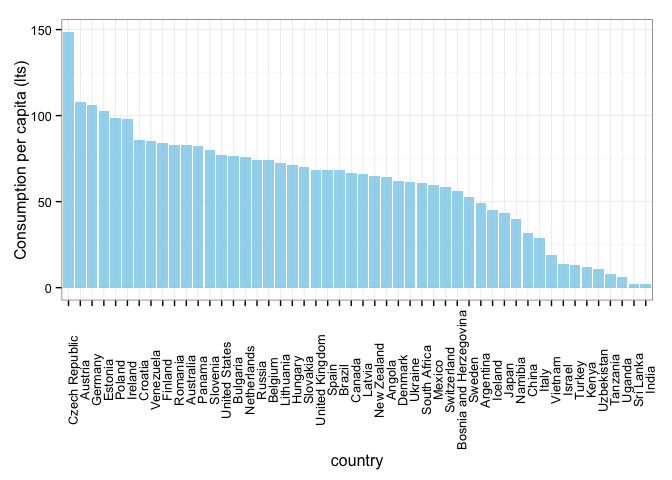
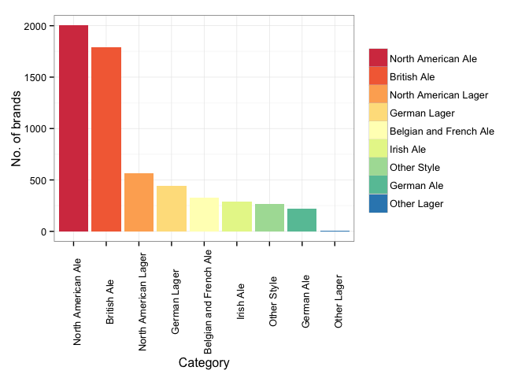
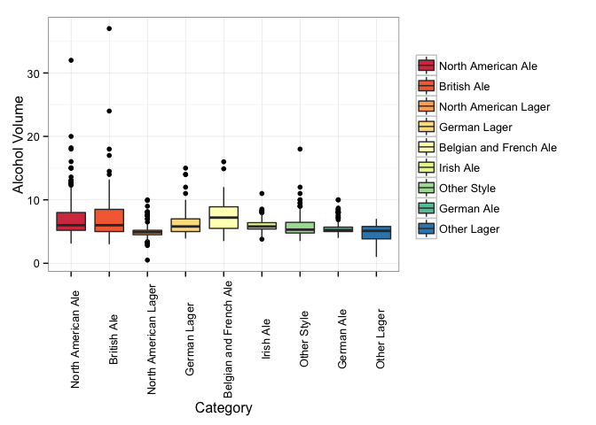
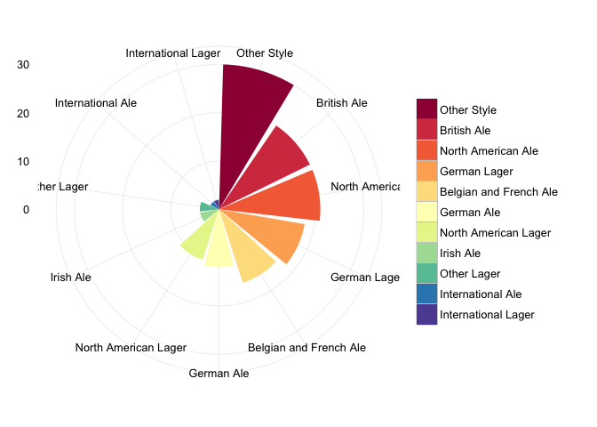

Todo el mundo ama la cerveza, es un hecho. Todos la tomamos y a todos nos encanta, no importa si es tipo lager, ale ó stout. Sin embargo, no todos están familiarizados con los distintos estilos de cerveza. La gente por lo general se refiere a su cerveza favorita como roja, rubia, negra, amarga o dulce. En este post nos concentramos principalmente en informar sobre los distintos tipos de cerveza en el mundo.

Comenzamos por ver el consumo de cerveza en el mundo. La siguiente es una gráfica creada con datos de 2012 sobre el consumo mundial per cápita. Esta solo muestra 50 países, pero todos sabemos que la cerveza se consume en todo el planeta, solo que algunos toman más que otros.

 

El país que más consume es la República Checa, seguido por Austria y luego Alemania. Ahora que somos conscientes del consumo mundial de cerveza pasemos a estudiar la diversidad de ésta. Es claro que hay una alta demanda de cerveza, pero no nos hemos percatado de su variedad. Incluso, en aquellos países donde el consumo no es el más alto, la oferta de distintos estilos es muy completa.

Comencemos por analizar la categoría más común

Como podemos ver, la categoría más popular es la Ale norteamericana, seguida de la Ale británica. Notemos que hay una gran diferencia entre estas dos primeras y las siguientes; sin embargo, esto no cuenta por la cerveza más tomada, sino la de mayor producción. Ahora veamos el porcentaje de alcohol en cada una de estas categorías:

|Categoría               | Alcohol Promedio|
|:----------------------|-------:|
|Belgian and French Ale |   7.389|
|British Ale            |   6.862|
|North American Ale     |   6.788|
|German Lager           |   6.220|
|Irish Ale              |   5.936|
|Other Style            |   5.827|
|German Ale             |   5.662|
|North American Lager   |   4.968|
|Other Lager            |   4.550|

Ahora sabemos cuál es la cerveza más fuerte: la ale belga y la francesa. Éstas le sacan un diferencia significativa a las siguientes en el ranking. Ahora veamos la distribución de porcentaje de alcohol por categoría. Cada punto corresponde a una marca en particular, y aquí vemos todas las marcas por categoría.

 

Ahora queremos ver los distintos estilos que hay en cada categoría. No vamos a nombrar cada uno de los estilos, solo mostraremos la variedad en cantidad.

Claramente hay muchos estilos sin clasificación, estos pueden ser cervezas artesanales hechas con distintos ingredientes, por eso no aplican para ser agrupadas en las otras categorías. Pero vemos,  en efecto, que hay muchos estilos, entonces no es sorpresa que uno desconozca el tipo y estilo de la cerveza favorita.

Concluimos diciendo que hay mucho por aprender sobre la cerveza y sus diferentes sabores, colores y orígenes. Dado el gusto que existe por la cerveza, ¿no sería interesante saber qué estilo es? Algunos solo se la toman sin importar el estilo, pero algunos curiosos encuentran esta información muy interesante. En un futuro post, te ayudaremos a descubrir cuál es el tipo de cerveza que tomas.

