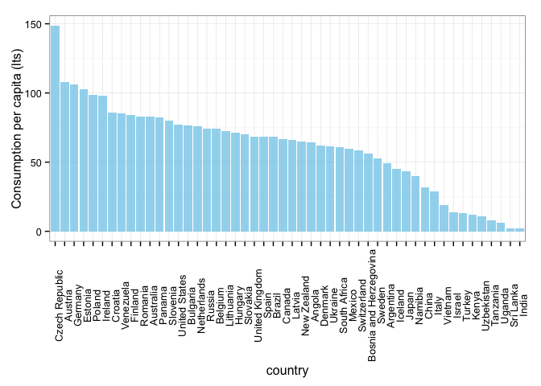
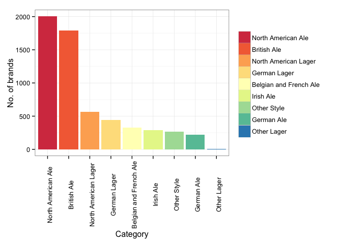

```r
library(ggplot2)
library(plyr)
library(knitr)
```


```r
data_path <- '/Users/ilanreinstein/Documents/beer/'
styles <- read.csv(paste(data_path, 'styles.csv', sep = ''),)
cats <- read.csv(paste(data_path, 'categories.csv', sep = ''),)
brew <- read.csv(paste(data_path, 'breweries.csv', sep = ''),)
beer <- read.csv(paste(data_path, 'beers.csv', sep = ''),)
cons <- read.csv(paste(data_path, 'consum.csv', sep = ''),)
```

### Which countries consume more beer per capita? ###


```r
cons$country <- factor(cons$country, levels = cons$country, ordered = T)
cons <- cons[order(cons$cons_lts),]
ggplot(cons, aes(country, cons_lts, fill = country)) + geom_bar(stat = 'identity', fill = 'skyblue', alpha =  0.8) + theme_bw() + theme(axis.text.x = element_text(angle = 90)) + labs(y = 'Consumption per capita (lts)')
```

 


### What is the most common category?


```r
A <- merge(beer, cats, by.x = 'cat_id', by.y = 'id')
A <- transform(A, cat_name = ordered(cat_name, levels = names(sort(-table(cat_name)))))
ggplot(A, aes(x = cat_name, fill = cat_name)) + geom_histogram() + theme_bw() + theme(axis.text.x = element_text(angle = 90), legend.title = element_blank()) + labs(x = 'Category', y = 'No. of brands') + scale_fill_brewer(palette = 'Spectral')
```

 

### What is the mean abv (alcohol volume) by category?


```r
A$abv[A$abv==0] <- NA
A$abv[A$abv > 50] <- NA
ABV <- ddply(A, .(cat_name), summarise, MeanABV = mean(abv,na.rm = T))
ABV1 <- ABV[order(ABV$MeanABV, decreasing = T),] 
colnames(ABV1)[1] <- 'Category'
kable(ABV1,row.names = F)
```


|Category               | MeanABV|
|:----------------------|-------:|
|Belgian and French Ale |   7.389|
|British Ale            |   6.862|
|North American Ale     |   6.788|
|German Lager           |   6.220|
|Irish Ale              |   5.936|
|Other Style            |   5.827|
|German Ale             |   5.662|
|North American Lager   |   4.968|
|Other Lager            |   4.550|

```r
ggplot(A, aes(x = cat_name, y = abv, fill = cat_name)) + geom_boxplot() + theme_bw() + theme(axis.text.x = element_text(angle = 90), legend.title = element_blank()) + scale_fill_brewer(palette = 'Spectral') + labs(x = 'Category', y = 'Alcohol Volume')
```

```
## Warning: Removed 2858 rows containing non-finite values (stat_boxplot).
```

 

### How many styles are held by category?


```r
B <- merge(cats, styles, by.x = 'id', by.y = 'cat_id')
```

```
## Warning: column name 'id' is duplicated in the result
```

```r
B <- transform(B, cat_name = ordered(cat_name, levels = names(sort(-table(cat_name)))))
q <- ggplot(B, aes(x = cat_name, fill = cat_name)) + geom_histogram() + theme_bw() + theme(legend.title = element_blank()) + labs(y = 'No. of styles', x = 'Category') + scale_fill_brewer(palette = 'Spectral')
q <- q + coord_polar()
q <- q + theme(
              axis.line=element_blank()
              ,axis.ticks=element_blank()
              ,axis.title.x=element_blank()
              ,axis.title.y=element_blank()
              ,panel.border=element_blank()
  )  
q
```

 


