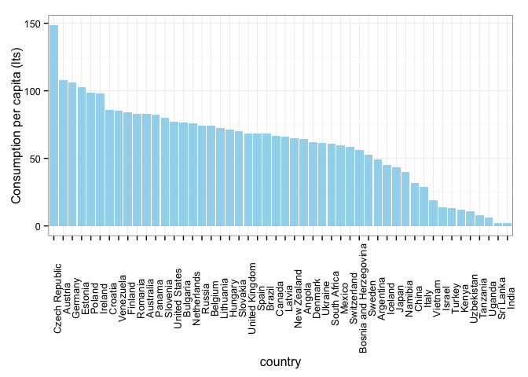
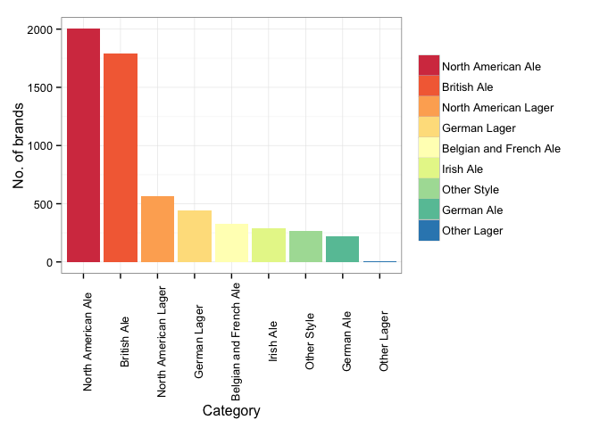
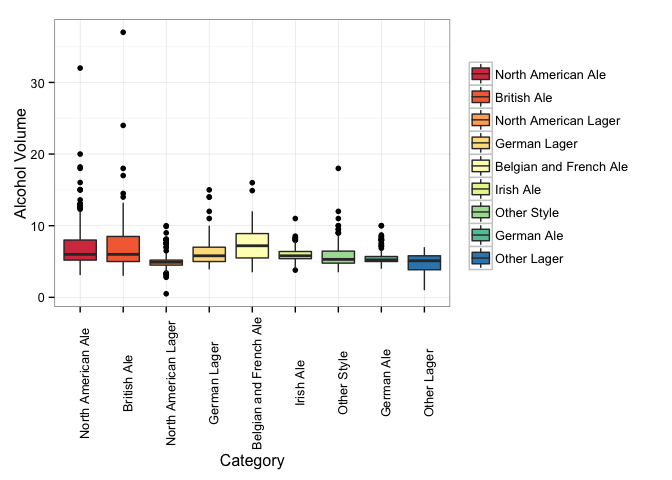
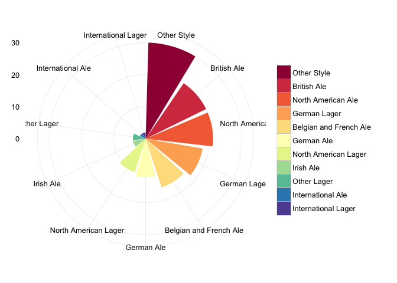

Everybody loves beer, it's a fact. We all drink it and we all adore it, no matter if it is lager, ale, stout, whatever. However not everyone is familiar with the styles of beer. People often refer to their favourite kind as red, clear, dark, sweet, strong, etc. In this post we will mainly educate you about the different types of beer in the world. We will let you find out what style is your favourite in a later post, but for now let us just concentrate on understanding the wide variety of beers in the world. 

We begin with the consumption of beer in the world. The following plot is created with data taken from 2012 about the consumption per capita. This only shows the top 50 countries, but we all know that beer is consumed everywhere, some countries just drink a little bit more.

 

As you can see the country that consumes the most is the Czech Republic, followed by Austria and Germany. So far we do not know which style they drink in each country, we just wanted to show you the vast amount of beer that is drinked in the world.

Yes, there is a high consumption of beer in this planet, however most of the times we don't realize about the wide variety of beers. Even in those countries where beer is not a traditional beverage, the supply of different styles is quite complete. We now show you some graphs about the different categories and styles of beer that you can find.

We begin by showing you the most common category:

Well as you see the most popular category is the North American Ale followed by the British Ale. Note that there is a huge difference between these first two and the following, however this does not account for the most drinked but for the most produced. Now let us take a look at the alcohol volume in each of these categories:

|Category               | MeanABV|
|:----------------------|-------:|
|Belgian and French Ale |   7.389|
|British Ale            |   6.862|
|North American Ale     |   6.788|
|German Lager           |   6.220|
|Irish Ale              |   5.936|
|Other Style            |   5.827|
|German Ale             |   5.662|
|North American Lager   |   4.968|
|Other Lager            |   4.550|

Well now we know which style is the strongest. The Belgian and French Ale keeps a siginificant difference with the rest of the categories. Let us now look at the distribution of alcohol percentages by category. Each point is the ABV (alcohol volume) of a particular brand, and here we plot all the brands by category.

 

Now we want to show the various styles that are in each category. We will not name each of the styles, we will only show you the variety in quantity.

Clearly there are a lot of unclassified styles, these might be original beers made with different ingredients, therefore they do not apply as any of the other categories. But note that indeed there are a lot of different styles by category, so it is no surprise that one is ignorant about the favourite type of beer one drinks. 

We conclude by stating that there is a lot to learn about beer and its different flavors, colours and origins. If you love beer wouldn't you like to know what style it is? Some might just drink it whatever the style, but some curious people find that information quite valuable. In a later opst we will show you what style is your favourite by just asking for your special brand.