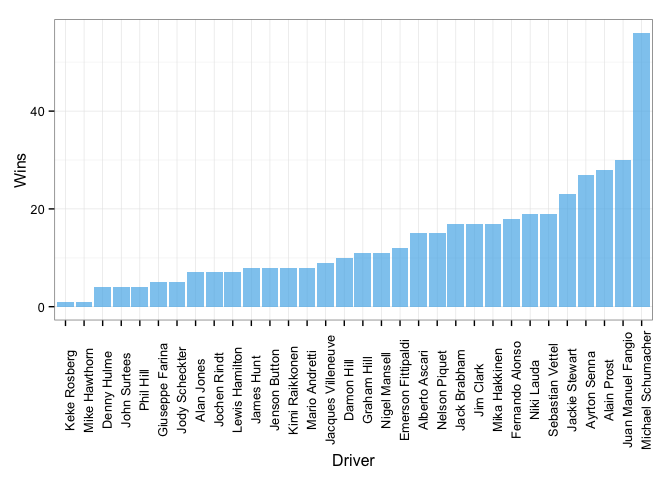
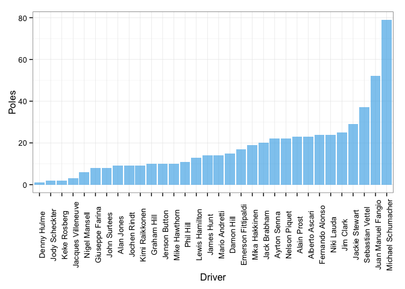
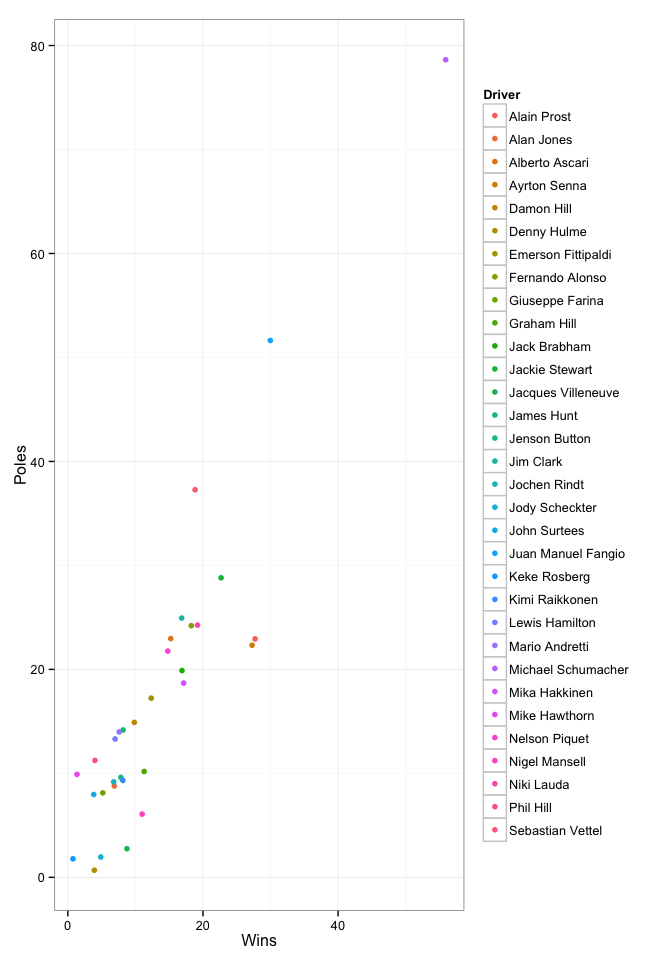
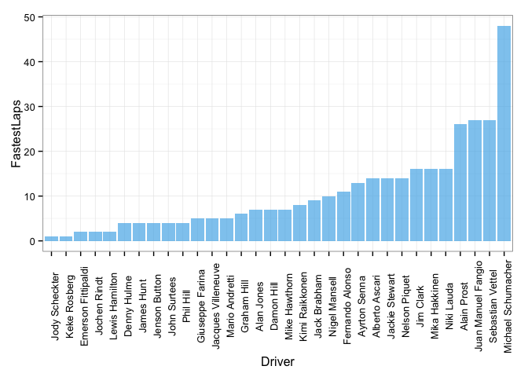

La Fórmula 1 ha sido uno de los deportes más prestigiosos de nuestra civilización. Las compañías automovilísticas tienen la oportunidad y el privilegio de mostrar sus juguetes en la pista y pelear por el campeonato. Al final, todo depende del piloto de cada auto, quien es responsable de llevar el carro a sus límites para dar una buena exhibición. Pero claro, el piloto también depende de la máquina que le da la escudería/constructor. Veremos en este _post_, usando algunas tablas y visualizaciones, quién es el mejor piloto en la historia de la F1.

Primero contestemos una simple pregunta, ¿quién es el piloto con más victorias? Claramente esta pregunta basta para hacer un post, sin embargo, recordemos que hay otros factores en cada temporada y en cada carrera que pueden o no favorecer al piloto. Por eso, esta es una sencilla inquietud de apertura de este _post_.

|   |Piloto             | Victorias|
|:--|:------------------|----:|
|21 |Keke Rosberg       |    1|
|27 |Mike Hawthorn      |    1|
|6  |Denny Hulme        |    4|
|19 |John Surtees       |    4|
|31 |Phil Hill          |    4|
|9  |Giuseppe Farina    |    5|
|18 |Jody Scheckter     |    5|
|2  |Alan Jones         |    7|
|17 |Jochen Rindt       |    7|
|23 |Lewis Hamilton     |    7|
|14 |James Hunt         |    8|
|15 |Jenson Button      |    8|
|22 |Kimi Raikkonen     |    8|
|24 |Mario Andretti     |    8|
|13 |Jacques Villeneuve |    9|
|5  |Damon Hill         |   10|
|10 |Graham Hill        |   11|
|29 |Nigel Mansell      |   11|
|7  |Emerson Fittipaldi |   12|
|3  |Alberto Ascari     |   15|
|28 |Nelson Piquet      |   15|
|11 |Jack Brabham       |   17|
|16 |Jim Clark          |   17|
|26 |Mika Hakkinen      |   17|
|8  |Fernando Alonso    |   18|
|30 |Niki Lauda         |   19|
|32 |Sebastian Vettel   |   19|
|12 |Jackie Stewart     |   23|
|4  |Ayrton Senna       |   27|
|1  |Alain Prost        |   28|
|20 |Juan Manuel Fangio |   30|
|25 |Michael Schumacher |   56|

 

Como vemos en la tabla y en la gráfica, fue casi predecible... Michael Schumacher es el piloto con más carreras ganadas.

Ahora, ¿ganó esas carreras ganando la pole? o ¿le quitó la pole a otro y la defendió durante la carrera?

|   |Piloto             | Poles|
|:--|:------------------|-----:|
|6  |Denny Hulme        |     1|
|18 |Jody Scheckter     |     2|
|21 |Keke Rosberg       |     2|
|13 |Jacques Villeneuve |     3|
|29 |Nigel Mansell      |     6|
|9  |Giuseppe Farina    |     8|
|19 |John Surtees       |     8|
|2  |Alan Jones         |     9|
|17 |Jochen Rindt       |     9|
|22 |Kimi Raikkonen     |     9|
|10 |Graham Hill        |    10|
|15 |Jenson Button      |    10|
|27 |Mike Hawthorn      |    10|
|31 |Phil Hill          |    11|
|23 |Lewis Hamilton     |    13|
|14 |James Hunt         |    14|
|24 |Mario Andretti     |    14|
|5  |Damon Hill         |    15|
|7  |Emerson Fittipaldi |    17|
|26 |Mika Hakkinen      |    19|
|11 |Jack Brabham       |    20|
|4  |Ayrton Senna       |    22|
|28 |Nelson Piquet      |    22|
|1  |Alain Prost        |    23|
|3  |Alberto Ascari     |    23|
|8  |Fernando Alonso    |    24|
|30 |Niki Lauda         |    24|
|16 |Jim Clark          |    25|
|12 |Jackie Stewart     |    29|
|32 |Sebastian Vettel   |    37|
|20 |Juan Manuel Fangio |    52|
|25 |Michael Schumacher |    79|

Bueno, podemos inferir que la mayoría de las carreras que ganó fueron perfectas i.e., obtuvo la pole y terminó de primero. Quiere decir que no perdió la pole en la mayoría de las carreras. Pero claro, hay paradas a pits y banderas amarillas que pueden retrasar o incluso afectar su posición. Al final, obtuvo la pole y terminó primero casi siempre.

A continuación, podemos analizar qué tan constante fue este comportamiento de pole-victoria para él y los otros pilotos. Queremos estudiar si ganar la pole implica ganar la carrera.

|Piloto            | Victorias| Poles|
|:------------------|----:|-----:|
|Alain Prost        |   28|    23|
|Alan Jones         |    7|     9|
|Alberto Ascari     |   15|    23|
|Ayrton Senna       |   27|    22|
|Damon Hill         |   10|    15|
|Denny Hulme        |    4|     1|
|Emerson Fittipaldi |   12|    17|
|Fernando Alonso    |   18|    24|
|Giuseppe Farina    |    5|     8|
|Graham Hill        |   11|    10|
|Jack Brabham       |   17|    20|
|Jackie Stewart     |   23|    29|
|Jacques Villeneuve |    9|     3|
|James Hunt         |    8|    14|
|Jenson Button      |    8|    10|
|Jim Clark          |   17|    25|
|Jochen Rindt       |    7|     9|
|Jody Scheckter     |    5|     2|
|John Surtees       |    4|     8|
|Juan Manuel Fangio |   30|    52|
|Keke Rosberg       |    1|     2|
|Kimi Raikkonen     |    8|     9|
|Lewis Hamilton     |    7|    13|
|Mario Andretti     |    8|    14|
|Michael Schumacher |   56|    79|
|Mika Hakkinen      |   17|    19|
|Mike Hawthorn      |    1|    10|
|Nelson Piquet      |   15|    22|
|Nigel Mansell      |   11|     6|
|Niki Lauda         |   19|    24|
|Phil Hill          |    4|    11|
|Sebastian Vettel   |   19|    37|

|   |Piloto             | Proporción|
|:--|:------------------|----------:|
|6  |Denny Hulme        |     4.0000|
|13 |Jacques Villeneuve |     3.0000|
|18 |Jody Scheckter     |     2.5000|
|29 |Nigel Mansell      |     1.8333|
|4  |Ayrton Senna       |     1.2273|
|1  |Alain Prost        |     1.2174|
|10 |Graham Hill        |     1.1000|
|26 |Mika Hakkinen      |     0.8947|
|22 |Kimi Raikkonen     |     0.8889|
|11 |Jack Brabham       |     0.8500|
|15 |Jenson Button      |     0.8000|
|12 |Jackie Stewart     |     0.7931|
|30 |Niki Lauda         |     0.7917|
|2  |Alan Jones         |     0.7778|
|17 |Jochen Rindt       |     0.7778|
|8  |Fernando Alonso    |     0.7500|
|25 |Michael Schumacher |     0.7089|
|7  |Emerson Fittipaldi |     0.7059|
|28 |Nelson Piquet      |     0.6818|
|16 |Jim Clark          |     0.6800|
|5  |Damon Hill         |     0.6667|
|3  |Alberto Ascari     |     0.6522|
|9  |Giuseppe Farina    |     0.6250|
|20 |Juan Manuel Fangio |     0.5769|
|14 |James Hunt         |     0.5714|
|24 |Mario Andretti     |     0.5714|
|23 |Lewis Hamilton     |     0.5385|
|32 |Sebastian Vettel   |     0.5135|
|19 |John Surtees       |     0.5000|
|21 |Keke Rosberg       |     0.5000|
|31 |Phil Hill          |     0.3636|
|27 |Mike Hawthorn      |     0.1000|

De estas últimas tablas vemos que algunos pilotos ganaron las carreras sin haber ganado la pole. Primero hicimos una tabla de victorias y poles, luego hallamos una proporción entre estas dos variables. Aquellos pilotos cuya proporción es mayor que 1, ganaron la carrera sin necesariamente haber ganado la pole. Michael tiene una proporción de 0.7, lo que es cercano a la mediana de la proporción. Ahora, veamos esa información visualmente.

 

¿Esto es extraño! Aunque Michael tiene una proporción promedio de victorias contra poles, es un valor atípico en la distribución de puntos. Él mantiene una fuerte relación entre poles y victorias. ¿Por qué pasa esto? Quizás se debe al número de carreras en las que ha participado. Cuanto más se compita (más carreras) en la F1, la proporción entre carreras ganadas y poles se estabiliza al rededor del valor medio (mediana), que es igual a:

0.7294

Ahora, notemos la proporción de Michael.

Finalmente, esta pregunta nos ayuda a determinar cómo la velocidad puede favorecer a un gran piloto. Aunque el piloto no es completamente responsable por esto, lo usaremos para determinar quién es en efecto el mejor piloto de todos los tiempos.

|   |Piloto             | Vueltas Rápidas|
|:--|:------------------|-----------:|
|18 |Jody Scheckter     |           1|
|21 |Keke Rosberg       |           1|
|7  |Emerson Fittipaldi |           2|
|17 |Jochen Rindt       |           2|
|23 |Lewis Hamilton     |           2|
|6  |Denny Hulme        |           4|
|14 |James Hunt         |           4|
|15 |Jenson Button      |           4|
|19 |John Surtees       |           4|
|31 |Phil Hill          |           4|
|9  |Giuseppe Farina    |           5|
|13 |Jacques Villeneuve |           5|
|24 |Mario Andretti     |           5|
|10 |Graham Hill        |           6|
|2  |Alan Jones         |           7|
|5  |Damon Hill         |           7|
|27 |Mike Hawthorn      |           7|
|22 |Kimi Raikkonen     |           8|
|11 |Jack Brabham       |           9|
|29 |Nigel Mansell      |          10|
|8  |Fernando Alonso    |          11|
|4  |Ayrton Senna       |          13|
|3  |Alberto Ascari     |          14|
|12 |Jackie Stewart     |          14|
|28 |Nelson Piquet      |          14|
|16 |Jim Clark          |          16|
|26 |Mika Hakkinen      |          16|
|30 |Niki Lauda         |          16|
|1  |Alain Prost        |          26|
|20 |Juan Manuel Fangio |          27|
|32 |Sebastian Vettel   |          27|
|25 |Michael Schumacher |          48|

 

Es por esto que Michael S. ha resultado ser el mejor piloto en la historia de la F1 según nuestro análisis. Michael corrió para uno de los mejores equipos, "Scuderia Ferrari". Por mucho tiempo, Ferrari tuvo los mejores carros y utilizó tecnología de punta. Pero he aquí lo interesante, podríamos pensar que Michael fue el mejor debido a su carro o, tal vez, era debido a esa intuición que pocos pilotos tienen. El hecho es que, como vimos ya, Michael es estadísticamente el mejor piloto en la historia de la F1

