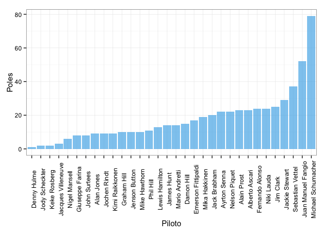
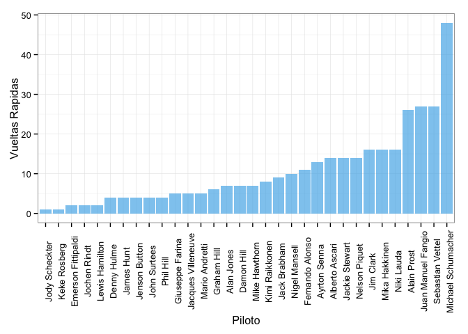

In this post we will use the following libraries:


```r
library(ggplot2)
library(reshape2)
library(plyr)
library(knitr)
```

The data is now loaded


```r
data_path <- 'data/'
df <- data.frame(read.csv(paste(data_path, 'f1_seasons.csv', sep = ''),))
```

We will use several visualization tools, such as tables and plots. To print a table in an organized way we use the function kable() from the knitr library. The table itself is created using ddply() from the reshape2 library.


```r
w <- ddply(df, .(Driver), summarize, Wins = sum(Wins))
w <- w[order(w$Wins),]
w$Driver <- factor(w$Driver, levels = w$Driver, ordered = TRUE)
kable(w)
```


|   |Driver             | Wins|
|:--|:------------------|----:|
|21 |Keke Rosberg       |    1|
|27 |Mike Hawthorn      |    1|
|6  |Denny Hulme        |    4|
|19 |John Surtees       |    4|
|31 |Phil Hill          |    4|
|9  |Giuseppe Farina    |    5|
|18 |Jody Scheckter     |    5|
|2  |Alan Jones         |    7|
|17 |Jochen Rindt       |    7|
|23 |Lewis Hamilton     |    7|
|14 |James Hunt         |    8|
|15 |Jenson Button      |    8|
|22 |Kimi Raikkonen     |    8|
|24 |Mario Andretti     |    8|
|13 |Jacques Villeneuve |    9|
|5  |Damon Hill         |   10|
|10 |Graham Hill        |   11|
|29 |Nigel Mansell      |   11|
|7  |Emerson Fittipaldi |   12|
|3  |Alberto Ascari     |   15|
|28 |Nelson Piquet      |   15|
|11 |Jack Brabham       |   17|
|16 |Jim Clark          |   17|
|26 |Mika Hakkinen      |   17|
|8  |Fernando Alonso    |   18|
|30 |Niki Lauda         |   19|
|32 |Sebastian Vettel   |   19|
|12 |Jackie Stewart     |   23|
|4  |Ayrton Senna       |   27|
|1  |Alain Prost        |   28|
|20 |Juan Manuel Fangio |   30|
|25 |Michael Schumacher |   56|

Now the visual form of the last table is created using ggplot2. It is a simple barplot that account for the number of wins by driver. 


```r
ggplot(w, aes(Driver, Wins)) + geom_bar(stat = 'identity', fill="#56B4E9", alpha = "0.7") + theme_bw() + theme(axis.text.x = element_text(angle = 90)) + labs(y = 'Victorias', x = 'Piloto')
```

 

We repeat the previous process of creating a table with ddply() and then plotting it using again the ggplot2 library tools.


```r
p <- ddply(df, .(Driver), summarize, Poles = sum(Poles))
p <- p[order(p$Poles),]
p$Driver <- factor(p$Driver, levels = p$Driver, ordered = TRUE)
kable(p)
```


|   |Driver             | Poles|
|:--|:------------------|-----:|
|6  |Denny Hulme        |     1|
|18 |Jody Scheckter     |     2|
|21 |Keke Rosberg       |     2|
|13 |Jacques Villeneuve |     3|
|29 |Nigel Mansell      |     6|
|9  |Giuseppe Farina    |     8|
|19 |John Surtees       |     8|
|2  |Alan Jones         |     9|
|17 |Jochen Rindt       |     9|
|22 |Kimi Raikkonen     |     9|
|10 |Graham Hill        |    10|
|15 |Jenson Button      |    10|
|27 |Mike Hawthorn      |    10|
|31 |Phil Hill          |    11|
|23 |Lewis Hamilton     |    13|
|14 |James Hunt         |    14|
|24 |Mario Andretti     |    14|
|5  |Damon Hill         |    15|
|7  |Emerson Fittipaldi |    17|
|26 |Mika Hakkinen      |    19|
|11 |Jack Brabham       |    20|
|4  |Ayrton Senna       |    22|
|28 |Nelson Piquet      |    22|
|1  |Alain Prost        |    23|
|3  |Alberto Ascari     |    23|
|8  |Fernando Alonso    |    24|
|30 |Niki Lauda         |    24|
|16 |Jim Clark          |    25|
|12 |Jackie Stewart     |    29|
|32 |Sebastian Vettel   |    37|
|20 |Juan Manuel Fangio |    52|
|25 |Michael Schumacher |    79|


```r
ggplot(p, aes(Driver, Poles)) + geom_bar(stat = 'identity', fill="#56B4E9", alpha = "0.7") + theme_bw() + theme(axis.text.x = element_text(angle = 90)) + labs(x = 'Piloto')
```

 

For this next couple of tables we make something different. We first find the total of wins and poles:


```r
A <- ddply(df, .(Driver), summarize, Wins = sum(Wins), Poles = sum(Poles))

kable(A)
```


|Driver             | Wins| Poles|
|:------------------|----:|-----:|
|Alain Prost        |   28|    23|
|Alan Jones         |    7|     9|
|Alberto Ascari     |   15|    23|
|Ayrton Senna       |   27|    22|
|Damon Hill         |   10|    15|
|Denny Hulme        |    4|     1|
|Emerson Fittipaldi |   12|    17|
|Fernando Alonso    |   18|    24|
|Giuseppe Farina    |    5|     8|
|Graham Hill        |   11|    10|
|Jack Brabham       |   17|    20|
|Jackie Stewart     |   23|    29|
|Jacques Villeneuve |    9|     3|
|James Hunt         |    8|    14|
|Jenson Button      |    8|    10|
|Jim Clark          |   17|    25|
|Jochen Rindt       |    7|     9|
|Jody Scheckter     |    5|     2|
|John Surtees       |    4|     8|
|Juan Manuel Fangio |   30|    52|
|Keke Rosberg       |    1|     2|
|Kimi Raikkonen     |    8|     9|
|Lewis Hamilton     |    7|    13|
|Mario Andretti     |    8|    14|
|Michael Schumacher |   56|    79|
|Mika Hakkinen      |   17|    19|
|Mike Hawthorn      |    1|    10|
|Nelson Piquet      |   15|    22|
|Nigel Mansell      |   11|     6|
|Niki Lauda         |   19|    24|
|Phil Hill          |    4|    11|
|Sebastian Vettel   |   19|    37|

Now we determine a proportion of wins and poles in order to determine a significant relation between these two variables.


```r
B <- ddply(A, .(Driver), summarize, Proportion = (Wins/Poles))
B <- B[order(B$Proportion, decreasing = T), ]

kable(B)
```


|   |Driver             | Proportion|
|:--|:------------------|----------:|
|6  |Denny Hulme        |     4.0000|
|13 |Jacques Villeneuve |     3.0000|
|18 |Jody Scheckter     |     2.5000|
|29 |Nigel Mansell      |     1.8333|
|4  |Ayrton Senna       |     1.2273|
|1  |Alain Prost        |     1.2174|
|10 |Graham Hill        |     1.1000|
|26 |Mika Hakkinen      |     0.8947|
|22 |Kimi Raikkonen     |     0.8889|
|11 |Jack Brabham       |     0.8500|
|15 |Jenson Button      |     0.8000|
|12 |Jackie Stewart     |     0.7931|
|30 |Niki Lauda         |     0.7917|
|2  |Alan Jones         |     0.7778|
|17 |Jochen Rindt       |     0.7778|
|8  |Fernando Alonso    |     0.7500|
|25 |Michael Schumacher |     0.7089|
|7  |Emerson Fittipaldi |     0.7059|
|28 |Nelson Piquet      |     0.6818|
|16 |Jim Clark          |     0.6800|
|5  |Damon Hill         |     0.6667|
|3  |Alberto Ascari     |     0.6522|
|9  |Giuseppe Farina    |     0.6250|
|20 |Juan Manuel Fangio |     0.5769|
|14 |James Hunt         |     0.5714|
|24 |Mario Andretti     |     0.5714|
|23 |Lewis Hamilton     |     0.5385|
|32 |Sebastian Vettel   |     0.5135|
|19 |John Surtees       |     0.5000|
|21 |Keke Rosberg       |     0.5000|
|31 |Phil Hill          |     0.3636|
|27 |Mike Hawthorn      |     0.1000|


```r
#Median Proportion
median(B$Proportion)
```

[1] 0.7294

As you can see the proportion seems to stabilize as the number of races increases, this means that the proportion actually does not informsus about the effectivity of a particular driver. However the proportion of each driver actually gets closer and closer to the median as the number of races increases, so one might infer that as the number of races increases and the porportion gets close to the median, the driver can be considered effective.

Finally we make a scatter plot in order the find (visually) a correlation between wins and poles.


```r
ggplot(A, aes(Wins, Poles, colour = Driver)) + geom_jitter() + theme_bw() + labs(x = 'Victorias') + theme(legend.title = element_text('Piloto'))
```

```
## Warning: font family 'Piloto' not found in PostScript font database
## Warning: font family 'Piloto' not found in PostScript font database
## Warning: font family 'Piloto' not found in PostScript font database
## Warning: font family 'Piloto' not found in PostScript font database
## Warning: font family 'Piloto' not found in PostScript font database
```

 

These last tables and plots are made in the same way as the previous ones.


```r
driv <- ddply(df, .(Driver), summarize, FastestLaps = sum(Fastest.Laps))
driv <- driv[order(driv$FastestLaps), ]
driv$Driver <- factor(driv$Driver, levels = driv$Driver, ordered = T)
kable(driv)
```


|   |Driver             | FastestLaps|
|:--|:------------------|-----------:|
|18 |Jody Scheckter     |           1|
|21 |Keke Rosberg       |           1|
|7  |Emerson Fittipaldi |           2|
|17 |Jochen Rindt       |           2|
|23 |Lewis Hamilton     |           2|
|6  |Denny Hulme        |           4|
|14 |James Hunt         |           4|
|15 |Jenson Button      |           4|
|19 |John Surtees       |           4|
|31 |Phil Hill          |           4|
|9  |Giuseppe Farina    |           5|
|13 |Jacques Villeneuve |           5|
|24 |Mario Andretti     |           5|
|10 |Graham Hill        |           6|
|2  |Alan Jones         |           7|
|5  |Damon Hill         |           7|
|27 |Mike Hawthorn      |           7|
|22 |Kimi Raikkonen     |           8|
|11 |Jack Brabham       |           9|
|29 |Nigel Mansell      |          10|
|8  |Fernando Alonso    |          11|
|4  |Ayrton Senna       |          13|
|3  |Alberto Ascari     |          14|
|12 |Jackie Stewart     |          14|
|28 |Nelson Piquet      |          14|
|16 |Jim Clark          |          16|
|26 |Mika Hakkinen      |          16|
|30 |Niki Lauda         |          16|
|1  |Alain Prost        |          26|
|20 |Juan Manuel Fangio |          27|
|32 |Sebastian Vettel   |          27|
|25 |Michael Schumacher |          48|


```r
ggplot(driv, aes(Driver, FastestLaps)) + geom_histogram(stat = 'identity', fill="#56B4E9", alpha = "0.7") + theme_bw() + theme(axis.text.x = element_text(angle = 90)) + labs(x = 'Piloto', y = 'Vueltas Rapidas')
```

 

