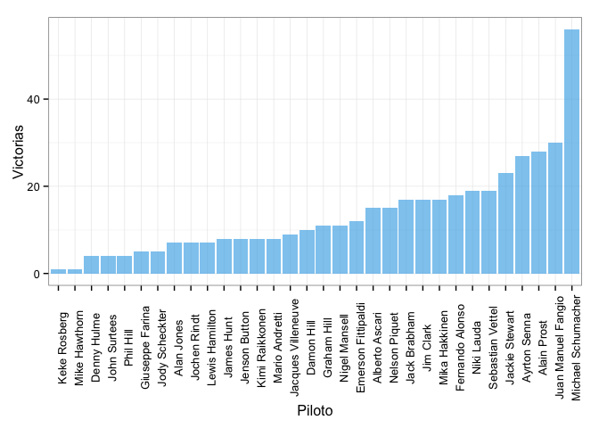
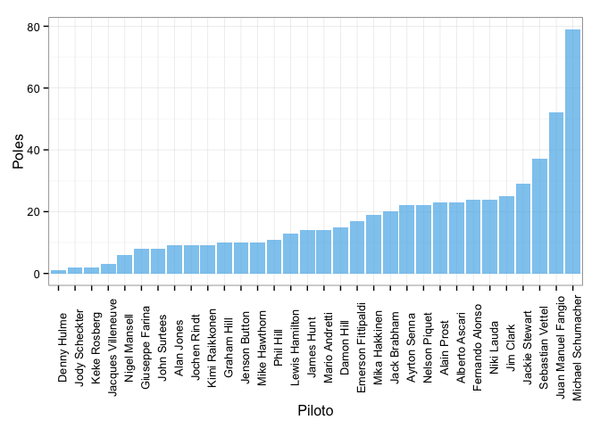
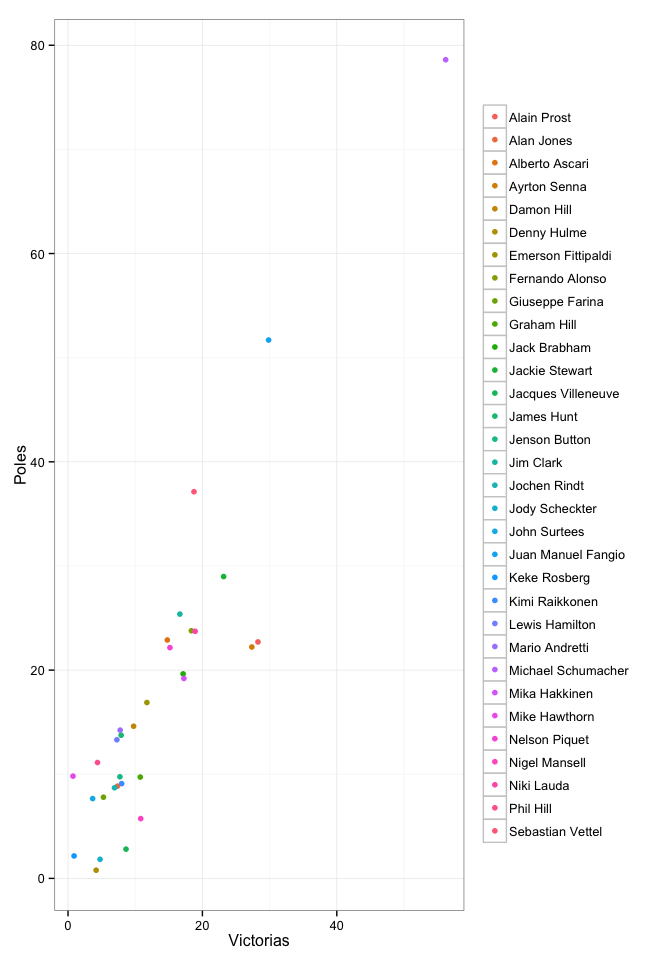
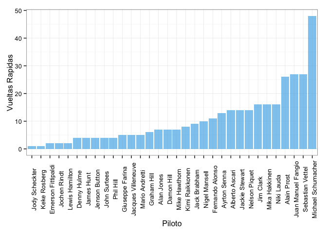

Formula One has been one of the most prestigious sports in our civilization. The opportunity for some car companies to show their goodies in the track and fight for the tournament. In the end it all comes to the driver of the car, who is responsible for pushing the car to its limits in order to give a nice show. Off course, the driver also depends on the machine it is given to him by the car/engine constructor. As we will see in this post we will try to determine, using some visualizatons and tables, who is the greatest driver in the Formula One history. 

First, let us start with a simple question. Who is the driver with most wins? Clearly this question might be enough to make a post, however, recall that there are other factors in each season and in each race that may or may not be favorable for the driver. That is why this is merely the opening question of our post.

|   |Driver             | Wins|
|:--|:------------------|----:|
|21 |Keke Rosberg       |    1|
|27 |Mike Hawthorn      |    1|
|6  |Denny Hulme        |    4|
|19 |John Surtees       |    4|
|31 |Phil Hill          |    4|
|9  |Giuseppe Farina    |    5|
|18 |Jody Scheckter     |    5|
|2  |Alan Jones         |    7|
|17 |Jochen Rindt       |    7|
|23 |Lewis Hamilton     |    7|
|14 |James Hunt         |    8|
|15 |Jenson Button      |    8|
|22 |Kimi Raikkonen     |    8|
|24 |Mario Andretti     |    8|
|13 |Jacques Villeneuve |    9|
|5  |Damon Hill         |   10|
|10 |Graham Hill        |   11|
|29 |Nigel Mansell      |   11|
|7  |Emerson Fittipaldi |   12|
|3  |Alberto Ascari     |   15|
|28 |Nelson Piquet      |   15|
|11 |Jack Brabham       |   17|
|16 |Jim Clark          |   17|
|26 |Mika Hakkinen      |   17|
|8  |Fernando Alonso    |   18|
|30 |Niki Lauda         |   19|
|32 |Sebastian Vettel   |   19|
|12 |Jackie Stewart     |   23|
|4  |Ayrton Senna       |   27|
|1  |Alain Prost        |   28|
|20 |Juan Manuel Fangio |   30|
|25 |Michael Schumacher |   56|

 

Well that was easy... As we see from the table and then from the plot, one could have guessed the answer. Michael Schumacher is the driver that has won the most races.

Now, did he win the races after winning the pole? Or, did he took it from someone else and defended it all along the race?

|   |Driver             | Poles|
|:--|:------------------|-----:|
|6  |Denny Hulme        |     1|
|18 |Jody Scheckter     |     2|
|21 |Keke Rosberg       |     2|
|13 |Jacques Villeneuve |     3|
|29 |Nigel Mansell      |     6|
|9  |Giuseppe Farina    |     8|
|19 |John Surtees       |     8|
|2  |Alan Jones         |     9|
|17 |Jochen Rindt       |     9|
|22 |Kimi Raikkonen     |     9|
|10 |Graham Hill        |    10|
|15 |Jenson Button      |    10|
|27 |Mike Hawthorn      |    10|
|31 |Phil Hill          |    11|
|23 |Lewis Hamilton     |    13|
|14 |James Hunt         |    14|
|24 |Mario Andretti     |    14|
|5  |Damon Hill         |    15|
|7  |Emerson Fittipaldi |    17|
|26 |Mika Hakkinen      |    19|
|11 |Jack Brabham       |    20|
|4  |Ayrton Senna       |    22|
|28 |Nelson Piquet      |    22|
|1  |Alain Prost        |    23|
|3  |Alberto Ascari     |    23|
|8  |Fernando Alonso    |    24|
|30 |Niki Lauda         |    24|
|16 |Jim Clark          |    25|
|12 |Jackie Stewart     |    29|
|32 |Sebastian Vettel   |    37|
|20 |Juan Manuel Fangio |    52|
|25 |Michael Schumacher |    79|

Well indeed we can infere that most of the races he won were almost perfect races. That means that he did not lose the pole in most of the races. But off course, there are pits stops and yellow flags that can stall him or even affect his position during the race. In the end he got the pole and finished first most of the times. 

Next we can analyze how effective or how constant this pole-win behavior was for him and for the other drivers. We wish to study if winning the pole implies winning the race?

|Driver             | Wins| Poles|
|:------------------|----:|-----:|
|Alain Prost        |   28|    23|
|Alan Jones         |    7|     9|
|Alberto Ascari     |   15|    23|
|Ayrton Senna       |   27|    22|
|Damon Hill         |   10|    15|
|Denny Hulme        |    4|     1|
|Emerson Fittipaldi |   12|    17|
|Fernando Alonso    |   18|    24|
|Giuseppe Farina    |    5|     8|
|Graham Hill        |   11|    10|
|Jack Brabham       |   17|    20|
|Jackie Stewart     |   23|    29|
|Jacques Villeneuve |    9|     3|
|James Hunt         |    8|    14|
|Jenson Button      |    8|    10|
|Jim Clark          |   17|    25|
|Jochen Rindt       |    7|     9|
|Jody Scheckter     |    5|     2|
|John Surtees       |    4|     8|
|Juan Manuel Fangio |   30|    52|
|Keke Rosberg       |    1|     2|
|Kimi Raikkonen     |    8|     9|
|Lewis Hamilton     |    7|    13|
|Mario Andretti     |    8|    14|
|Michael Schumacher |   56|    79|
|Mika Hakkinen      |   17|    19|
|Mike Hawthorn      |    1|    10|
|Nelson Piquet      |   15|    22|
|Nigel Mansell      |   11|     6|
|Niki Lauda         |   19|    24|
|Phil Hill          |    4|    11|
|Sebastian Vettel   |   19|    37|

|   |Driver             | Proportion|
|:--|:------------------|----------:|
|6  |Denny Hulme        |     4.0000|
|13 |Jacques Villeneuve |     3.0000|
|18 |Jody Scheckter     |     2.5000|
|29 |Nigel Mansell      |     1.8333|
|4  |Ayrton Senna       |     1.2273|
|1  |Alain Prost        |     1.2174|
|10 |Graham Hill        |     1.1000|
|26 |Mika Hakkinen      |     0.8947|
|22 |Kimi Raikkonen     |     0.8889|
|11 |Jack Brabham       |     0.8500|
|15 |Jenson Button      |     0.8000|
|12 |Jackie Stewart     |     0.7931|
|30 |Niki Lauda         |     0.7917|
|2  |Alan Jones         |     0.7778|
|17 |Jochen Rindt       |     0.7778|
|8  |Fernando Alonso    |     0.7500|
|25 |Michael Schumacher |     0.7089|
|7  |Emerson Fittipaldi |     0.7059|
|28 |Nelson Piquet      |     0.6818|
|16 |Jim Clark          |     0.6800|
|5  |Damon Hill         |     0.6667|
|3  |Alberto Ascari     |     0.6522|
|9  |Giuseppe Farina    |     0.6250|
|20 |Juan Manuel Fangio |     0.5769|
|14 |James Hunt         |     0.5714|
|24 |Mario Andretti     |     0.5714|
|23 |Lewis Hamilton     |     0.5385|
|32 |Sebastian Vettel   |     0.5135|
|19 |John Surtees       |     0.5000|
|21 |Keke Rosberg       |     0.5000|
|31 |Phil Hill          |     0.3636|
|27 |Mike Hawthorn      |     0.1000|

From this last tables we see that some drivers won the races without winning the pole. First we made a table of the wins and poles, then we found a proportion of these two variables. Those drivers whose proportion is higher than one are those that won the race despite of not having te pole. Michael, has a proportion of 0.7 which is near the average of the proportion. Now let's make a plot of this information.

 

That is strange!! Eventhough Michael has an average probability of winning the race after the pole, he is an outier in the scatter plot. He holds a strong linear relation between poles and wins. Why can this be happening? Maybe because of the number of races each of the drivers participate. The longer (more races) a pilot stays as a Formula One driver, the probability of winning the race once the pole is aquired, stabilizes around the median of the proportion win/pole. Which is:

0.7294

Note Michael's proportion.

Finally this question helps us determine how speed can make a good driver. Although the driver is not fully responsible for this we will use it anyway to determine who is indeed the best driver of all time.

|   |Driver             | FastestLaps|
|:--|:------------------|-----------:|
|18 |Jody Scheckter     |           1|
|21 |Keke Rosberg       |           1|
|7  |Emerson Fittipaldi |           2|
|17 |Jochen Rindt       |           2|
|23 |Lewis Hamilton     |           2|
|6  |Denny Hulme        |           4|
|14 |James Hunt         |           4|
|15 |Jenson Button      |           4|
|19 |John Surtees       |           4|
|31 |Phil Hill          |           4|
|9  |Giuseppe Farina    |           5|
|13 |Jacques Villeneuve |           5|
|24 |Mario Andretti     |           5|
|10 |Graham Hill        |           6|
|2  |Alan Jones         |           7|
|5  |Damon Hill         |           7|
|27 |Mike Hawthorn      |           7|
|22 |Kimi Raikkonen     |           8|
|11 |Jack Brabham       |           9|
|29 |Nigel Mansell      |          10|
|8  |Fernando Alonso    |          11|
|4  |Ayrton Senna       |          13|
|3  |Alberto Ascari     |          14|
|12 |Jackie Stewart     |          14|
|28 |Nelson Piquet      |          14|
|16 |Jim Clark          |          16|
|26 |Mika Hakkinen      |          16|
|30 |Niki Lauda         |          16|
|1  |Alain Prost        |          26|
|20 |Juan Manuel Fangio |          27|
|32 |Sebastian Vettel   |          27|
|25 |Michael Schumacher |          48|

 

This is why Michael S. is turning up to be the best driver in F1 history according to our analysis. Michael runned for one of the best teams in F1, Scuderia Ferrari. For years Ferrari had the best cars and state-of-the-art technology. And here's the catch, maybe Michael S. was great only because of his car, or maybe he has that driver intuition that few racers have. The fact is that, as shown in the previous visualizations, Michael S. is statistically the best drive in F1 history.