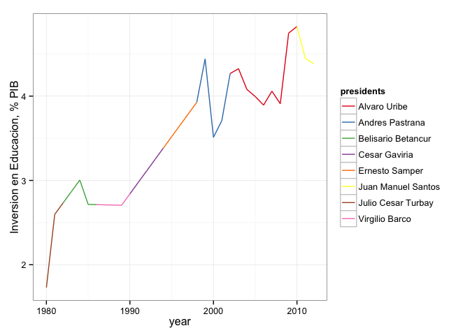

```r
library(reshape2)
library(knitr)
library(plyr)
library(ggplot2)
library(scales)
library(zoo)
options(scipen = 10)
```


```r
df <- read.csv('data/table2.csv', header = T)
df2 <- read.csv('data/table1.csv', header = T)
a <- rowSums(df2[,3:6])
df2$preprimary <- (df2$preprimary/a)*100
df2$primary <- (df2$primary/a)*100
df2$secondary <- (df2$secondary/a)*100
df2$tertiary <- (df2$tertiary/a)*100

df3 <- melt(df2, id = c('country','year'),varnames = 'indicator')
```

### ¿Cómo ha cambiado en Colombia la inversión en educación desde 1980?


```r
ggplot(df, aes(year, eduPerc, group = 1, colour = presidents)) + geom_path() + theme_bw() + scale_colour_brewer(palette = 'Set1') + labs(y = 'Inversion en Educacion, % PIB')
```

 

### ¿Cuánto invierte Colombia en los distintos niveles de educación?


```r
ggplot(df3, aes(year,value, fill=variable)) + geom_area(position = 'stack') + labs(y = 'Inversion por nivel educativo % de PIB') + scale_fill_brewer(palette = 'Set1', name = 'Nivel Educativo', labels = c('Preescolar', 'Primaria', 'Secundaria', 'Terciaria')) + theme_bw()
```

 


