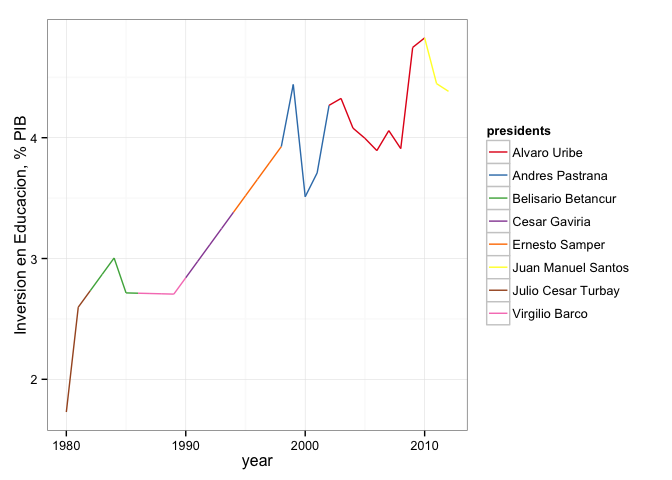
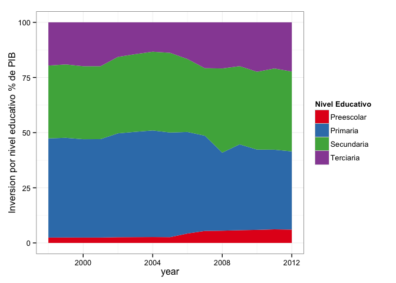

La educación es un derecho fundamental para la humanidad, el acceso a ésta es primordial para tener un estándar de vida digno. Los seres pensantes y educados son quienes cambian el curso de la historia de un país, lastimosamente, el acceso a una buena educación es cada vez más costoso y de menor calidad. Hace unos meses se presentaron protestas de parte de muchos profesores insatisfechos con sus salarios y sus beneficios, y también, creen que están siendo calificados de manera injusta. En un [post](http://datablog.co/posts/4-inversion-investigacion-desarrollo-es/) anterior, discutíamos que la inversión en investigación científica es una apuesta a un mejor futuro en el país. Lo mismo pensamos con respecto a la educación, un país que educa a su gente es uno que se preocupa por cuidar y mantener el bienestar de su población en todos los aspectos posibles. 

Muchos se preguntan cómo mejorar la sociedad en la que vivimos, es muy fuerte la sensación de impotencia cuando notamos lo poco que podemos hacer conociendo la condicion social de algunas personas en el mundo, además es realmente complicado percibir el cambio en tan poco tiempo.

En estos momentos se discute el futuro de la educación en nuestro país, comienza un nuevo período presidencial y la expectativa del cambio nunca ha estado tan alta como ahora. Mientras en el congreso se debate y se analizan las propuestas, nosotros mencionaremos algunas cosas sobre la inversión en educación en Colombia a través de los años. 

 

En la anterior gráfica, vemos como ha evolucionado la inversión en educación a lo largo de los años, quiénes han sido los presidentes en cada período. Vemos que el único período estable es entre 1990 y 2000, bajo el mandato de César Gaviria y Ernesto Samper. El punto más alto sin embargo, fue alcanzado por Alvaro Uribe, luego de una caída muy pronunciada desde que subió a la presidencia. El mismo comportamiento se observa en el período de Andrés Pastrana, comenzó bien, bajo y luego mejoró de nuevo. Solo debemos esperar que Juan Manuel Santos recupere la inversión en educación y la deje en un mejor nivel que cuando recibio el cargo.

Ahora queremos ver la inversión por niveles educativos. Es importante conocer estas cifras debido a que la distribucion no es equitativa, se invierte más en algunos niveles que en otros.

 

Los niveles que reciben mayor financiación son la primaria y la secundaria/bachillerato. Esto es un buen indicador, sin embargo, se puede mejorar la etapa preescolar, e idealmente el nivel terciario o universitario. Es importante reforzar estos últimos dos sectores, dado que significan la preparación básica para estudiar y la formación profesional respectivamente. El aumento en el número de profesionales financiados por el gobierno sería una excelente iniciativa para mejorar la economía del país, siempre y cuando éstos puedan conseguir empleo fácilmente.

En conclusión, todo lo que podemos desear es que la inversión general aumente y que, en el actual debate que se lleva a cabo en el congreso, se adopten medidas y políticas para mejorar el sector educativo y no nos quedemos atrás otra vez en las pruebas internacionales.