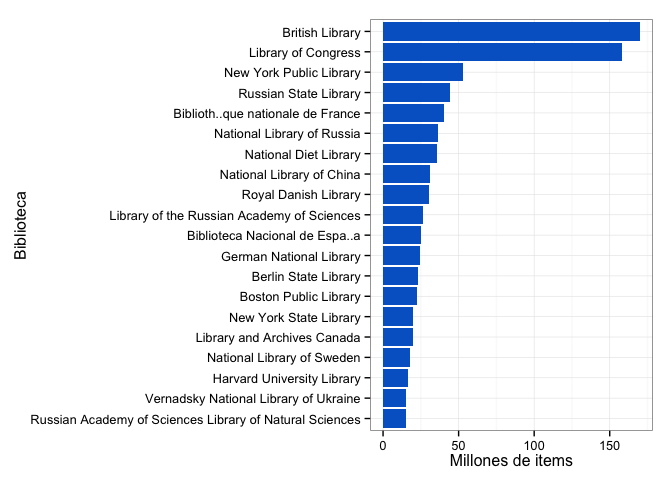
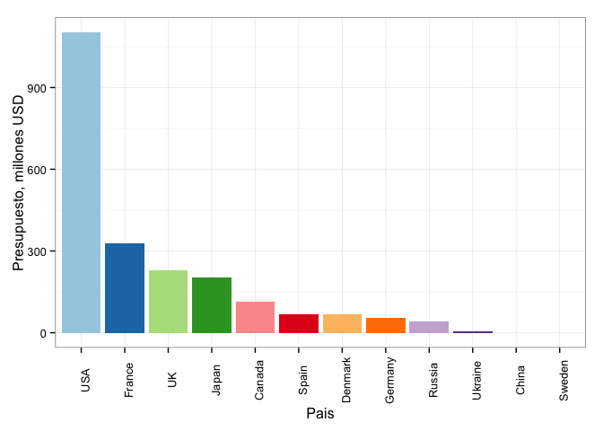

```r
library(dplyr)
library(knitr)
library(ggplot2)
```


```r
df <- read.csv('data/table1.csv',header = T)
```

### ¿En qué países están las bibliotecas mas grandes?


```r
B <- df %>% group_by(Location) %>% summarise(count = n()) %>% arrange(desc(count))
B$Location <- factor(B$Location, levels = B$Location, ordered = T)
ggplot(B, aes(Location,count, fill = Location)) + geom_bar(stat = 'identity') + theme_bw() + scale_fill_brewer(palette = 'Paired') + theme(axis.text.x = element_text(angle = 90), legend.position = 'none') + labs(x = 'Pais', y = 'No. de Bibliotecas')
```

 

### ¿Cuáles son las ciudades en éstos países?


```r
D <- df %>% select(Location,City,Name) %>% arrange(Location)

kable(D)
```


|Location |City           |Name                                                    |
|:--------|:--------------|:-------------------------------------------------------|
|Canada   |Ottawa         |Library and Archives Canada                             |
|China    |Beijing        |National Library of China                               |
|Denmark  |Copenhagen     |Royal Danish Library                                    |
|France   |Paris          |Biblioth<c3><a8>que nationale de France                       |
|Germany  |Berlin         |Berlin State Library                                    |
|Germany  |Frankfurt      |German National Library                                 |
|Japan    |Tokyo          |National Diet Library                                   |
|Russia   |St. Petersburg |Library of the Russian Academy of Sciences              |
|Russia   |St. Petersburg |National Library of Russia                              |
|Russia   |Moscow         |Russian Academy of Sciences Library of Natural Sciences |
|Russia   |Moscow         |Russian State Library                                   |
|Spain    |Madrid         |Biblioteca Nacional de Espa<c3><b1>a                          |
|Sweden   |Stockholm      |National Library of Sweden                              |
|UK       |London         |British Library                                         |
|USA      |Boston         |Boston Public Library                                   |
|USA      |Cambridge, MA  |Harvard University Library                              |
|USA      |Washington DC  |Library of Congress                                     |
|USA      |New York       |New York Public Library                                 |
|USA      |Albany         |New York State Library                                  |
|Ukraine  |Kiev           |Vernadsky National Library of Ukraine                   |

### ¿Que biblioteca tiene más ejemplares en sus bibiotecas?


```r
A <- df %>% select(Location, Name, MillNumItems) %>% arrange(MillNumItems)
A$Name <- factor(A$Name, levels = A$Name, ordered = T)
ggplot(A, aes(Name, MillNumItems)) + geom_bar(stat = 'identity', fill = '#0066CC') + theme_bw() + theme(legend.position = 'none') + labs(x = 'Biblioteca', y = 'Millones de items') + coord_flip()
```

 

### ¿Cuál es el presupuesto dirigido a las bibliotecas?


```r
C <- df %>% group_by(Location) %>% summarise(Budget = sum(BudgetMillUSD,na.rm = T)) %>% arrange(desc(Budget))
C$Location <- factor(C$Location, levels = C$Location, ordered = T)
ggplot(C, aes(Location, Budget, fill = Location)) + geom_bar(stat = 'identity') + theme_bw() + scale_fill_brewer(palette = 'Paired') + theme(axis.text.x = element_text(angle = 90), legend.position = 'none') + labs(x = 'Pais', y = 'Presupuesto, millones USD')
```

 

### ¿Cuál es la biblioteca más visitada al año?


```r
E <- df %>% select(Name, visitorYearMill) %>% arrange(visitorYearMill)
E <- na.omit(E)
E$Name <- factor(E$Name, levels = E$Name, ordered = T)
ggplot(E, aes(Name, visitorYearMill)) + geom_bar(stat = 'identity', fill = '#0066CC') + theme_bw() + theme(legend.position = 'none') + labs(x = 'Biblioteca', y = 'Millones de visitas anuales') + coord_flip()
```

 

