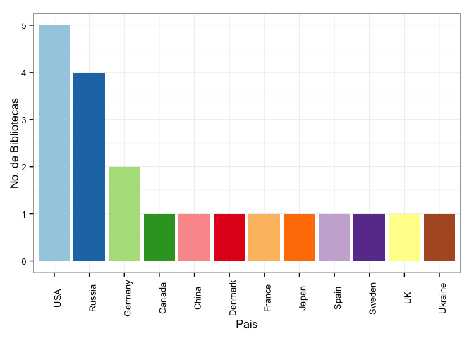
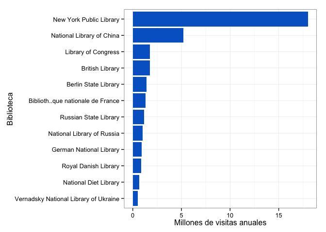

Las bibliotecas públicas son lugares de fácil acceso a la cultura y a los libros. Los precios de los libros y de las boletas a eventos culturales tienden a ser muy altos y por eso no todos tienen el privilegio de asistir a actividades ni de disfrutar un buen libro. Todas las personas tienen derecho al conocimiento y a la cultura, y la mejor manera de ejercer estos derechos es estando en establecimientos que lo permitan, en este caso, las bibliotecas publicas. Cada país cuenta con colecciones de arte, historia y literatura, repartidas en las distintas bibliotecas del territorio; pero más que un lugar en el que se almacenan libros, las bibliotecas públicas cuentan con artículos académicos, colecciones de arte, presentan conciertos e incluso tienen espacios al aire libre para leer y descansar. Por eso estos lugares, más que promover la lectura, educan a la gente por medio de distintas actividades, son espacios públicos y como tales tienen el fin de servir a la sociedad.

En este breve _post_ queremos hablar sobre las bibliotecas públicas más grandes del mundo. Haremos un ranking de acuerdo al número de ejemplares que hay en cada una, al presupesto que reciben éstas y a las visitas que reciben anualmente.

Comenzamos viendo en que países se encuentran las bibliotecas más grandes del mundo. Éstas se encuentran repartidas en tan solo 12 países al rededor del mundo, veamos:

Es claro ver que EEUU es el primero con cinco de las bibliotecas públicas más grandes del mundo, seguido de Rusia con cuatro y Alemania con dos, el resto de países en el ranking tiene una sola biblioteca. Ahora, ¿en dónde exactamente están estas bibliotecas?

|País |Ciudad          |Biblioteca                                                    |
|:--------|:--------------|:-------------------------------------------------------|
|Canada   |Ottawa         |Library and Archives Canada                             |
|China    |Beijing        |National Library of China                               |
|Denmark  |Copenhagen     |Royal Danish Library                                    |
|France   |Paris          |Bibliothèque nationale de France                        |
|Germany  |Berlin         |Berlin State Library                                    |
|Germany  |Frankfurt      |German National Library                                 |
|Japan    |Tokyo          |National Diet Library                                   |
|Russia   |St. Petersburg |Library of the Russian Academy of Sciences              |
|Russia   |St. Petersburg |National Library of Russia                              |
|Russia   |Moscow         |Russian Academy of Sciences Library of Natural Sciences |
|Russia   |Moscow         |Russian State Library                                   |
|Spain    |Madrid         |Biblioteca Nacional de España                           |
|Sweden   |Stockholm      |National Library of Sweden                              |
|UK       |London         |British Library                                         |
|USA      |Boston         |Boston Public Library                                   |
|USA      |Cambridge, MA  |Harvard University Library                              |
|USA      |Washington DC  |Library of Congress                                     |
|USA      |New York       |New York Public Library                                 |
|USA      |Albany         |New York State Library                                  |
|Ukraine  |Kiev           |Vernadsky National Library of Ukraine                   |

Analicemos ahora cuantos ejemplares hay en cada bibliteca. Aunque ya vimos cual es el país con más bibliotecas, queremos ver cuál es la biblioteca más grande de acuerdo con el número de ítems.

 

En este caso la British Library de Londres se lleva el premio con más de 150 millones de ítems, ¿será también la más visitada?

 

La más visitada es la Biblioteca Pública de Nueva York, en la Cuidad de Nueva York con casi 20 millones de visitas al año. Luego está Biblioteca Nacional de China con cinco millones. Algunas desaparecieron del ranking, esto se debe a que no se conoce o no se reportó el dato.

Finalmente nos gustaría conocer cuanto invierte cada uno de estos países en sus bibliotecas.

 

Dado que es el país con más bibliotecas públicas de gran tamaño, es el que más invierte en éstas. Es importante que los países inviertan en este tipo de bibliotecas, la gente necesita de espacios públicos para la recreación y sobretodo, para la educación. Es bueno que existan estos espacios, no solo es importante generar empleo y mejorar la economía, es fundamental que la gente tenga acceso al descanso y a la cultura, sin importar el estrato ni los ingresos.

