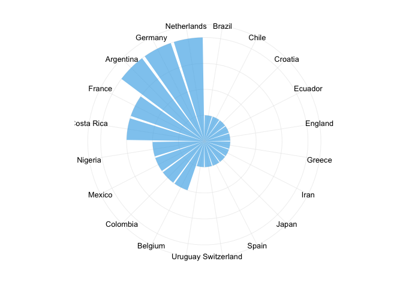
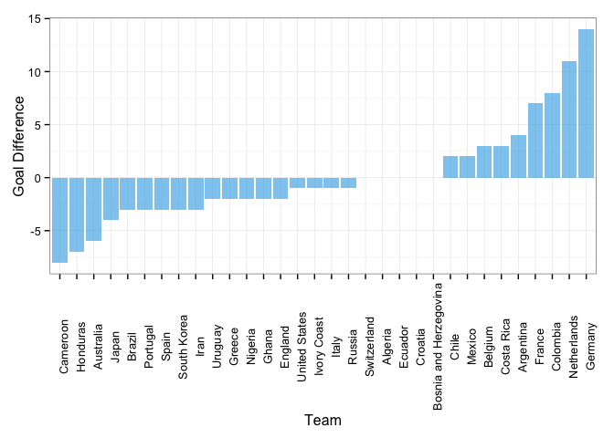
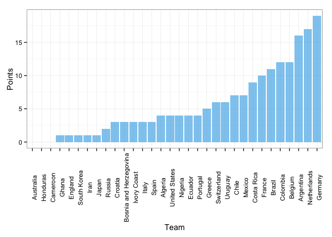

In this post we used the libraries:


```r
library(ggplot2)
library(plyr)
library(knitr)
```

We loaded the following datasets:


```r
data_path <- "data/"
df <- read.csv(paste(data_path, 'fifa-rank.csv', sep = ''),)
df2 <- read.csv(paste(data_path, 'fifa-prog.csv', sep = ''),)
```

In this post we do not use tables, we only make several visualizations in an ordered way. We use the factor() and order() functions in order to organize the observations.

## Clean Sheets

```r
cs <- df[order(df$CS), c("Team","CS")]
cs <- subset(cs, CS >0)
cs$Team <- factor(cs$Team, levels = cs$Team, ordered = TRUE)
q <- ggplot(cs, aes(x = Team, y = CS)) + geom_bar(stat = 'identity', fill="#56B4E9", alpha = "0.7") + theme_bw() + labs(y = 'Clean Sheets')
q <- q + coord_polar()
q <- q + theme(
              axis.line=element_blank()
              ,axis.text.y=element_blank()
              ,axis.ticks=element_blank()
              ,axis.title.x=element_blank()
              ,axis.title.y=element_blank()
              ,panel.border=element_blank()
  )  
q
```

 

## Goal Difference

```r
gd <- df2[order(df2$GD), ]
gd$Team <- factor(gd$Team, levels = gd$Team, ordered = TRUE)
ggplot(gd, aes(x = Team, y = GD, fill = Team)) + geom_bar(stat = 'identity', position = 'identity', fill="#56B4E9", alpha = "0.7")  + theme_bw() + theme(axis.text.x = element_text(angle = 90)) + labs(y = 'Goal Difference')
```

 

## Points

```r
pts <- df2[order(df2$Pts), ]
pts$Team <- factor(pts$Team, levels = pts$Team, ordered = TRUE)
ggplot(pts, aes(x = Team, y = Pts, fill = Team)) + geom_bar(stat = 'identity', fill="#56B4E9", alpha = "0.7") + theme_bw() + theme(axis.text.x = element_text(angle = 90)) + labs(y = 'Points')
```

 
