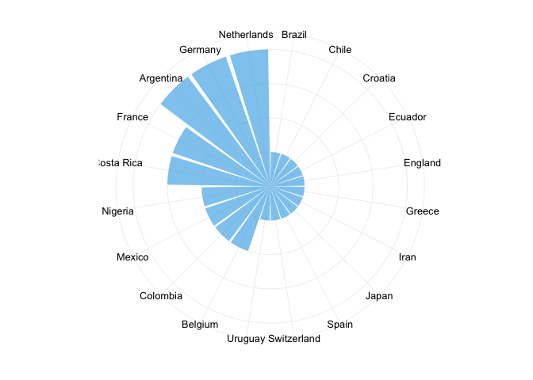
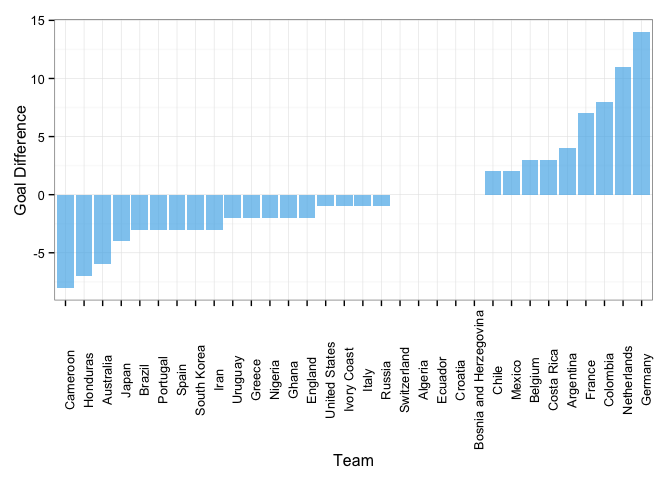
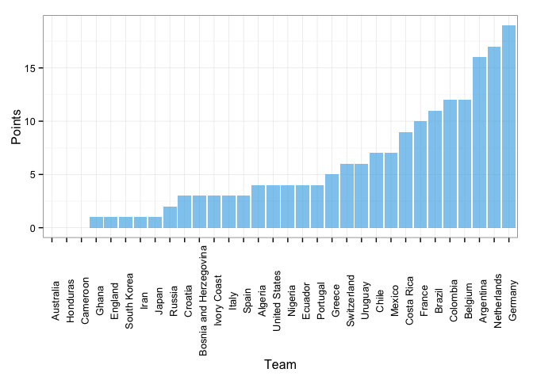

In this post we want to determine who is the champion according to the statistics taken from the World Cup. In soccer there is not much importance in this rankings because the winners already took the trophy home and nobody cares whether they played a flawless tournament or if they had several difficulties. Unlike most sports played in the U.S., where statistics play an important role, in soccer they are often ignored by the fans and the players. However, data can be obtained, and we are very interested in it. That is the reason for this post, to look how the teams performed in the WC, no matter the outcome.

The first item to analyze is what is known as the Clean Sheets. This statistic can be atributed to the goalkeepers, because they are responsible for keeping the score in zero. For example, if the final result of a match is 3-0, the clean sheet goes for the winning team, the team that did not allow any goals.

 

As we can see there is a tie between Argentina, Germany and Netherlands with 4 clean sheets. Or as I prefer, Romero, Neuer and Cillesen.
Now let us take a look at the goal difference. This is quite related to the clean sheets, however it is atributed to the goals that were scored minus the goals received. We will see if those teams that had the most clean sheets have the largest positive goal difference.

 

Brasil, that is painful, -3?!?! Well, the answer is clear, the champion in goal difference is Germany. Interesting fact: After Mezut Özil failed to score the 8th goal against Brasil, Oscar saved the brasilian honor. After, some journalists noted that most of the players in Germany were a little stressed about it and ran to keep playing and scoring. In the end, the journalists refered to the germans as 'machines' and 'beasts'. No wonder they have the largest positive goal difference.

Finally, let's count the points earned by each of the teams and define a ranking by points.

 

As we saw from the last plots, Germany is a complete winner. They deserved to win, their victory was not a coincidence. After the WC 2002, in which Germany lost 2-0 against Brasil, they changed their football philosophy and started the new german football era. With lots of money invested in technology, the german teams started a revolution in soccer. Technology focused on passes and precision made the german clubs and their league increase their quality. German clubs are encouraged, and even forced to train their players to certain level, that of the national team. Only the best players are called to play for the National Team, and it is also not a coincidence that most of them play in the local league, the Bundesliga.