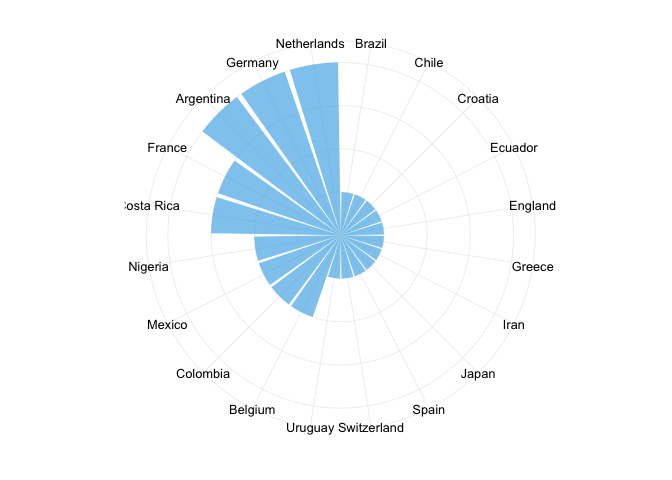
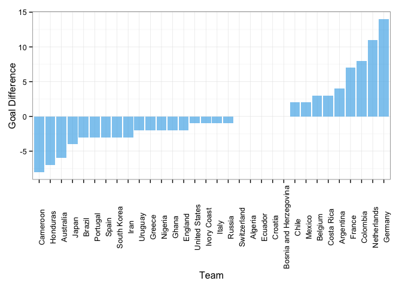
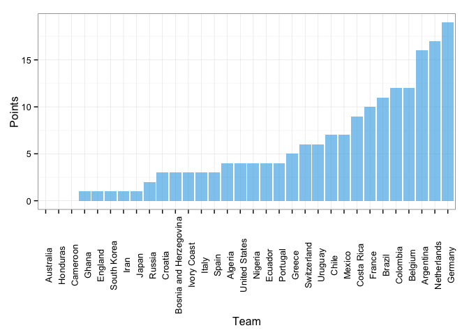

En este datapost queremos determinar quién sería el campeón de la copa según las estadísticas que deja el Mundial. En el fútbol no se le da importancia a este tipo de rankings porque los ganadores ya están en casa celebrando y ya no importa si se jugó bien o mal. A diferencia de los deportes en EEUU, donde las estadísticas juegan un papel importante, en el fútbol son irrelevantes. Sin embargo, se puede obtener mucha información a partir de los datos, y en este caso es lo que nos interesa. Queremos ver entonces cómo actuaron los equipos en el Mundial con estas estadísticas.

Comenzamos por analizar los 'arcos limpios', esto hace referencia a los arqueros, pues son los responsables de mantener el arco en cero. Por ejemplo, si el marcador final es 3-0, el arco limpio le corresponde al equipo ganador, aquel que no permitió goles en su contra.

 

Como podemos ver, hay un empate entre Alemania, Argentina y Holanda con 4 arcos limpios. O mejor, Neuer, Romero y Cillesen. 

Ahora, veamos la diferencia de goles. Esto está relacionado a los arcos limpios de los equipos, pero se refiere a los goles que anotaron menos los goles que recibieron.

 

La respuesta es clara, el campeón por diferencia de goles es Alemania. Finalmente, contemos los puntos ganados por cada uno de los equipos.

 

Como se puede ver en las últimas gráficas, Alemania es un completo ganador. Merecía ganar, su victoria no fue una coincidencia. Después del Mundial de 2002, en el que Alemania pierde 2-0 contra Brasil, los alemanes deciden cambiar su manera de jugar y comenzar la nueva era de su fútbol. Con grandes cantidades de dinero invertidas en tecnología, el equipo alemán revolucionó el fútbol y la manera como se juega. La liga alemana motiva a los clubes a usar la tecnología para mejorar la precisión de los pases, entre otros aspectos. Ojalá el resto de países inviertan en estos cambios para ver cada vez mejores partidos en los mundiales.

