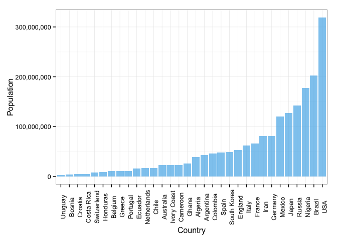
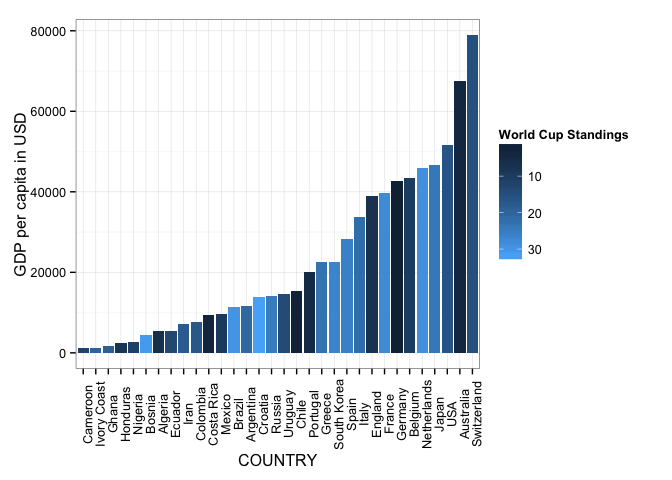
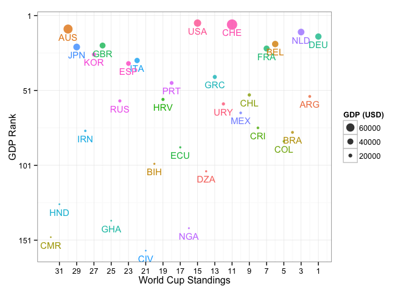
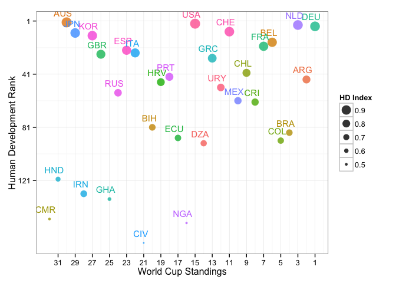
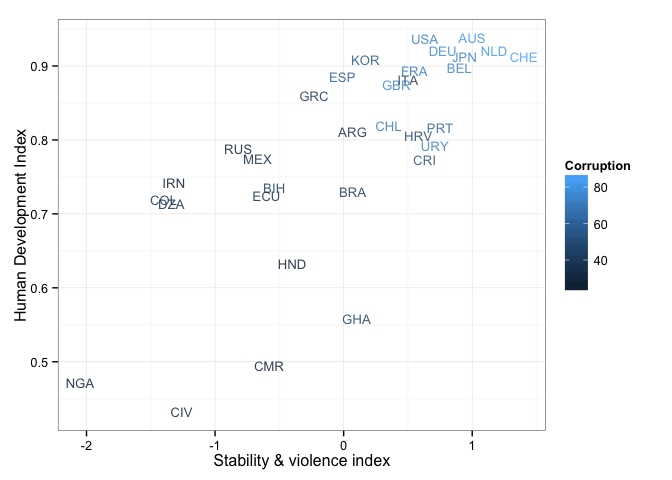

After a wonderful World Cup (WC) earlier this summer, we all ended up a little bummed. Fantastic goals, beautiful plays, nail-biting matches and a lot of excitment was experienced. In this blogpost we will be using socio-economic data to analyze a little bit further each of the competing countries in the WC. Some of the outcomes might be a little overwhelming, nevertheless that is the reality of our society. Some might imply that the economic condition of a country might be reflected in the tournament. It's no surprise given the fact that some of the most powerful countries nowadays showed remarkable results in the WC, however that is just a cloudy hypothesis.

We therefore intend to show some visualizations comparing several indicators of a county's economy and social condition. We will not try to establish if indeed there is a conection between sport performance and socio-economic indices; we will merely expose some of the realities experienced by some of the countries.

In order to get a feel of the size of each country let's take a look at the population in each of them.

 

As expected USA is the biggest country, while the smallest is Uruguay.

Let's look now at th eincome per capita in each country.

 

Now we wish to analyze the relation between the GDP rank (income per capita) and the country's position in the World Cup. The income per capita is measured in thousand of dollars while the ranking is measured according to their actual position in general.

 

From this we can now see that the GDP does not mean the team will be succesful in the world cup, clearly some countries with good GDP performed well while others din't. Same goes for los GDP, some teams got far in the World Cup while others didn't.

Now we will do the same for the Human Development Index (HDI). The HDI measures the average achievements in a country in three basic dimensions of human development: a long and healthy life, access to knowledge and a decent standard of living. We want to compare the HDI world ranking with the World cup ranking in each country. 

 

We see from this last plot that most countries are close to the average HDI, we see that most of the countries are in the top 100 HDI-rank. There is one country with a close-to-average HDI but does not make it in the top 100 HDI-rank nor in the top 20 FIFA-rank. Note also that the highest HDI isn't in the top 20 Fifa-rank either.

Finally we wish to establish a connection between corruption, stability and development. As stated in the beginning, we do not intend to show anything controversial, however the data speaks by itself and the reality is something to be dealt with.

 

Here the higher the value in the corruption the less corrupt the country. It is a score that determines how corrput is the country, so in this case having a big score corresponds to a transparent and not so corrupt government. The stability measures the absence of violence and the political stability.  Summarizing, this last plot exposes some strong realities about the conditions some countries experience. We only asked some questions about these socioeconomic indicators and chose those that were the most informative. We intended nothing different to what we have already shown. We wanted to expose graphically the wide breach in social conditions present in the countries that assisted the WC. Here there is neither champion nor loser, there is only data.
