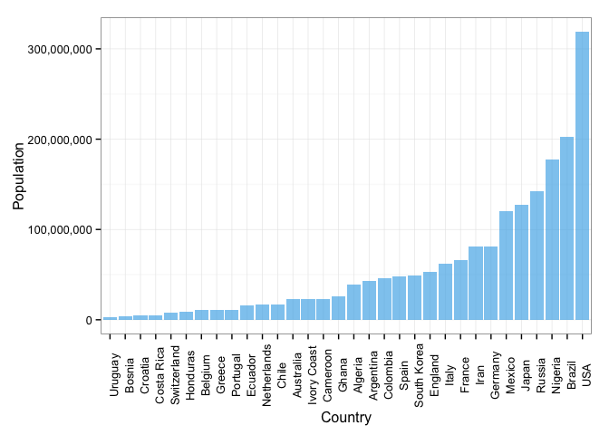
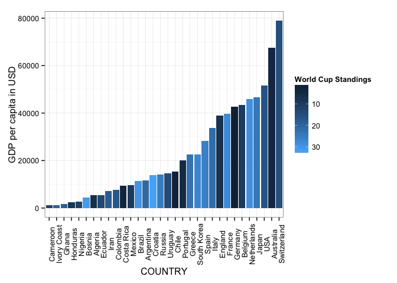
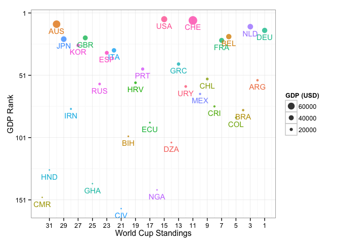
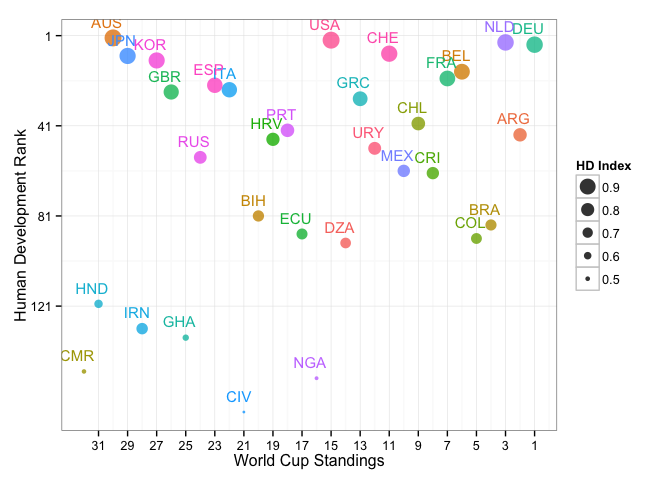
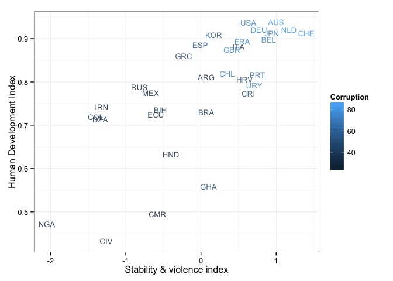

Después de un fantástico mundial, a todos nos queda el sabor amargo de su final. Espectaculares goles, jugadas elegantes y partidos emocionantes se vivieron en la última Copa del Mundo. En este datapost usaremos información socioeconómica para analizar a cada uno de los países participantes. Algunos resultados pueden ser impresionantes, pero esa es la realidad de nuestra sociedad. Algunas personas incluso piensan que la condición económica de un país puede verse reflejada en el campeonato. No es descabellado pensar eso, dado que algunos de los países más poderosos hoy en día mostraron resultados impecables en el Mundial, sin embargo, esta es una hipótesis nublada.

Por lo tanto, nos concentraremos en mostrar algunas visualizaciones donde comparamos varios índices socioeconómicos de los países. No trataremos de establecer si en efecto hay una correlación entre el desempeño deportivo y la condición social de los estados, este post es puramente informativo.

Para tener una idea clara del tamaño de cada país veamos una gráfica de población. 

 

El país con más población es EEUU, mientras que el de menor es Uruguay. Veamos ahora el ingreso per cápita de cada país.

 

Ahora queremos analizar la relación entre el ranking del PIB y la posición final del país en la Copa Mundial. El ingreso per cápita se mide en miles de dólares y la posición de cada Estado es la posición real en el mundo.

 

Podemos inferir que tener un buen PIB no significa ser exitoso en el torneo. Como muestran los datos,  a algunos países les fue bien sin tener el mejor PIB y viceversa.

Ahora haremos lo mismo para el Índice de Desarrollo Humano (IDH, o Human Development Index, HDI en inglés). El IDH es un indicador social estadístico compuesto por tres parámetros: vida larga y saludable, acceso a educación y un estándar de vida digno. Queremos comparar el ranking del IDH con el ranking pos-mundial de cada país.

 

Vemos de esta última visualización que la mayoría de países están cercanos al IDH promedio; vemos también que muchos países están entre los 100 mejores según el IDH. Hay un país con un IDH promedio, pero no entra en el ranking de los top 100 del IDH ni en el top 20 de la FIFA. Notemos también que el país con el IDH más alto no está en el top 20 de la FIFA.

Finalmente, queremos establecer una conexión entre la corrupción, la estabilidad y el desarrollo. Como mencionamos al comienzo, no queremos mostrar nada controversial, pero los datos hablan por sí solos y hay que reconocer la realidad tal como es.

 

Aquí el medidor de corrupción es un puntaje, lo que quiere decir que entre más alto, menos corrupto es el país. Resumiendo, esta última gráfica expone unas impactantes realidades sobre las condiciones que viven algunos países. Aún hay altos índices de corrupción y violencia, y también, buenos resultados en deporte.

Como comentario final: simplemente resolvimos algunas preguntas usando estos indicadores socioeconómicos y escogimos aquellos que son más informativos. No pretendemos nada distinto a lo que presentamos, queríamos exponer gráficamente la gran brecha social que existen en algunos países que participaron en el Mundial. Aquí nadie gana y nadie pierde, solo mostramos los datos.

