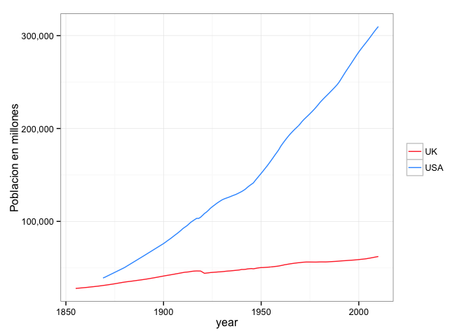
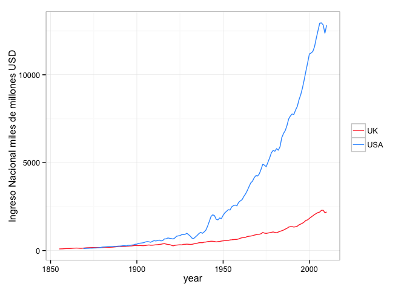
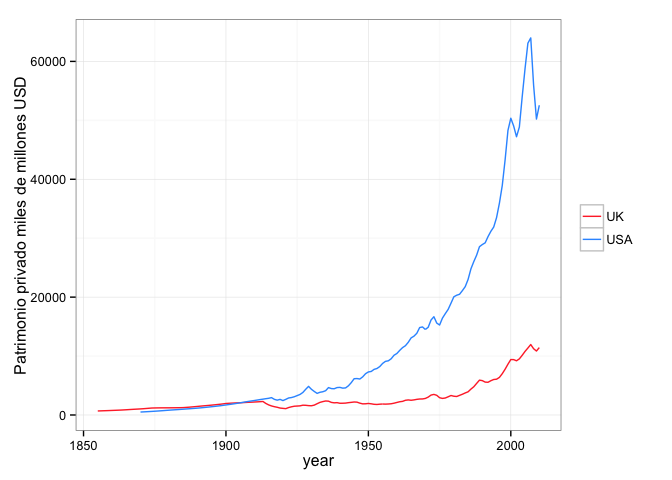
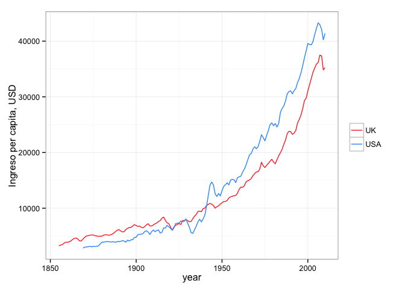
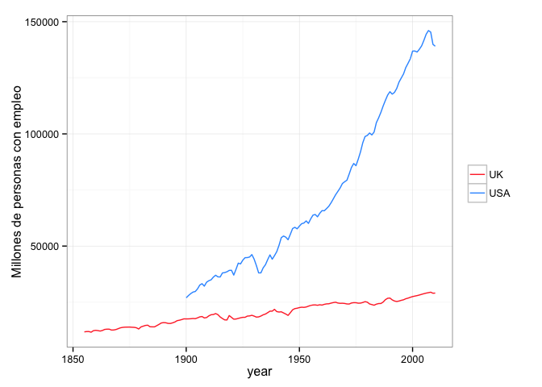

```r
library(ggplot2)
library(scales)
```


```r
data_path <- 'data/'
df <- read.csv(paste0(data_path,'clean.csv'), header = T)
```

### ¿Cómo ha cambiado la población en el tiempo? ###


```r
ggplot(df, aes(x = year, colour = country)) + geom_line(aes(y = df$population)) + theme_bw() + guides(colour = guide_legend(title = NULL)) + labs(y = 'Poblacion en millones') + scale_colour_manual(values = c('#FF3333','#3399FF')) + scale_y_continuous(labels = comma)
```

 

### ¿Cuál ha sido el ingreso nacional? ###


```r
ggplot(df, aes(x = year, colour = country)) + geom_line(aes(y = df$natIncome2010bill)) + theme_bw() + guides(colour = guide_legend(title = NULL)) + labs(y = 'Ingreso Nacional miles de millones USD') + scale_colour_manual(values = c('#FF3333','#3399FF'))
```

 

### ¿Cuál ha sido el patrimonio privado? ###


```r
ggplot(df, aes(x = year, colour = country)) + geom_line(aes(y = df$privWealth2010bill)) + theme_bw() + guides(colour = guide_legend(title = NULL)) + labs(y = 'Patrimonio privado miles de millones USD') + scale_colour_manual(values = c('#FF3333','#3399FF'))
```

```
## Warning: Removed 3 rows containing missing values (geom_path).
```

 

### ¿Cuál ha sido el ingreso per cápita? ###


```r
ggplot(df, aes(x = year, colour = country)) + geom_line(aes(y = df$perCapitaNatIncome2010)) + theme_bw() + guides(colour = guide_legend(title = NULL)) + labs(y = 'Ingreso per capita, USD') + scale_colour_manual(values = c('#FF3333','#3399FF'))
```

 

### ¿Cuál ha sido el patromonio privado per cápita? ###


```r
ggplot(df, aes(x = year, colour = country)) + geom_line(aes(y = df$perCapitaPrivWealth2010)) + theme_bw() + guides(colour = guide_legend(title = NULL)) + labs(y = 'Patrimonio privado per capita, USD') + scale_colour_manual(values = c('#FF3333','#3399FF'))
```

 

### ¿Cómo ha cambiado el empleo en EEUU y en el Reino Unido? ###


```r
ggplot(df, aes(x = year, colour = country)) + geom_line(aes(y = df$employedPopulation)) + theme_bw() + guides(colour = guide_legend(title = NULL)) + labs(y = 'Millones de personas con empleo') + scale_colour_manual(values = c('#FF3333','#3399FF'))
```

 

