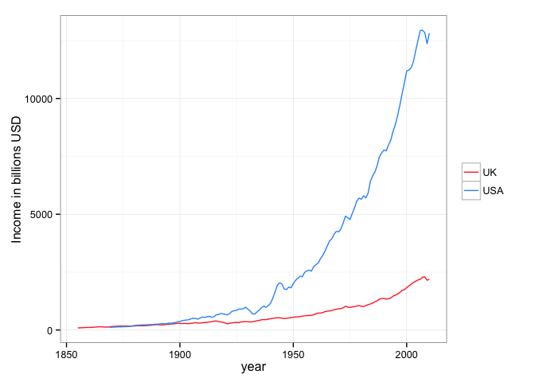

```r
library(ggplot2)
library(scales)
library(googleVis)
```

```
## 
## Welcome to googleVis version 0.5.5
## 
## Please read the Google API Terms of Use
## before you start using the package:
## https://developers.google.com/terms/
## 
## Note, the plot method of googleVis will by default use
## the standard browser to display its output.
## 
## See the googleVis package vignettes for more details,
## or visit http://github.com/mages/googleVis.
## 
## To suppress this message use:
## suppressPackageStartupMessages(library(googleVis))
```

```r
op <- options(gvis.plot.tag='chart')
#options(op)
```


```r
data_path <- 'data/'
df <- read.csv(paste0(data_path,'clean.csv'), header = T)
```

### What has been the change in population over the years? ###


```r
ggplot(df, aes(x = year, colour = country)) + geom_line(aes(y = df$population)) + theme_bw() + guides(colour = guide_legend(title = NULL)) + labs(y = 'Population in millions') + scale_colour_manual(values = c('#FF3333','#3399FF')) + scale_y_continuous(labels = comma)
```

 

### What has been the national income? ###


```r
ggplot(df, aes(x = year, colour = country)) + geom_line(aes(y = df$natIncome2010bill)) + theme_bw() + guides(colour = guide_legend(title = NULL)) + labs(y = 'Income in billions USD') + scale_colour_manual(values = c('#FF3333','#3399FF'))
```

 

### What has been the private wealth? ###


```r
ggplot(df, aes(x = year, colour = country)) + geom_line(aes(y = df$privWealth2010bill)) + theme_bw() + guides(colour = guide_legend(title = NULL)) + labs(y = 'Wealth in billions USD') + scale_colour_manual(values = c('#FF3333','#3399FF'))
```

```
## Warning: Removed 3 rows containing missing values (geom_path).
```

 

### What has been the income per capita? ###


```r
ggplot(df, aes(x = year, colour = country)) + geom_line(aes(y = df$perCapitaNatIncome2010)) + theme_bw() + guides(colour = guide_legend(title = NULL)) + labs(y = 'Income in USD') + scale_colour_manual(values = c('#FF3333','#3399FF'))
```

 

### What has been the private wealth per capita? ###


```r
ggplot(df, aes(x = year, colour = country)) + geom_line(aes(y = df$perCapitaPrivWealth2010)) + theme_bw() + guides(colour = guide_legend(title = NULL)) + labs(y = 'Private Wealth in USD') + scale_colour_manual(values = c('#FF3333','#3399FF'))
```

 

### What has been the evolution of employment in the US and UK? ###


```r
ggplot(df, aes(x = year, colour = country)) + geom_line(aes(y = df$employedPopulation)) + theme_bw() + guides(colour = guide_legend(title = NULL)) + labs(y = 'Employed Population in millions') + scale_colour_manual(values = c('#FF3333','#3399FF'))
```

 


```r
M <- gvisMotionChart(df, idvar="population", timevar="year")
plot(M)
```

<!-- MotionChart generated in R 3.0.2 by googleVis 0.5.5 package -->
<!-- Wed Aug 20 14:12:02 2014 -->


<!-- jsHeader -->
<script type="text/javascript">
 
// jsData 
function gvisDataMotionChartID49c049d85f7c () {
var data = new google.visualization.DataTable();
var datajson =
[
 [
 "39051",
1869,
7.6,
null,
111,
null,
194,
null,
374,
null,
2835,
null,
5453,
null,
null,
90,
4930,
null,
20304,
null,
"USA" 
],
[
 "39905",
1870,
7.8,
33,
119,
502,
195,
820,
375,
1578,
2987,
12584,
5745,
24203,
421,
90,
5195,
466,
20748,
12506,
"USA" 
],
[
 "40938",
1871,
8,
34,
125,
527,
196,
829,
376,
1591,
3045,
12874,
5843,
24702,
423,
90,
5283,
468,
21336,
null,
"USA" 
],
[
 "41972",
1872,
8.1,
35,
129,
554,
193,
827,
369,
1584,
3076,
13193,
5889,
25255,
429,
90,
5324,
474,
21926,
null,
"USA" 
],
[
 "43006",
1873,
8.4,
36,
136,
580,
196,
837,
374,
1599,
3154,
13476,
6024,
25736,
427,
90,
5447,
472,
22519,
null,
"USA" 
],
[
 "44040",
1874,
8.1,
37,
135,
609,
185,
836,
352,
1592,
3056,
13832,
5823,
26353,
453,
90,
5265,
501,
23115,
null,
"USA" 
],
[
 "45073",
1875,
8.2,
37,
142,
640,
182,
821,
346,
1560,
3146,
14194,
5980,
26979,
451,
90,
5407,
499,
23713,
null,
"USA" 
],
[
 "46107",
1876,
8,
37,
144,
671,
173,
809,
328,
1534,
3112,
14551,
5902,
27594,
468,
90,
5336,
517,
24314,
null,
"USA" 
],
[
 "47141",
1877,
8.1,
39,
149,
706,
173,
820,
327,
1551,
3157,
14978,
5974,
28337,
474,
90,
5401,
525,
24917,
null,
"USA" 
],
[
 "48174",
1878,
8,
38,
155,
741,
165,
791,
312,
1493,
3219,
15385,
6076,
29040,
478,
90,
5494,
529,
25523,
null,
"USA" 
],
[
 "49208",
1879,
8.7,
39,
174,
780,
177,
791,
333,
1490,
3540,
15854,
6666,
29855,
448,
90,
6027,
495,
26131,
null,
"USA" 
],
[
 "50262",
1880,
10.2,
43,
195,
815,
203,
850,
382,
1597,
3875,
16209,
7281,
30454,
418,
90,
6583,
463,
26753,
17392,
"USA" 
],
[
 "51542",
1881,
10.5,
44,
202,
849,
204,
859,
383,
1611,
3911,
16463,
7331,
30859,
421,
90,
6629,
466,
27498,
null,
"USA" 
],
[
 "54100",
1883,
11.2,
47,
217,
914,
206,
870,
385,
1623,
4007,
16903,
7475,
31537,
422,
90,
6759,
467,
28996,
null,
"USA" 
],
[
 "55379",
1884,
10.9,
47,
221,
949,
196,
842,
365,
1568,
3989,
17129,
7425,
31885,
429,
90,
6714,
475,
29750,
null,
"USA" 
],
[
 "56658",
1885,
10.7,
47,
222,
984,
188,
834,
350,
1549,
3924,
17370,
7288,
32260,
443,
90,
6589,
490,
30506,
null,
"USA" 
],
[
 "57938",
1886,
11,
49,
229,
1019,
190,
844,
352,
1564,
3952,
17580,
7323,
32576,
445,
90,
6621,
492,
31267,
null,
"USA" 
],
[
 "59217",
1887,
11.3,
50,
235,
1052,
190,
853,
352,
1576,
3967,
17759,
7333,
32832,
448,
90,
6631,
495,
32030,
null,
"USA" 
],
[
 "60496",
1888,
11.4,
53,
234,
1091,
188,
880,
348,
1623,
3863,
18032,
7125,
33261,
467,
90,
6442,
516,
32797,
null,
"USA" 
],
[
 "61775",
1889,
12.1,
55,
248,
1126,
196,
891,
362,
1639,
4021,
18227,
7400,
33544,
453,
90,
6690,
501,
33566,
null,
"USA" 
],
[
 "63056",
1890,
12,
56,
252,
1165,
191,
881,
350,
1618,
3998,
18482,
7340,
33937,
462,
90,
6637,
511,
34340,
23318,
"USA" 
],
[
 "64361",
1891,
12.4,
58,
260,
1208,
193,
895,
353,
1640,
4039,
18775,
7399,
34398,
465,
90,
6690,
514,
35130,
null,
"USA" 
],
[
 "65666",
1892,
12.9,
59,
274,
1255,
197,
900,
359,
1645,
4174,
19106,
7630,
34924,
458,
90,
6898,
506,
35924,
null,
"USA" 
],
[
 "66970",
1893,
12.9,
62,
274,
1303,
193,
919,
353,
1676,
4093,
19454,
7464,
35481,
475,
90,
6749,
526,
36719,
null,
"USA" 
],
[
 "68275",
1894,
11.9,
61,
266,
1352,
174,
886,
317,
1613,
3895,
19808,
7088,
36045,
509,
90,
6409,
562,
37519,
null,
"USA" 
],
[
 "69580",
1895,
13.1,
62,
297,
1405,
188,
889,
342,
1614,
4273,
20193,
7757,
36663,
473,
90,
7014,
523,
38322,
null,
"USA" 
],
[
 "70885",
1896,
12.8,
64,
291,
1458,
181,
908,
328,
1646,
4101,
20574,
7429,
37273,
502,
90,
6717,
555,
39128,
null,
"USA" 
],
[
 "72189",
1897,
13.6,
66,
312,
1514,
188,
913,
339,
1649,
4316,
20976,
7801,
37916,
486,
90,
7053,
538,
39937,
null,
"USA" 
],
[
 "73494",
1898,
14.1,
69,
319,
1568,
191,
941,
345,
1697,
4337,
21336,
7822,
38480,
492,
90,
7072,
544,
40750,
null,
"USA" 
],
[
 "74799",
1899,
15.9,
73,
356,
1635,
213,
980,
383,
1763,
4755,
21861,
8557,
39340,
460,
90,
7737,
508,
41566,
null,
"USA" 
],
[
 "76094",
1900,
16.6,
78,
363,
1705,
218,
1024,
391,
1840,
4768,
22406,
8561,
40231,
470,
90,
7741,
520,
42379,
26956,
"USA" 
],
[
 "77584",
1901,
18.7,
81,
407,
1769,
241,
1049,
432,
1876,
5248,
22805,
9389,
40800,
435,
90,
8489,
481,
43365,
27948,
"USA" 
],
[
 "79163",
1902,
19.5,
86,
419,
1838,
247,
1083,
440,
1930,
5290,
23214,
9431,
41383,
439,
90,
8527,
485,
44406,
28807,
"USA" 
],
[
 "80632",
1903,
20.6,
91,
431,
1911,
256,
1135,
454,
2015,
5339,
23698,
9485,
42095,
444,
90,
8576,
491,
45392,
29494,
"USA" 
],
[
 "82166",
1904,
21.6,
96,
447,
1988,
263,
1168,
465,
2067,
5443,
24190,
9634,
42817,
444,
90,
8711,
492,
46421,
29750,
"USA" 
],
[
 "83822",
1905,
23.6,
100,
487,
2064,
281,
1190,
496,
2099,
5816,
24626,
10257,
43433,
423,
90,
9274,
468,
47525,
30918,
"USA" 
],
[
 "85450",
1906,
25.3,
107,
508,
2148,
297,
1254,
521,
2205,
5945,
25136,
10448,
44176,
423,
90,
9446,
468,
48620,
32638,
"USA" 
],
[
 "87008",
1907,
25.8,
117,
496,
2235,
297,
1339,
520,
2345,
5697,
25690,
9978,
44991,
451,
90,
9022,
499,
49681,
33238,
"USA" 
],
[
 "88710",
1908,
23.9,
118,
469,
2312,
270,
1329,
470,
2320,
5283,
26061,
9219,
45481,
493,
90,
8336,
546,
50831,
32136,
"USA" 
],
[
 "90490",
1909,
26.7,
122,
523,
2386,
295,
1347,
514,
2342,
5784,
26363,
10059,
45848,
456,
90,
9095,
504,
52033,
33897,
"USA" 
],
[
 "92407",
1910,
28,
122,
562,
2458,
302,
1324,
524,
2294,
6077,
26597,
10532,
46094,
438,
90,
9522,
484,
53321,
34559,
"USA" 
],
[
 "93863",
1911,
28.8,
135,
543,
2537,
307,
1433,
529,
2475,
5780,
27024,
9982,
46670,
468,
90,
9025,
517,
54350,
34960,
"USA" 
],
[
 "95335",
1912,
31,
142,
570,
2617,
325,
1492,
560,
2568,
5983,
27456,
10297,
47252,
459,
90,
9310,
508,
55394,
36173,
"USA" 
],
[
 "97225",
1913,
32.5,
148,
593,
2689,
334,
1518,
574,
2603,
6096,
27657,
10455,
47435,
454,
90,
9453,
502,
56687,
37004,
"USA" 
],
[
 "99111",
1914,
30.5,
154,
548,
2764,
307,
1550,
525,
2650,
5530,
27889,
9451,
47668,
504,
90,
8545,
558,
57986,
36281,
"USA" 
],
[
 "100546",
1915,
32.3,
161,
568,
2834,
322,
1604,
548,
2732,
5654,
28188,
9630,
48014,
499,
90,
8707,
551,
59028,
36223,
"USA" 
],
[
 "101961",
1916,
40.9,
182,
660,
2944,
401,
1790,
681,
3038,
6476,
28873,
10994,
49014,
446,
90,
9940,
493,
60063,
38014,
"USA" 
],
[
 "103268",
1917,
49.3,
197,
664,
2655,
477,
1907,
809,
3234,
6431,
25705,
10902,
43578,
400,
90,
9857,
442,
60914,
38175,
"USA" 
],
[
 "103208",
1918,
62.3,
219,
715,
2517,
604,
2127,
1031,
3629,
6926,
24389,
11819,
41621,
352,
90,
10687,
389,
60477,
38540,
"USA" 
],
[
 "104514",
1919,
69.1,
263,
694,
2648,
661,
2521,
1118,
4266,
6642,
25336,
11240,
42877,
381,
90,
10163,
422,
61758,
39150,
"USA" 
],
[
 "106461",
1920,
78,
281,
679,
2445,
733,
2637,
1236,
4449,
6382,
22967,
10764,
38740,
360,
90,
9733,
398,
63117,
39208,
"USA" 
],
[
 "108538",
1921,
65.5,
265,
656,
2651,
604,
2441,
1018,
4116,
6041,
24421,
10187,
41184,
404,
90,
9211,
447,
64360,
37061,
"USA" 
],
[
 "110049",
1922,
66.1,
268,
712,
2887,
601,
2436,
1013,
4110,
6467,
26231,
10908,
44249,
406,
90,
9863,
449,
65237,
39637,
"USA" 
],
[
 "111947",
1923,
77.5,
283,
811,
2959,
693,
2526,
1166,
4253,
7248,
26435,
12202,
44502,
365,
90,
11032,
403,
66498,
42395,
"USA" 
],
[
 "114109",
1924,
79.6,
296,
833,
3096,
698,
2594,
1172,
4357,
7296,
27131,
12253,
45564,
372,
90,
11078,
411,
67945,
42045,
"USA" 
],
[
 "115829",
1925,
82.9,
320,
851,
3290,
715,
2764,
1198,
4631,
7350,
28403,
12313,
47585,
386,
90,
11133,
427,
69137,
43716,
"USA" 
],
[
 "117397",
1926,
88.3,
341,
903,
3486,
752,
2905,
1255,
4849,
7688,
29693,
12830,
49552,
386,
90,
11600,
427,
70348,
44828,
"USA" 
],
[
 "119035",
1927,
87,
367,
905,
3822,
731,
3087,
1215,
5132,
7603,
32108,
12637,
53369,
422,
90,
11426,
467,
71615,
44856,
"USA" 
],
[
 "120509",
1928,
87.9,
416,
922,
4364,
729,
3454,
1206,
5711,
7648,
36216,
12646,
59882,
474,
90,
11434,
524,
72882,
45123,
"USA" 
],
[
 "121878",
1929,
93.9,
464,
982,
4856,
770,
3810,
1267,
6266,
8057,
39845,
13249,
65526,
495,
90,
11979,
547,
74112,
46207,
"USA" 
],
[
 "123188",
1930,
82.9,
402,
900,
4363,
673,
3263,
1098,
5324,
7304,
35417,
11917,
57785,
485,
90,
10709,
540,
75505,
44183,
"USA" 
],
[
 "124149",
1931,
67.4,
330,
816,
3994,
543,
2658,
880,
4307,
6572,
32175,
10649,
52133,
490,
91,
9716,
537,
76620,
41305,
"USA" 
],
[
 "124949",
1932,
51.1,
268,
700,
3668,
409,
2142,
658,
3445,
5606,
29359,
9017,
47222,
524,
89,
7994,
591,
77683,
38038,
"USA" 
],
[
 "125690",
1933,
48.8,
274,
687,
3854,
388,
2177,
620,
3474,
5469,
30667,
8727,
48937,
561,
87,
7600,
644,
78764,
38052,
"USA" 
],
[
 "126485",
1934,
58.1,
295,
776,
3943,
459,
2335,
727,
3696,
6133,
31176,
9707,
49343,
508,
88,
8571,
576,
79915,
40310,
"USA" 
],
[
 "127362",
1935,
66,
315,
864,
4124,
518,
2474,
814,
3888,
6781,
32379,
10654,
50871,
477,
88,
9427,
540,
81064,
41673,
"USA" 
],
[
 "128181",
1936,
74.7,
359,
967,
4650,
583,
2802,
909,
4372,
7545,
36279,
11772,
56603,
481,
89,
10448,
542,
82156,
43989,
"USA" 
],
[
 "128961",
1937,
83.3,
361,
1034,
4480,
646,
2799,
1001,
4338,
8016,
34740,
12422,
53837,
433,
86,
10707,
503,
83216,
46068,
"USA" 
],
[
 "129969",
1938,
76.6,
348,
979,
4452,
589,
2680,
908,
4130,
7533,
34256,
11608,
52787,
455,
86,
10032,
526,
84344,
44142,
"USA" 
],
[
 "131028",
1939,
82,
360,
1058,
4651,
626,
2750,
959,
4215,
8078,
35496,
12381,
54407,
439,
87,
10796,
504,
85486,
45738,
"USA" 
],
[
 "132122",
1940,
90.9,
367,
1160,
4684,
688,
2779,
1047,
4228,
8777,
35449,
13355,
53938,
404,
86,
11548,
467,
86832,
47520,
"USA" 
],
[
 "133402",
1941,
116,
381,
1384,
4557,
868,
2858,
1313,
4323,
10377,
34160,
15699,
51682,
329,
83,
12974,
398,
88173,
50350,
"USA" 
],
[
 "134860",
1942,
150,
415,
1657,
4595,
1109,
3074,
1669,
4629,
12287,
34069,
18502,
51302,
277,
82,
15135,
339,
89560,
53750,
"USA" 
],
[
 "136739",
1943,
184,
471,
1937,
4957,
1347,
3448,
2024,
5181,
14164,
36250,
21284,
54471,
256,
76,
16281,
335,
90999,
54470,
"USA" 
],
[
 "138397",
1944,
198,
535,
2034,
5496,
1431,
3867,
2143,
5793,
14693,
39715,
22014,
59501,
270,
78,
17200,
346,
92376,
53960,
"USA" 
],
[
 "139928",
1945,
198,
615,
1984,
6156,
1417,
4397,
2116,
6567,
14179,
43995,
21176,
65703,
310,
79,
16691,
394,
93697,
52820,
"USA" 
],
[
 "141389",
1946,
199,
691,
1776,
6183,
1405,
4889,
2092,
7282,
12563,
43728,
18710,
65127,
348,
82,
15347,
424,
94933,
55250,
"USA" 
],
[
 "144126",
1947,
216,
757,
1745,
6104,
1501,
5249,
2249,
7865,
12110,
42354,
18146,
63466,
350,
81,
14683,
432,
96183,
57812,
"USA" 
],
[
 "146631",
1948,
243,
846,
1854,
6468,
1654,
5773,
2487,
8677,
12642,
44109,
19002,
66300,
349,
82,
15631,
424,
97552,
58359,
"USA" 
],
[
 "149188",
1949,
238,
915,
1818,
7003,
1592,
6132,
2400,
9246,
12187,
46939,
18376,
70777,
385,
84,
15389,
460,
98941,
57683,
"USA" 
],
[
 "151684",
1950,
264,
964,
1999,
7304,
1740,
6358,
2633,
9623,
13176,
48150,
19941,
72873,
365,
82,
16319,
447,
100224,
58892,
"USA" 
],
[
 "154287",
1951,
304,
1046,
2146,
7387,
1969,
6778,
2995,
10308,
13910,
47882,
21154,
72818,
344,
78,
16517,
441,
101452,
59967,
"USA" 
],
[
 "156954",
1952,
321,
1115,
2231,
7741,
2047,
7102,
3131,
10862,
14217,
49323,
21743,
75434,
347,
78,
16944,
445,
102626,
60273,
"USA" 
],
[
 "159565",
1953,
339,
1149,
2324,
7886,
2122,
7202,
3268,
11091,
14562,
49422,
22426,
76112,
339,
78,
17462,
436,
103611,
61206,
"USA" 
],
[
 "162391",
1954,
339,
1209,
2303,
8219,
2086,
7443,
3237,
11553,
14183,
50615,
22014,
78563,
357,
80,
17570,
447,
104623,
60106,
"USA" 
],
[
 "165275",
1955,
372,
1309,
2487,
8751,
2251,
7920,
3523,
12395,
15048,
52950,
23552,
82870,
352,
79,
18605,
445,
105603,
62130,
"USA" 
],
[
 "168221",
1956,
395,
1408,
2553,
9101,
2348,
8369,
3701,
13197,
15175,
54102,
23928,
85307,
357,
79,
18852,
453,
106687,
63792,
"USA" 
],
[
 "171274",
1957,
413,
1469,
2586,
9193,
2413,
8579,
3836,
13637,
15097,
53673,
23998,
85317,
356,
79,
19000,
449,
107748,
64065,
"USA" 
],
[
 "174141",
1958,
416,
1559,
2543,
9540,
2387,
8953,
3823,
14342,
14603,
54783,
23393,
87757,
375,
81,
18875,
465,
108710,
63043,
"USA" 
],
[
 "177130",
1959,
454,
1676,
2742,
10137,
2560,
9464,
4114,
15209,
15482,
57230,
24880,
91969,
370,
80,
19795,
465,
110223,
64628,
"USA" 
],
[
 "180760",
1960,
474,
1749,
2826,
10433,
2622,
9678,
4258,
15716,
15635,
57715,
25390,
93722,
369,
79,
20038,
468,
111314,
65785,
"USA" 
],
[
 "183742",
1961,
491,
1859,
2894,
10963,
2671,
10118,
4364,
16532,
15749,
59666,
25733,
97493,
379,
80,
20477,
476,
112450,
65744,
"USA" 
],
[
 "186590",
1962,
529,
1965,
3077,
11433,
2834,
10532,
4649,
17276,
16490,
61274,
27049,
100507,
372,
79,
21433,
469,
113754,
66701,
"USA" 
],
[
 "189300",
1963,
560,
2042,
3222,
11755,
2957,
10787,
4863,
17742,
17021,
62098,
27995,
102134,
365,
79,
22034,
464,
115096,
67759,
"USA" 
],
[
 "191927",
1964,
601,
2176,
3409,
12335,
3134,
11338,
5149,
18631,
17763,
64271,
29190,
105614,
362,
80,
23298,
453,
116796,
69301,
"USA" 
],
[
 "194347",
1965,
652,
2350,
3631,
13081,
3356,
12090,
5514,
19865,
18683,
67307,
30699,
110598,
360,
80,
24510,
451,
118275,
71070,
"USA" 
],
[
 "196599",
1966,
710,
2470,
3844,
13374,
3612,
12566,
5931,
20634,
19555,
68026,
32111,
111706,
348,
79,
25419,
439,
119724,
72878,
"USA" 
],
[
 "198752",
1967,
750,
2639,
3941,
13862,
3776,
13280,
6194,
21788,
19829,
69747,
32533,
114430,
352,
80,
25891,
442,
121143,
74376,
"USA" 
],
[
 "200745",
1968,
821,
2945,
4137,
14836,
4091,
14670,
6649,
23844,
20609,
73906,
33497,
120125,
359,
78,
26261,
457,
123507,
75913,
"USA" 
],
[
 "202736",
1969,
888,
3112,
4266,
14940,
4382,
15350,
7077,
24788,
21040,
73693,
33977,
119006,
350,
77,
26267,
453,
125543,
77875,
"USA" 
],
[
 "205089",
1970,
930,
3181,
4239,
14509,
4532,
15513,
7281,
24919,
20669,
70744,
33202,
113640,
342,
80,
26443,
430,
127674,
78669,
"USA" 
],
[
 "207692",
1971,
1006,
3428,
4368,
14889,
4842,
16505,
7690,
26213,
21030,
71689,
33400,
113855,
341,
81,
27029,
421,
130774,
79354,
"USA" 
],
[
 "209924",
1972,
1110,
3872,
4623,
16122,
5289,
18444,
8317,
29003,
22023,
76797,
34630,
120759,
349,
80,
27687,
436,
133502,
82135,
"USA" 
],
[
 "211939",
1973,
1246,
4227,
4916,
16673,
5879,
19942,
9162,
31076,
23194,
78670,
36142,
122591,
339,
80,
28943,
424,
136006,
85052,
"USA" 
],
[
 "213898",
1974,
1341,
4313,
4852,
15597,
6272,
20163,
9690,
31152,
22681,
72920,
35043,
112663,
321,
80,
28078,
401,
138444,
86803,
"USA" 
],
[
 "215981",
1975,
1444,
4620,
4771,
15267,
6686,
21392,
10237,
32755,
22092,
70685,
33826,
108231,
320,
84,
28299,
382,
141055,
85830,
"USA" 
],
[
 "218086",
1976,
1610,
5260,
5030,
16438,
7381,
24121,
11210,
36630,
23066,
75374,
35028,
114463,
327,
83,
28956,
395,
143609,
88753,
"USA" 
],
[
 "220289",
1977,
1797,
5854,
5280,
17197,
8159,
26575,
12285,
40013,
23969,
78066,
36090,
117542,
326,
82,
29596,
397,
146305,
92017,
"USA" 
],
[
 "222629",
1978,
2028,
6527,
5566,
17917,
9109,
29318,
13597,
43764,
25003,
80477,
37323,
120131,
322,
82,
30454,
394,
149142,
96046,
"USA" 
],
[
 "225106",
1979,
2248,
7485,
5698,
18969,
9988,
33252,
14781,
49211,
25311,
84266,
37458,
124709,
333,
81,
30468,
409,
152105,
98826,
"USA" 
],
[
 "227726",
1980,
2433,
8635,
5650,
20055,
10684,
37919,
15669,
55615,
24812,
88066,
36391,
129163,
355,
82,
29997,
431,
155268,
99303,
"USA" 
],
[
 "230008",
1981,
2730,
9571,
5797,
20323,
11868,
41612,
17274,
60563,
25202,
88360,
36680,
128602,
351,
82,
30223,
426,
158033,
100400,
"USA" 
],
[
 "232218",
1982,
2851,
10235,
5707,
20483,
12279,
44073,
17748,
63701,
24574,
88205,
35519,
127488,
359,
85,
30043,
424,
160665,
99529,
"USA" 
],
[
 "234333",
1983,
3071,
10961,
5912,
21103,
13105,
46777,
18824,
67193,
25229,
90056,
36241,
129360,
357,
85,
30981,
418,
163135,
100821,
"USA" 
],
[
 "236394",
1984,
3461,
11738,
6423,
21780,
14642,
49653,
20895,
70858,
27169,
92132,
38772,
131479,
339,
85,
32996,
398,
165650,
105003,
"USA" 
],
[
 "238506",
1985,
3696,
12771,
6657,
23001,
15497,
53547,
21975,
75927,
27911,
96438,
39576,
136744,
346,
85,
33490,
408,
168205,
107154,
"USA" 
],
[
 "240683",
1986,
3871,
14073,
6822,
24797,
16085,
58472,
22699,
82513,
28343,
103029,
39996,
145391,
364,
84,
33732,
431,
170556,
109601,
"USA" 
],
[
 "242843",
1987,
4150,
15197,
7106,
26023,
17089,
62580,
24051,
88073,
29263,
107158,
41183,
150810,
366,
84,
34438,
438,
172552,
112439,
"USA" 
],
[
 "245061",
1988,
4522,
16383,
7486,
27121,
18454,
66852,
25939,
93969,
30549,
110671,
42941,
155561,
362,
84,
35964,
433,
174344,
114974,
"USA" 
],
[
 "247387",
1989,
4801,
17903,
7658,
28559,
19405,
72368,
27266,
101686,
30955,
115444,
43496,
162214,
373,
84,
36342,
446,
176060,
117327,
"USA" 
],
[
 "250181",
1990,
5060,
18831,
7771,
28924,
20224,
75271,
28366,
105578,
31063,
115613,
43570,
162164,
372,
84,
36709,
442,
178365,
118796,
"USA" 
],
[
 "253530",
1991,
5218,
19693,
7740,
29213,
20581,
77677,
28832,
108816,
30529,
115223,
42768,
161415,
377,
86,
36658,
440,
180978,
117712,
"USA" 
],
[
 "256922",
1992,
5517,
20889,
7994,
30269,
21474,
81305,
30075,
113872,
31116,
117813,
43580,
165003,
379,
87,
37723,
437,
183443,
118488,
"USA" 
],
[
 "260282",
1993,
5785,
21985,
8201,
31168,
22225,
84465,
31153,
118398,
31508,
119746,
44166,
167853,
380,
86,
38155,
440,
185685,
120258,
"USA" 
],
[
 "263455",
1994,
6181,
22973,
8582,
31896,
23462,
87198,
32922,
122354,
32576,
121070,
45710,
169882,
372,
86,
39152,
434,
187757,
123071,
"USA" 
],
[
 "266588",
1995,
6522,
24629,
8871,
33497,
24466,
92385,
34344,
129686,
33276,
125653,
46711,
176385,
378,
86,
40041,
441,
189911,
124908,
"USA" 
],
[
 "269714",
1996,
6932,
26933,
9252,
35947,
25700,
99858,
36094,
140245,
34302,
133280,
48175,
187184,
389,
85,
40959,
457,
192043,
126720,
"USA" 
],
[
 "272958",
1997,
7406,
29693,
9713,
38943,
27132,
108782,
38092,
152721,
35585,
142671,
49958,
200298,
401,
84,
41971,
477,
194426,
129572,
"USA" 
],
[
 "276154",
1998,
7876,
33389,
10214,
43301,
28519,
120906,
40019,
169662,
36985,
156800,
51900,
220031,
424,
83,
43133,
510,
196795,
131476,
"USA" 
],
[
 "279328",
1999,
8358,
37787,
10682,
48295,
29922,
135279,
41946,
189642,
38243,
172898,
53611,
242380,
452,
82,
44176,
549,
199255,
133501,
"USA" 
],
[
 "282398",
2000,
8939,
40256,
11183,
50360,
31654,
142551,
44282,
199421,
39598,
178330,
55396,
249474,
450,
82,
45292,
551,
201865,
136901,
"USA" 
],
[
 "285225",
2001,
9185,
40089,
11237,
49043,
32203,
140552,
44954,
196203,
39396,
171946,
54995,
240028,
436,
84,
45923,
523,
204323,
136939,
"USA" 
],
[
 "287955",
2002,
9409,
39218,
11327,
47213,
32674,
136193,
45493,
189630,
39335,
163959,
54768,
228290,
417,
86,
47212,
484,
206811,
136481,
"USA" 
],
[
 "290626",
2003,
9840,
41442,
11602,
48863,
33859,
142596,
47143,
198545,
39922,
168131,
55585,
234099,
421,
87,
48228,
485,
208729,
137730,
"USA" 
],
[
 "293262",
2004,
10534,
47100,
12080,
54013,
35920,
160607,
50014,
223622,
41193,
184180,
57355,
256445,
447,
86,
49572,
517,
210622,
139240,
"USA" 
],
[
 "295993",
2005,
11274,
52969,
12513,
58792,
38088,
178955,
53032,
249169,
42275,
198625,
58862,
276558,
470,
85,
50086,
552,
212584,
141710,
"USA" 
],
[
 "298818",
2006,
12031,
58682,
12936,
63094,
40263,
196382,
56060,
273434,
43290,
211146,
60275,
293990,
488,
84,
50805,
579,
214613,
144418,
"USA" 
],
[
 "301696",
2007,
12396,
61241,
12952,
63988,
41089,
202990,
57211,
282635,
42932,
212095,
59777,
295313,
494,
84,
50456,
585,
216680,
146050,
"USA" 
],
[
 "304543",
2008,
12558,
54754,
12837,
55969,
41235,
179791,
57414,
250333,
42150,
183781,
58688,
255890,
436,
87,
50963,
502,
218725,
145371,
"USA" 
],
[
 "307240",
2009,
12225,
49643,
12366,
50214,
39790,
161577,
55402,
224974,
40248,
163437,
56040,
227563,
406,
91,
51241,
444,
220662,
139888,
"USA" 
],
[
 "309774",
2010,
12822,
52559,
12822,
52559,
41390,
169668,
57630,
236238,
41390,
169668,
57630,
236238,
410,
91,
52612,
449,
222481,
139070,
"USA" 
],
[
 "27822",
1855,
0.7,
5,
90.18,
681.36,
24,
180,
45,
338,
3239.8,
24490.55,
6080.47,
45973.43,
756,
null,
null,
null,
14821,
11760,
"UK" 
],
[
 "28011",
1856,
0.7,
5.2,
94.522,
700.732,
25,
184,
47,
345,
3373.4,
25018.27,
6332.64,
46965.41,
742,
null,
null,
null,
14922,
11890,
"UK" 
],
[
 "28187",
1857,
0.7,
5,
97.361,
718.1,
24,
178,
45,
335,
3455.23,
25477.52,
6486.28,
47827.13,
737,
null,
null,
null,
15016,
11910,
"UK" 
],
[
 "28390",
1858,
0.7,
4.7,
105.377,
734.299,
24,
165,
44,
309,
3714.08,
25864.96,
6972.25,
48553.58,
696,
null,
null,
null,
15124,
11610,
"UK" 
],
[
 "28591",
1859,
0.7,
4.7,
111.222,
752.669,
24,
166,
46,
311,
3887.76,
26322.54,
7297.9,
49411.96,
677,
null,
null,
null,
15231,
12280,
"UK" 
],
[
 "28778",
1860,
0.7,
5,
111.723,
772.542,
25,
175,
47,
328,
3881.08,
26843.58,
7284.54,
50390.58,
692,
null,
null,
null,
15331,
12450,
"UK" 
],
[
 "28976",
1861,
0.8,
5.3,
114.896,
791.747,
26,
182,
49,
341,
3962.91,
27326.21,
7438.18,
51297.39,
690,
null,
null,
null,
15436,
12320,
"UK" 
],
[
 "29245",
1862,
0.8,
5.3,
120.407,
811.453,
27,
181,
51,
343,
4118.22,
27747.05,
7820.61,
52691.84,
674,
null,
null,
null,
15400,
12120,
"UK" 
],
[
 "29471",
1863,
0.8,
5.2,
129.425,
832.161,
28,
178,
53,
338,
4393.77,
28236.36,
8343.32,
53622.03,
643,
null,
null,
null,
15519,
12390,
"UK" 
],
[
 "29681",
1864,
0.8,
5.3,
135.604,
858.046,
28,
180,
54,
342,
4570.79,
28909.37,
8678.99,
54901.25,
633,
null,
null,
null,
15629,
12850,
"UK" 
],
[
 "29925",
1865,
0.9,
5.6,
139.111,
886.937,
29,
187,
56,
355,
4647.61,
29635.82,
8827.62,
56282.34,
638,
null,
null,
null,
15758,
12960,
"UK" 
],
[
 "30148",
1866,
0.9,
6.1,
134.936,
918.834,
30,
203,
57,
385,
4478.94,
30479.17,
8505.31,
57882.2,
681,
null,
null,
null,
15875,
12960,
"UK" 
],
[
 "30409",
1867,
0.9,
6.7,
125.25,
948.56,
29,
221,
55,
419,
4116.55,
31193.93,
7818.94,
59239.91,
758,
null,
null,
null,
16013,
12570,
"UK" 
],
[
 "30690",
1868,
0.9,
6.8,
126.586,
976.95,
29,
223,
55,
423,
4123.23,
31833.54,
7830.63,
60452.33,
772,
null,
null,
null,
16161,
12600,
"UK" 
],
[
 "30978",
1869,
0.9,
6.7,
137.775,
1004.171,
30,
216,
56,
409,
4445.54,
32414.7,
8443.52,
61557.87,
729,
null,
null,
null,
16312,
12810,
"UK" 
],
[
 "31257",
1870,
1,
6.9,
148.463,
1031.893,
32,
220,
60,
417,
4751.15,
33010.89,
9023.01,
62690.13,
695,
null,
null,
null,
16459,
13200,
"UK" 
],
[
 "31556",
1871,
1.1,
7.2,
157.982,
1064.124,
34,
227,
65,
436,
5008.33,
33722.31,
9622.54,
64799.34,
673,
null,
null,
null,
16423,
13580,
"UK" 
],
[
 "31874",
1872,
1.1,
7.7,
161.489,
1103.87,
35,
242,
68,
467,
5066.78,
34630.79,
9766.16,
66746.56,
683,
null,
null,
null,
16538,
13770,
"UK" 
],
[
 "32177",
1873,
1.2,
8.3,
165.831,
1143.115,
38,
259,
72,
499,
5151.95,
35527.58,
9929.82,
68475.01,
690,
null,
null,
null,
16695,
13860,
"UK" 
],
[
 "32501",
1874,
1.2,
8.3,
168.503,
1181.525,
36,
255,
70,
491,
5185.35,
36352.56,
9993.28,
70064.85,
701,
null,
null,
null,
16863,
13880,
"UK" 
],
[
 "32839",
1875,
1.2,
8.2,
170.173,
1193.716,
36,
249,
69,
481,
5182.01,
36352.56,
9988.27,
70063.18,
701,
null,
null,
null,
17039,
13900,
"UK" 
],
[
 "33200",
1876,
1.2,
8.3,
168.002,
1203.235,
35,
249,
67,
479,
5061.77,
36242.34,
9756.14,
69851.09,
716,
null,
null,
null,
17226,
13820,
"UK" 
],
[
 "33576",
1877,
1.1,
8.2,
168.503,
1209.915,
34,
245,
66,
472,
5020.02,
36036.93,
9674.31,
69453.63,
718,
null,
null,
null,
17421,
13770,
"UK" 
],
[
 "33932",
1878,
1.1,
8.1,
167.334,
1213.088,
33,
238,
63,
458,
4929.84,
35751.36,
9502.3,
68905.87,
725,
null,
null,
null,
17606,
13590,
"UK" 
],
[
 "34304",
1879,
1.1,
7.7,
170.674,
1215.593,
32,
226,
61,
435,
4976.6,
35435.73,
9590.81,
68297.99,
712,
null,
null,
null,
17799,
13040,
"UK" 
],
[
 "34623",
1880,
1.1,
8,
171.843,
1216.261,
33,
231,
63,
446,
4963.24,
35130.12,
9567.43,
67706.81,
708,
null,
null,
null,
17964,
13950,
"UK" 
],
[
 "34935",
1881,
1.2,
8,
180.026,
1221.104,
34,
228,
65,
440,
5153.62,
34954.77,
9964.89,
67574.88,
678,
null,
null,
null,
18071,
14300,
"UK" 
],
[
 "35206",
1882,
1.2,
8.1,
184.535,
1226.114,
34,
229,
65,
435,
5240.46,
34829.52,
9943.18,
66088.58,
665,
null,
null,
null,
18554,
14626,
"UK" 
],
[
 "35450",
1883,
1.2,
8,
184.201,
1232.126,
34,
226,
64,
429,
5198.71,
34754.37,
9863.02,
65946.63,
669,
null,
null,
null,
18682,
14740,
"UK" 
],
[
 "35724",
1884,
1.2,
7.9,
183.7,
1238.639,
33,
221,
62,
419,
5143.6,
34672.54,
9761.15,
65791.32,
674,
null,
null,
null,
18827,
14040,
"UK" 
],
[
 "36015",
1885,
1.2,
7.7,
187.374,
1251.164,
32,
214,
61,
406,
5200.38,
34741.01,
9869.7,
65919.91,
668,
null,
null,
null,
18980,
14000,
"UK" 
],
[
 "36313",
1886,
1.2,
7.8,
193.386,
1286.568,
32,
216,
62,
409,
5323.96,
35427.38,
10100.16,
67224.18,
666,
null,
null,
null,
19137,
13990,
"UK" 
],
[
 "36598",
1887,
1.2,
8,
203.239,
1322.807,
33,
218,
63,
413,
5551.08,
36143.81,
10532.69,
68583.56,
651,
null,
null,
null,
19287,
14530,
"UK" 
],
[
 "36881",
1888,
1.3,
8.3,
213.76,
1364.724,
35,
225,
67,
428,
5794.9,
37002.19,
10995.28,
70210.14,
639,
null,
null,
null,
19437,
15100,
"UK" 
],
[
 "37178",
1889,
1.4,
8.7,
225.45,
1407.977,
37,
233,
71,
443,
6065.44,
37873.93,
11511.31,
71865.11,
624,
null,
null,
null,
19593,
15720,
"UK" 
],
[
 "37485",
1890,
1.4,
9,
230.627,
1453.067,
38,
239,
72,
453,
6152.28,
38762.37,
11674.97,
73551.81,
630,
null,
null,
null,
19755,
15880,
"UK" 
],
[
 "37802",
1891,
1.4,
9.4,
223.613,
1500.996,
37,
247,
69,
461,
5913.47,
39709.26,
11016.99,
73981,
671,
null,
null,
null,
20290,
15810,
"UK" 
],
[
 "38134",
1892,
1.4,
9.6,
219.104,
1545.752,
36,
253,
66,
468,
5744.8,
40534.24,
10642.91,
75101.57,
706,
null,
null,
null,
20582,
15530,
"UK" 
],
[
 "38490",
1893,
1.4,
9.8,
222.611,
1587.502,
36,
254,
66,
468,
5784.88,
41243.99,
10659.61,
76000.03,
713,
null,
null,
null,
20888,
15500,
"UK" 
],
[
 "38859",
1894,
1.5,
9.9,
240.313,
1628.584,
38,
255,
69,
468,
6185.68,
41908.65,
11334.29,
76801.63,
678,
null,
null,
null,
21204,
15780,
"UK" 
],
[
 "39221",
1895,
1.5,
10.1,
249.498,
1675.511,
38,
257,
70,
469,
6359.36,
42718.6,
11591.47,
77860.41,
672,
null,
null,
null,
21519,
16150,
"UK" 
],
[
 "39599",
1896,
1.5,
10.3,
259.184,
1723.774,
39,
259,
71,
470,
6543.06,
43531.89,
11862.01,
78915.85,
665,
null,
null,
null,
21844,
16760,
"UK" 
],
[
 "39987",
1897,
1.6,
10.8,
261.689,
1775.544,
40,
270,
72,
488,
6544.73,
44405.3,
11800.22,
80064.81,
679,
null,
null,
null,
22177,
16950,
"UK" 
],
[
 "40381",
1898,
1.7,
11.1,
275.55,
1826.813,
42,
276,
75,
494,
6821.95,
45238.63,
12234.42,
81135.28,
663,
null,
null,
null,
22516,
17230,
"UK" 
],
[
 "40773",
1899,
1.8,
11.6,
287.24,
1885.43,
43,
285,
77,
508,
7045.73,
46240.63,
12568.42,
82491.32,
656,
null,
null,
null,
22856,
17560,
"UK" 
],
[
 "41155",
1900,
1.8,
12.6,
283.065,
1953.065,
44,
306,
78,
540,
6877.06,
47456.39,
12139.23,
83767.2,
690,
null,
null,
null,
23315,
17530,
"UK" 
],
[
 "41538",
1901,
1.8,
12.8,
280.059,
1982.123,
43,
307,
76,
540,
6741.79,
47720.25,
11855.33,
83904.14,
708,
null,
null,
null,
23625,
17550,
"UK" 
],
[
 "41893",
1902,
1.8,
13,
284.568,
2010.847,
44,
309,
77,
541,
6791.89,
48000.81,
11897.08,
84066.13,
707,
null,
null,
null,
23920,
17610,
"UK" 
],
[
 "42246",
1903,
1.8,
13.3,
277.554,
2035.73,
43,
314,
75,
547,
6569.78,
48187.85,
11459.54,
84064.46,
734,
null,
null,
null,
24216,
17720,
"UK" 
],
[
 "42611",
1904,
1.8,
13.4,
276.051,
2056.772,
42,
314,
73,
546,
6479.6,
48268.01,
11260.81,
83879.09,
745,
null,
null,
null,
24521,
17640,
"UK" 
],
[
 "42981",
1905,
1.9,
13.5,
288.242,
2076.645,
44,
315,
76,
545,
6706.72,
48314.77,
11609.84,
83635.27,
720,
null,
null,
null,
24830,
18000,
"UK" 
],
[
 "43361",
1906,
2,
13.7,
304.107,
2100.693,
46,
315,
79,
544,
7012.33,
48446.7,
12092.47,
83540.08,
691,
null,
null,
null,
25146,
18440,
"UK" 
],
[
 "43737",
1907,
2.1,
14,
315.463,
2129.584,
47,
320,
82,
550,
7212.73,
48690.52,
12388.06,
83638.61,
675,
null,
null,
null,
25462,
18600,
"UK" 
],
[
 "44124",
1908,
2,
14.2,
300.934,
2158.141,
45,
322,
77,
551,
6821.95,
48909.29,
11673.3,
83693.72,
717,
null,
null,
null,
25786,
17960,
"UK" 
],
[
 "44520",
1909,
2,
14.5,
302.437,
2175.175,
45,
325,
77,
554,
6795.23,
48859.19,
11583.12,
83287.91,
719,
null,
null,
null,
26117,
18140,
"UK" 
],
[
 "44916",
1910,
2.1,
14.8,
313.459,
2202.73,
47,
330,
80,
560,
6978.93,
49039.55,
11851.99,
83279.56,
703,
null,
null,
null,
26449,
18890,
"UK" 
],
[
 "45268",
1911,
2.2,
15,
326.151,
2227.446,
48,
331,
82,
558,
7204.38,
49208.22,
12162.61,
83072.48,
683,
null,
null,
null,
26814,
19390,
"UK" 
],
[
 "45436",
1912,
2.3,
15.7,
332.33,
2258.675,
51,
345,
85,
578,
7316.27,
49710.89,
12277.84,
83431.53,
680,
null,
null,
null,
27072,
19490,
"UK" 
],
[
 "45649",
1913,
2.4,
15.7,
347.026,
2288.902,
52,
344,
87,
574,
7601.84,
50141.75,
12683.65,
83667,
660,
null,
null,
null,
27357,
19910,
"UK" 
],
[
 "46049",
1914,
2.5,
13.4,
357.38,
1959.077,
53,
292,
88,
484,
7760.49,
42544.92,
12874.03,
70580.88,
548,
null,
null,
null,
27757,
19440,
"UK" 
],
[
 "46340",
1915,
2.9,
13.2,
379.758,
1711.416,
63,
284,
104,
469,
8196.36,
36930.38,
13518.65,
60916.59,
451,
null,
null,
null,
28094,
18400,
"UK" 
],
[
 "46514",
1916,
3.6,
14,
390.78,
1533.561,
76,
300,
125,
492,
8401.77,
32969.14,
13779.17,
54072.93,
392,
null,
null,
null,
28361,
17700,
"UK" 
],
[
 "46614",
1917,
4.2,
16.1,
365.396,
1408.311,
89,
345,
146,
562,
7840.65,
30211.97,
12785.52,
49266.67,
385,
null,
null,
null,
28584,
17100,
"UK" 
],
[
 "46575",
1918,
4.8,
18.2,
343.519,
1308.946,
103,
392,
167,
635,
7376.39,
28106.1,
11962.21,
45574.3,
381,
null,
null,
null,
28722,
17060,
"UK" 
],
[
 "46534",
1919,
5.2,
18,
336.171,
1176.014,
111,
388,
179,
625,
7222.75,
25272.11,
11646.58,
40751.34,
350,
null,
null,
null,
28859,
19030,
"UK" 
],
[
 "46821",
null,
5.4,
18.3,
305.944,
1031.559,
116,
390,
186,
626,
6533.04,
22032.31,
10477.58,
35328.85,
337,
null,
null,
null,
29200,
20810,
"UK" 
],
[
 "43718",
null,
5.2,
17.7,
296.258,
998.827,
120,
405,
192,
649,
6775.19,
22847.27,
10865.02,
36634.79,
337,
null,
null,
null,
27265,
19537,
"UK" 
],
[
 "44072",
1921,
4.3,
17.4,
265.864,
1074.645,
98,
394,
155,
627,
6033.71,
24385.34,
9599.16,
38794.1,
404,
null,
null,
null,
27703,
17417,
"UK" 
],
[
 "44372",
1922,
4.1,
17.6,
293.586,
1261.852,
92,
396,
145,
625,
6614.87,
28440.1,
10442.51,
44892.94,
430,
null,
null,
null,
28110,
17483,
"UK" 
],
[
 "44596",
1923,
4,
18.2,
308.616,
1390.776,
91,
408,
142,
640,
6920.48,
31185.58,
10839.97,
48847.5,
451,
null,
null,
null,
28472,
17758,
"UK" 
],
[
 "44915",
1924,
4.1,
19.4,
318.469,
1486.968,
92,
431,
144,
670,
7089.15,
33106.08,
11020.33,
51457.71,
467,
null,
null,
null,
28897,
18032,
"UK" 
],
[
 "45059",
1925,
4.2,
19.8,
326.318,
1518.531,
94,
439,
145,
677,
7241.12,
33702.27,
11168.96,
51985.43,
465,
null,
null,
null,
29212,
18238,
"UK" 
],
[
 "45232",
1926,
4.1,
20.1,
319.638,
1550.762,
92,
444,
140,
680,
7065.77,
34286.77,
10816.59,
52486.43,
485,
null,
null,
null,
29547,
18244,
"UK" 
],
[
 "45389",
1927,
4.4,
20.9,
351.869,
1661.65,
98,
461,
148,
701,
7752.14,
36609.74,
11776.84,
55622.69,
472,
null,
null,
null,
29874,
18789,
"UK" 
],
[
 "45578",
1928,
4.5,
20.7,
354.708,
1643.614,
98,
454,
148,
685,
7783.87,
36061.98,
11738.43,
54385.22,
463,
null,
null,
null,
30223,
18868,
"UK" 
],
[
 "45672",
1929,
4.5,
19.8,
362.891,
1588.838,
99,
434,
148,
649,
7945.86,
34786.1,
11895.41,
52073.94,
438,
null,
null,
null,
30510,
19146,
"UK" 
],
[
 "45866",
1930,
4.3,
19,
355.71,
1564.79,
94,
413,
140,
614,
7755.48,
34114.76,
11524.67,
50694.52,
440,
null,
null,
null,
30866,
18788,
"UK" 
],
[
 "46074",
1931,
4.1,
19.4,
348.863,
1673.34,
88,
422,
130,
623,
7570.11,
36317.49,
11175.64,
53615.35,
480,
null,
null,
null,
31210,
18340,
"UK" 
],
[
 "46335",
1932,
4,
21.7,
353.205,
1912.985,
86,
468,
127,
687,
7621.88,
41284.07,
11180.65,
60552.53,
542,
null,
null,
null,
31591,
18430,
"UK" 
],
[
 "46520",
1933,
4.2,
23.7,
377.921,
2139.604,
90,
509,
131,
741,
8124.55,
45991.8,
11838.63,
67022.11,
566,
null,
null,
null,
31923,
18813,
"UK" 
],
[
 "46666",
1934,
4.4,
25.1,
399.798,
2272.202,
95,
539,
137,
780,
8565.43,
48690.52,
12403.09,
70500.72,
568,
null,
null,
null,
32230,
19360,
"UK" 
],
[
 "46868",
1935,
4.6,
26.5,
415.496,
2376.243,
99,
564,
142,
812,
8866.03,
50699.53,
12755.46,
72943.93,
572,
null,
null,
null,
32576,
19704,
"UK" 
],
[
 "47081",
1936,
5,
26.3,
443.051,
2344.513,
105,
558,
151,
798,
9410.45,
49797.73,
13453.52,
71192.1,
529,
null,
null,
null,
32932,
20321,
"UK" 
],
[
 "47289",
1937,
5.2,
24.8,
447.894,
2137.934,
110,
525,
156,
747,
9470.57,
45211.91,
13453.52,
64229.87,
477,
null,
null,
null,
33287,
20987,
"UK" 
],
[
 "47494",
1938,
5.2,
24.3,
444.721,
2063.953,
110,
511,
156,
722,
9365.36,
43456.74,
13221.39,
61350.79,
464,
null,
null,
null,
33641,
20986,
"UK" 
],
[
 "47761",
1939,
5.7,
25.4,
474.113,
2092.844,
120,
531,
169,
745,
9924.81,
43819.13,
13926.13,
61479.38,
441,
null,
null,
null,
34041,
21800,
"UK" 
],
[
 "48226",
1940,
6.8,
28.2,
482.797,
1990.473,
142,
584,
197,
814,
10011.65,
41275.72,
13959.53,
57553.21,
412,
null,
null,
null,
34586,
20800,
"UK" 
],
[
 "48216",
1941,
7.9,
31.3,
505.008,
1995.483,
164,
649,
229,
906,
10474.24,
41387.61,
14617.51,
57758.62,
395,
null,
null,
null,
34549,
20600,
"UK" 
],
[
 "48400",
1942,
8.7,
33.9,
517.7,
2018.696,
180,
701,
251,
979,
10698.02,
41709.92,
14941.49,
58259.62,
390,
null,
null,
null,
34651,
20700,
"UK" 
],
[
 "48789",
1943,
9.2,
36.3,
529.056,
2091.174,
188,
744,
263,
1040,
10843.31,
42862.22,
15158.59,
59921.27,
395,
null,
null,
null,
34900,
20200,
"UK" 
],
[
 "49016",
1944,
9.4,
38.3,
525.215,
2144.28,
191,
781,
268,
1093,
10714.72,
43747.32,
14991.59,
61210.51,
408,
null,
null,
null,
35032,
19700,
"UK" 
],
[
 "49182",
1945,
9.4,
40.4,
514.36,
2204.901,
192,
822,
269,
1152,
10457.54,
44832.82,
14644.23,
62783.65,
429,
null,
null,
null,
35120,
19100,
"UK" 
],
[
 "48939",
1946,
9.3,
41.2,
489.644,
2179.183,
189,
842,
265,
1180,
10006.64,
44527.21,
14024.66,
62409.57,
445,
null,
null,
null,
34916,
20300,
"UK" 
],
[
 "49290",
1947,
10.2,
40.6,
505.843,
2008.509,
208,
825,
291,
1157,
10263.82,
40748,
14398.74,
57162.43,
397,
null,
null,
null,
35136,
21600,
"UK" 
],
[
 "49732",
1948,
11.3,
41.1,
518.201,
1888.77,
227,
827,
319,
1161,
10420.8,
37977.47,
14630.87,
53321.43,
364,
78,
11342.64,
470,
35421,
22124,
"UK" 
],
[
 "50028",
1949,
12,
42.5,
537.072,
1901.963,
240,
850,
337,
1194,
10736.43,
38017.55,
15086.78,
53424.97,
354,
76,
11464.55,
466,
35601,
22300,
"UK" 
],
[
 "50280",
1950,
12.6,
44.8,
551.434,
1955.069,
251,
891,
354,
1254,
10966.89,
38884.28,
15424.12,
54689.16,
355,
77,
11843.64,
462,
35749,
22582,
"UK" 
],
[
 "50289",
1951,
13.9,
46.7,
563.458,
1897.287,
276,
930,
388,
1307,
11205.7,
37728.64,
15759.79,
53064.25,
337,
77,
12120.86,
438,
35755,
22751,
"UK" 
],
[
 "50451",
1952,
14.9,
47.8,
565.128,
1812.952,
295,
947,
416,
1334,
11200.69,
35935.06,
15774.82,
50612.69,
321,
78,
12314.58,
411,
35820,
22677,
"UK" 
],
[
 "50593",
1953,
15.8,
49.1,
576.15,
1785.898,
313,
971,
442,
1369,
11389.4,
35300.46,
16063.73,
49789.38,
310,
79,
12720.39,
391,
35870,
22841,
"UK" 
],
[
 "50765",
1954,
16.8,
51.5,
599.864,
1833.326,
332,
1014,
469,
1432,
11818.59,
36115.42,
16691.65,
51010.15,
306,
79,
13263.14,
385,
35942,
23216,
"UK" 
],
[
 "50946",
1955,
17.9,
54.4,
614.059,
1860.38,
352,
1067,
498,
1509,
12052.39,
36516.22,
17047.36,
51649.76,
303,
79,
13398.41,
385,
36019,
23542,
"UK" 
],
[
 "51184",
1956,
19.2,
57,
621.574,
1843.012,
376,
1114,
533,
1580,
12144.24,
36006.87,
17227.72,
51073.61,
296,
80,
13775.83,
371,
36085,
23736,
"UK" 
],
[
 "51430",
1957,
20.2,
59.9,
629.423,
1865.39,
393,
1164,
558,
1653,
12236.09,
36270.73,
17381.36,
51519.5,
296,
79,
13790.86,
374,
36207,
23775,
"UK" 
],
[
 "51652",
1958,
21.1,
63.4,
633.765,
1906.138,
408,
1226,
580,
1745,
12269.49,
36903.66,
17453.17,
52494.78,
301,
79,
13842.63,
379,
36311,
23609,
"UK" 
],
[
 "51956",
1959,
22.3,
67.7,
659.316,
2001.829,
429,
1303,
612,
1858,
12690.33,
38530.24,
18102.8,
54964.71,
304,
80,
14435.48,
381,
36421,
23836,
"UK" 
],
[
 "52372",
1960,
24.1,
73.1,
701.066,
2126.578,
460,
1396,
657,
1992,
13386.72,
40604.38,
19096.45,
57923.95,
303,
81,
15536.01,
373,
36713,
23699,
"UK" 
],
[
 "52807",
1961,
25.4,
78.6,
728.12,
2247.486,
482,
1488,
692,
2137,
13787.52,
42561.62,
19807.87,
61152.06,
309,
81,
15985.24,
383,
36754,
24026,
"UK" 
],
[
 "53292",
1962,
26.9,
84.7,
732.295,
2309.944,
504,
1590,
728,
2297,
13740.76,
43346.52,
19856.3,
62638.36,
315,
79,
15741.42,
398,
36878,
24232,
"UK" 
],
[
 "53625",
1963,
28,
92.9,
751.834,
2495.314,
522,
1733,
755,
2505,
14019.65,
46532.88,
20260.44,
67244.22,
332,
80,
16115.5,
417,
37109,
24275,
"UK" 
],
[
 "53991",
1964,
30.5,
98.1,
795.087,
2554.933,
565,
1817,
819,
2633,
14727.73,
47319.45,
21344.27,
68580.22,
321,
79,
16853.64,
407,
37254,
24568,
"UK" 
],
[
 "54350",
1965,
33,
101.7,
811.286,
2499.656,
607,
1871,
880,
2712,
14926.46,
45990.13,
21633.18,
66653.04,
308,
78,
16875.35,
395,
37502,
24817,
"UK" 
],
[
 "54643",
1966,
34.9,
108.6,
823.31,
2561.446,
639,
1988,
929,
2889,
15068.41,
46876.9,
21900.38,
68134.33,
311,
77,
16765.13,
406,
37594,
24974,
"UK" 
],
[
 "54959",
1967,
36.7,
115.6,
841.847,
2653.463,
667,
2103,
970,
3056,
15317.24,
48279.7,
22262.77,
70175.07,
315,
76,
16828.59,
417,
37812,
24611,
"UK" 
],
[
 "55214",
1968,
39.6,
122.8,
874.746,
2712.581,
717,
2224,
1039,
3223,
15841.62,
49129.73,
22959.16,
71202.12,
310,
75,
17147.56,
415,
38098,
24477,
"UK" 
],
[
 "55461",
1969,
43.2,
131,
897.792,
2721.265,
779,
2362,
1129,
3423,
16188.98,
49064.6,
23461.83,
71108.6,
303,
73,
17112.49,
416,
38268,
24513,
"UK" 
],
[
 "55632",
1970,
47.4,
144.8,
918.834,
2807.938,
852,
2603,
1234,
3772,
16516.3,
50472.41,
23936.11,
73149.34,
306,
72,
17231.06,
425,
38386,
24417,
"UK" 
],
[
 "55928",
1971,
51.9,
170.5,
925.013,
3035.559,
929,
3048,
1346,
4417,
16539.68,
54275,
23971.18,
78660.34,
328,
73,
17493.25,
450,
38590,
24200,
"UK" 
],
[
 "56097",
1972,
58.1,
205.3,
955.908,
3379.412,
1035,
3659,
1500,
5303,
17040.68,
60241.91,
24695.96,
87307.6,
354,
76,
18705.67,
467,
38707,
24168,
"UK" 
],
[
 "56223",
1973,
67.1,
228.1,
1026.549,
3491.803,
1193,
4057,
1729,
5880,
18258.11,
62105.63,
26461.15,
90007.99,
340,
77,
20387.36,
441,
38794,
24622,
"UK" 
],
[
 "56236",
1974,
74.3,
250.7,
989.976,
3339.833,
1321,
4458,
1912,
6452,
17603.47,
59388.54,
25475.85,
85946.55,
337,
75,
19205,
448,
38859,
24773,
"UK" 
],
[
 "56226",
1975,
93.1,
280.4,
972.775,
2930.182,
1656,
4987,
2393,
7206,
17302.87,
52112.35,
25003.24,
75306.98,
301,
74,
18612.15,
405,
38908,
24755,
"UK" 
],
[
 "56216",
1976,
109.5,
309.5,
994.986,
2813.449,
1947,
5506,
2806,
7934,
17698.66,
50046.56,
25502.57,
72113.94,
283,
75,
19198.32,
376,
39014,
24545,
"UK" 
],
[
 "56190",
1977,
126.6,
360,
1013.69,
2881.752,
2254,
6407,
3233,
9192,
18041.01,
51285.7,
25885,
73581.87,
284,
76,
19645.88,
375,
39164,
24574,
"UK" 
],
[
 "56178",
1978,
144.7,
431.6,
1035.233,
3087.162,
2576,
7683,
3681,
10976,
18426.78,
54953.02,
26325.88,
78503.36,
298,
78,
20437.46,
384,
39325,
24848,
"UK" 
],
[
 "56240",
1979,
168.8,
528.2,
1055.941,
3303.761,
3002,
9392,
4276,
13378,
18775.81,
58743.92,
26746.72,
83682.03,
313,
77,
20672.93,
405,
39480,
25230,
"UK" 
],
[
 "56330",
1980,
197.2,
609.6,
1030.39,
3185.191,
3501,
10822,
4966,
15351,
18291.51,
56546.2,
25945.12,
80206.76,
309,
76,
19590.77,
409,
39713,
24996,
"UK" 
],
[
 "56357",
1981,
215.9,
669,
1012.855,
3138.431,
3831,
11871,
5411,
16767,
17972.54,
55689.49,
25385.67,
78657,
310,
75,
19123.17,
411,
39901,
24199,
"UK" 
],
[
 "56316",
1983,
263.6,
848.9,
1092.514,
3519.024,
4680,
15075,
6537,
21054,
19400.39,
62488.06,
27095.75,
87274.2,
322,
75,
20404.06,
428,
40322,
23639,
"UK" 
],
[
 "56409",
1984,
284.3,
945.3,
1125.079,
3740.633,
5040,
16757,
6991,
23242,
19946.48,
66312.36,
27665.22,
91973.58,
332,
76,
20938.46,
439,
40671,
24112,
"UK" 
],
[
 "56554",
1985,
310.6,
1050.3,
1162.988,
3933.518,
5491,
18572,
7574,
25617,
20564.38,
69552.16,
28364.95,
95933.15,
338,
76,
21481.21,
447,
41002,
24372,
"UK" 
],
[
 "56684",
1986,
336.1,
1213.3,
1216.929,
4392.768,
5930,
21404,
8134,
29361,
21469.52,
77496.35,
29448.78,
106305.52,
361,
76,
22476.53,
473,
41323,
24402,
"UK" 
],
[
 "56804",
1987,
367.6,
1393.9,
1262.854,
4788.391,
6472,
24538,
8829,
33477,
22232.71,
84298.26,
30330.54,
115004.55,
379,
75,
22890.69,
502,
41637,
25045,
"UK" 
],
[
 "56916",
1988,
412.5,
1658.1,
1332.994,
5358.696,
7247,
29133,
9847,
39583,
23420.08,
94149.59,
31821.85,
127922,
402,
75,
23734.04,
539,
41890,
26112,
"UK" 
],
[
 "57076",
1989,
451.5,
1965,
1358.545,
5912.468,
7910,
34428,
10704,
46587,
23800.84,
103588.43,
32207.62,
140173.12,
435,
74,
23730.7,
591,
42179,
26738,
"UK" 
],
[
 "57237",
1990,
485.8,
2084.5,
1358.712,
5829.803,
8488,
36419,
11454,
49148,
23737.38,
101853.3,
32035.61,
137454.36,
429,
74,
23677.26,
581,
42413,
26822,
"UK" 
],
[
 "57439",
1991,
509,
2126.8,
1335.666,
5581.307,
8861,
37027,
11926,
49835,
23254.75,
97170.62,
31297.47,
130781.04,
418,
76,
23777.46,
550,
42677,
26016,
"UK" 
],
[
 "57585",
1992,
534.7,
2195.3,
1352.199,
5552.416,
9285,
38123,
12479,
51240,
23481.87,
96420.79,
31563,
129597.01,
411,
79,
24876.32,
521,
42843,
25517,
"UK" 
],
[
 "57714",
1993,
562.9,
2366.3,
1383.595,
5816.276,
9753,
41001,
13074,
54961,
23972.85,
100777.82,
32135.81,
135091.31,
420,
81,
26016.93,
519,
43055,
25300,
"UK" 
],
[
 "57862",
1994,
604.6,
2488.1,
1463.421,
6022.354,
10450,
43001,
14007,
57642,
25292.15,
104081.08,
33904.34,
139520.15,
412,
81,
27337.9,
510,
43165,
25501,
"UK" 
],
[
 "58025",
1995,
638.4,
2575.1,
1505.505,
6072.955,
11002,
44379,
14747,
59490,
25945.12,
104660.57,
34779.42,
140295.03,
403,
80,
27703.63,
506,
43287,
25814,
"UK" 
],
[
 "58164",
1996,
683.1,
2803.8,
1554.269,
6379.567,
11745,
48205,
15744,
64618,
26723.34,
109680.59,
35823.17,
147026.8,
410,
80,
28531.95,
515,
43390,
26056,
"UK" 
],
[
 "58314",
1997,
732.5,
3160.9,
1624.242,
7009.324,
12561,
54206,
16837,
72662,
27852.26,
120199.92,
37336.19,
161124.94,
432,
79,
29492.2,
546,
43502,
26523,
"UK" 
],
[
 "58475",
1998,
788.6,
3575,
1713.754,
7769.508,
13486,
61137,
18102,
82064,
29308.5,
132868.54,
39340.19,
178347.65,
453,
77,
30295.47,
589,
43564,
26794,
"UK" 
],
[
 "58684",
1999,
819.2,
4046.7,
1745.651,
8622.878,
13960,
68958,
18713,
92437,
29746.04,
146938.29,
39874.59,
196968.15,
494,
75,
29859.6,
660,
43778,
27167,
"UK" 
],
[
 "58886",
2000,
863.2,
4441.8,
1828.316,
9407.444,
14659,
75431,
19624,
100979,
31046.97,
159755.54,
41562.96,
213863.54,
515,
74,
30627.8,
698,
43988,
27484,
"UK" 
],
[
 "59113",
2001,
911.9,
4501.6,
1903.633,
9397.09,
15427,
76153,
20596,
101673,
32202.61,
158968.97,
42995.82,
212241.97,
494,
74,
31917.04,
665,
44276,
27711,
"UK" 
],
[
 "59319",
2002,
969.6,
4516.8,
1974.441,
9197.859,
16345,
76145,
21794,
101527,
33284.77,
155057.83,
44380.25,
206744.33,
466,
76,
33764.06,
612,
44489,
27922,
"UK" 
],
[
 "59552",
2003,
1029.6,
4785.6,
2048.756,
9523.008,
17289,
80361,
23022,
107005,
34403.67,
159910.85,
45811.44,
212930.01,
465,
77,
35115.09,
606,
44724,
28189,
"UK" 
],
[
 "59842",
2004,
1084.7,
5219.5,
2105.703,
10132.224,
18126,
87222,
24104,
115987,
35186.9,
169316.29,
46790.06,
225154.41,
481,
76,
35581.02,
633,
45001,
28489,
"UK" 
],
[
 "60235",
2005,
1137.1,
5676.6,
2161.648,
10791.54,
18878,
94241,
25037,
124988,
35888.3,
179155.93,
47596.67,
237607.6,
499,
75,
35871.6,
662,
45417,
28779,
"UK" 
],
[
 "60584",
2006,
1189.5,
6172.9,
2189.704,
11363.515,
19634,
101890,
25971,
134775,
36143.81,
187566.05,
47810.43,
248103.55,
519,
74,
35397.32,
701,
45802,
29031,
"UK" 
],
[
 "60986",
2007,
1271.1,
6644.3,
2286.898,
11954.027,
20843,
108948,
27497,
143731,
37498.18,
196011.24,
49470.41,
258589.48,
523,
75,
37062.31,
698,
46227,
29228,
"UK" 
],
[
 "61398",
2008,
1313.8,
6444.4,
2292.743,
11246.448,
21398,
104962,
28192,
138290,
37342.87,
183173.95,
49199.87,
241336.71,
491,
76,
37217.62,
648,
46601,
29442,
"UK" 
],
[
 "61792",
2009,
1254.1,
6325.5,
2151.962,
10854.499,
20295,
102368,
26669,
134517,
34826.18,
175660.62,
45763.01,
230829.07,
504,
79,
36090.37,
640,
47024,
28978,
"UK" 
],
[
 "62181",
2010,
1312.3,
6848.6,
2191.541,
11437.162,
21105,
110139,
27696,
144540,
35245.35,
183932.13,
46252.32,
241381.8,
522,
79,
36601.39,
659,
47382,
29043,
"UK" 
] 
];
data.addColumn('string','population');
data.addColumn('number','year');
data.addColumn('number','natIncome_bill');
data.addColumn('number','privWealth_bill');
data.addColumn('number','natIncome2010bill');
data.addColumn('number','privWealth2010bill');
data.addColumn('number','perCapitaNatIncome');
data.addColumn('number','perCapitaPrivWealth');
data.addColumn('number','perAdultNatIncome');
data.addColumn('number','perAdultPrivWealth');
data.addColumn('number','perCapitaNatIncome2010');
data.addColumn('number','perCapitaPrivWealth2010');
data.addColumn('number','perAdultNatIncome2010');
data.addColumn('number','perAdultPrivWealth2010');
data.addColumn('number','ratioPrivWealthNatIncome');
data.addColumn('number','ratioDisposIncomeNatIncome');
data.addColumn('number','perAdultDisposIncome2010');
data.addColumn('number','ratioPrivWealthDisposIncome');
data.addColumn('number','adultPopulation_20_yr');
data.addColumn('number','employedPopulation');
data.addColumn('string','country');
data.addRows(datajson);
return(data);
}
 
// jsDrawChart
function drawChartMotionChartID49c049d85f7c() {
var data = gvisDataMotionChartID49c049d85f7c();
var options = {};
options["width"] =    600;
options["height"] =    500;

    var chart = new google.visualization.MotionChart(
    document.getElementById('MotionChartID49c049d85f7c')
    );
    chart.draw(data,options);
    

}
  
 
// jsDisplayChart
(function() {
var pkgs = window.__gvisPackages = window.__gvisPackages || [];
var callbacks = window.__gvisCallbacks = window.__gvisCallbacks || [];
var chartid = "motionchart";
  
// Manually see if chartid is in pkgs (not all browsers support Array.indexOf)
var i, newPackage = true;
for (i = 0; newPackage && i < pkgs.length; i++) {
if (pkgs[i] === chartid)
newPackage = false;
}
if (newPackage)
  pkgs.push(chartid);
  
// Add the drawChart function to the global list of callbacks
callbacks.push(drawChartMotionChartID49c049d85f7c);
})();
function displayChartMotionChartID49c049d85f7c() {
  var pkgs = window.__gvisPackages = window.__gvisPackages || [];
  var callbacks = window.__gvisCallbacks = window.__gvisCallbacks || [];
  window.clearTimeout(window.__gvisLoad);
  // The timeout is set to 100 because otherwise the container div we are
  // targeting might not be part of the document yet
  window.__gvisLoad = setTimeout(function() {
  var pkgCount = pkgs.length;
  google.load("visualization", "1", { packages:pkgs, callback: function() {
  if (pkgCount != pkgs.length) {
  // Race condition where another setTimeout call snuck in after us; if
  // that call added a package, we must not shift its callback
  return;
}
while (callbacks.length > 0)
callbacks.shift()();
} });
}, 100);
}
 
// jsFooter
</script>
 
<!-- jsChart -->  
<script type="text/javascript" src="https://www.google.com/jsapi?callback=displayChartMotionChartID49c049d85f7c"></script>
 
<!-- divChart -->
  
<div id="MotionChartID49c049d85f7c" 
  style="width: 600; height: 500;">
</div>

