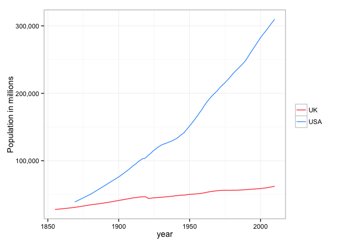
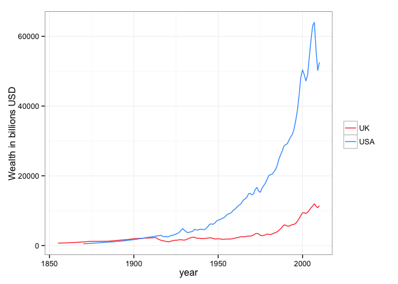
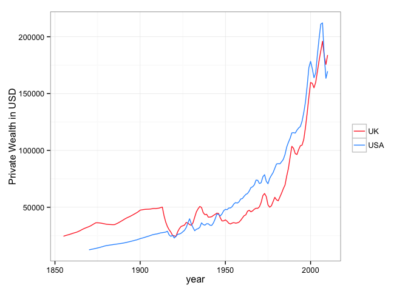

In this datapost we wish to compare two of the most powerful countries in the world by looking at some historical economic data. The data we use has information about the national income and private wealth since the 19th century. Population, employment and measures per capita of these qantities are also a  part of the data. We will see how some variables have changed in the history of these two countries.

We begin with the population. Unfortunately, the data for the US starts in a later year than the UK, so some of the visualizations will appear to be shorter in that country.

 

Well as you can see clearly, the United States population increased incredibly fast over the last century. This will affect on the next questions from this post, we will see some major differences in employment and other variables, but it is mainly because of the huge deifference in the number of people. Maybe the purpose of this post will be to analyze which of the two countries has been more stable according to the chosen variables.

 

Here is the first example of the huge difference in population, nevertheless, the UK shows a much more smoother line than the US. In fact look at that little fall between 1900 and 1950. Can we associate that to the 1929 Crisis? Maybe, maybe not; but before we draw any conlussion let us first look at the private wealth in the history of these two countries. 

 

There isn't really a smoother line here, both are stable on average, however there are some strange jumps in the end of the US line, wonder what might be causing it? Also, there is not a downfall in the 1900-1950 period in the wealth, contrary to what we observed in the national income plot. Let's mention something about these last explored concepts in order to increase our understanding and maybe ask better questions in the future.

[Private wealth](http://en.wikipedia.org/wiki/Wealth_management) refers to the private sector, the banking and financial assets that are held by the people in the country. The [national income](http://www.economicsonline.co.uk/Managing_the_economy/National_income.html) is related purely to government assets and earnings, or you may call it the public or government sector. These definitions might need some clarifications, you can follows the links to get a little more insight.

Now that we have seen the private wealth and the national income in a general way, we now show you the 'per capita' information. Maybe distinct patterns will emerge and more profound insights can be made.

 

As you can see this is a much more unstable variable, for both US and UK. You can see also a clear and considerable big jump during in the 1900-1950 period. This plot shows a quite unsteady income per capita, and not just during the complicated 1929 period, but for several years.

 

Again we see a very wobbly progress in wealth, specially in the UK. It is no coincidence now that all the strange behavior in the economic history of these two countries happens during the 1929 crisis. Not sure yet? Let's look at the employment history:

 

Well is not as clear as the 'per capita' plots, however there is a clear collapse in the employed population in the US.
Well that's all folks! We've seen the progress of history in these two major countries using a small group of economic indexes. We all know that the 1929 crisis affected a lot most countries in the world, but we did not know how it affected a particular set of variables. In a later post we will try to dig in a little more on this. You can provide your feedback in order to improve the plots or the questions, even the information and typos you find. 

Thanks for reading, see you later...

