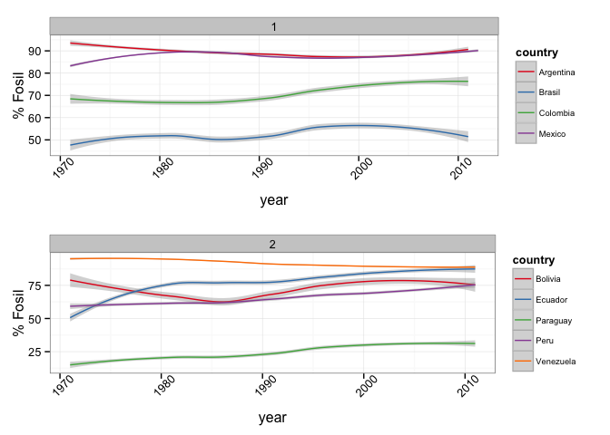
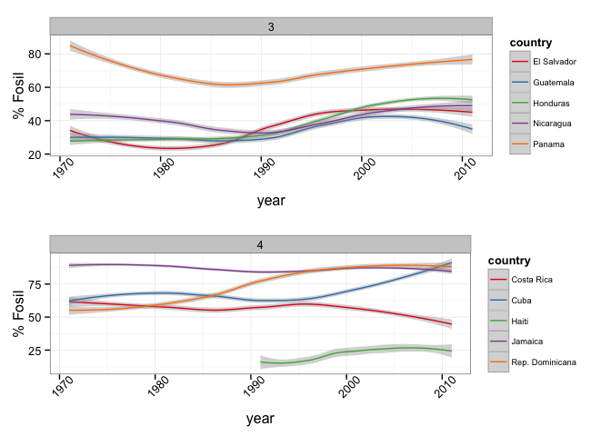
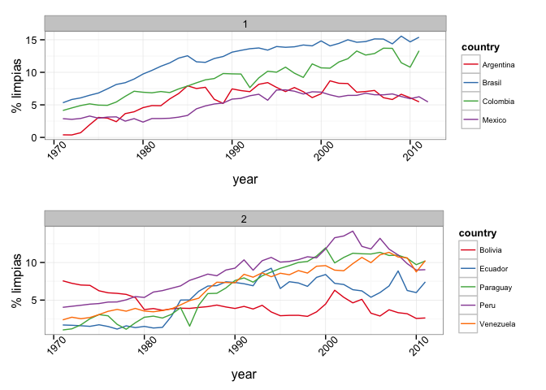
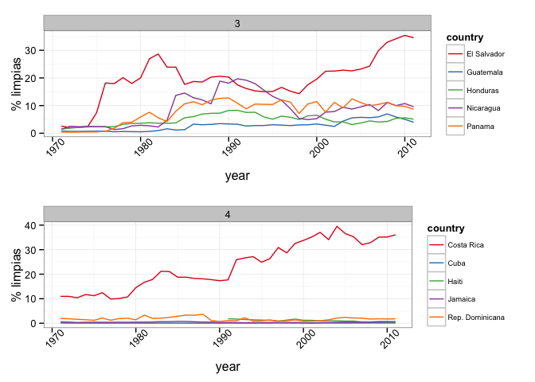
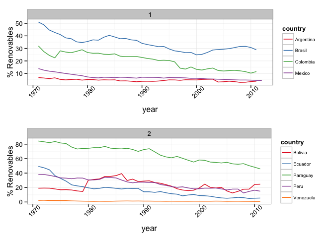
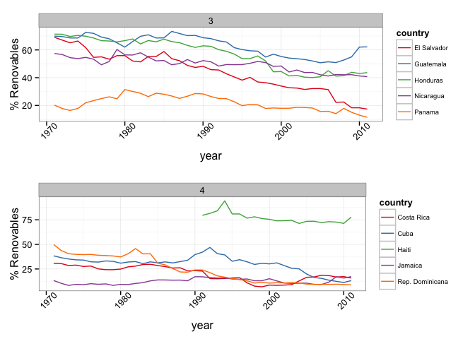

La electricidad es un recurso indispensable para la vida diaria de los seres humanos. Desde la invención del bombillo, la necesidad de acceder a este importante medio de subsistencia ha crecido exponencialmente. Para lograr el abastecimiento de la población mundial, existen numerosas maneras de producir energía en el planeta, lo que ha exigido que el hombre cuente con un amplio conocimiento sobre el funcionamiento de la naturaleza y sus recursos.

Los métodos de producción de energía no han sido los mismos siempre, los avances de la ciencia han permitido que la explotación de los recursos naturales se diversifique, promoviendo así el cuidado de los mismos. Hay una gran diferencia entre estos métodos, especialmente en costos de implementación. Mientras que algunos son de fácil acceso y no tienen costo alguno, su mantenimiento es complicado y costoso. Por otro lado, están aquellos que son levemente más difíciles de implementar y de conseguir, pero los costos de operación disminuyen.

A continuación vemos cómo los países latinoamericanos proveen energía a su población, no en términos de distribucion, sino en cuáles son las fuentes utilizadas para satisfacer la demanda de cada nación. Nuestro propósito es ilustrar con visualizaciones cómo es el mercado en Latinoamérica (LA), y qué cambios son posibles para mejorar los suministros de electricidad a la gente, dado que esta tiene que estar a disposición del usuario 24 horas al día, 7 días a la semana.

**Porcentaje Productos Fósil:**

Los combustibles fósiles son el petróleo y sus derivados, el gas y el carbón. Son los más usados en el mundo y también los más contaminantes, sin embargo, aún cuentan con los costos más bajos de operación y afortunadamente siguen siendo abundantes en la tierra, contrario  a lo que algunos dirían. Existen grandes reservas de éstos en LA, lo que la hace un mercado de mucho interés y de suma importancia para el resto del mundo, dado que la demanda de esta categoría es la más alta en este momento. Siendo éste un continente donde los países se encuentran aún en desarrollo, los combustibles fósiles proveen electricidad constantemente y de manera efectiva y económica.

Veamos cómo ha evolucionado el uso de combustibles fósiles en los países de América Latina y el Caribe. La agrupación es meramente arbitraria, no existe criterio alguno para haber separado a los países de esta manera, aunque coincidencialmente el grupo 1 contiene a los países con mayor población. El porcentaje mostrado corresponde a la fracción del uso total de energía eléctrica en cada país. 

 

 

Es evidente que el consumo de energía en LA está soportado en su mayoría por recursos fósiles. Esto muestra la popularidad y la dependencia de estos recursos para soportar la alta demanda de energía.

**Porcentaje Energías Alternativas:**

También conocidas como energías limpias, son las más favorables para el cuidado del planeta, dado que utilizan fuentes renovables de energía como lo son el agua, el sol, el movimiento del mar y los ríos, el viento y la temperatura interna de la tierra. Latinoamérica posee una alta variedad de accidentes geográficos y de hidrografía para producir suficiente electricidad; además, muchos de los países se encuentran cerca a la línea del Ecuador, lo que significa una constancia en la condiciones climáticas.

 

Es claro ver cómo ha aumentado el porcentaje del uso de energías alternativas a lo largo de los años, pero aún hay países que tienen un bajo porcentaje o incluso no tienen. Es bueno ver que LA está introduciendo estas nuevas tecnologías en su matriz energética. Las energías  alternativas son importantes recursos que aunque su costo inicial de instalación es un poco más alto que el de otros, su mantenimiento y operación es muy bajo dado que el combustible utilizado es de costo cero, como por ejemplo el viento, el sol, el agua o su movimiento.  Además, no siempre es trivial el acceso a estos recursos, como mencionamos antes, la variación en los climas afecta directamente la forma como se obtienen estos recursos; hay países afortunados con mayor y fácil acceso a ellos y otros no tan afortunados. Por ejemplo, una región puede o no tener viento suficiente y otra puede tener mayor o menor radiación solar, así como otras pueden tener mayores o menores ríos. 

**Porcentaje energías renovables:**

Los combustibles renovables más utilizados son la biomasa sólida, la biomasa líquida, el biogás, los residuos industriales y municipales. Latinoamérica podría implementar grandes plantas de estos recursos, pero de nuevo, los costos de instalación aumentan y si no existen políticas de regulación e incentivos suficientes para explotar estos recursos, su desarrollo no se puede hacer de manera exitosa.

 

Según los datos, estos recursos están muy presentes en el inventario energético de LA y el Caribe, aunque claramente podemos observar una leve caída en el uso de éstos recursos a través del tiempo, pero en general, se podría decir que su uso se ha mantenido constante. 

No podemos concluir este data post sin mencionar algunos puntos importantes sobre los datos y su fuente. Dado que existen entradas no reportadas en la tabla, los métodos de agregación y ponderación pueden presentar inconsistencias, como es el caso de un dato que está por encima del 100% lo cual no tiene sentido. También se pueden ver cambios pronunciados en el comportamiento debido a la ponderación de porcentajes con datos no reportados. En general, los datos son confiables y proveen la suficiente información para hacer un post como este. 

Finalmente, hemos visto que muchos países estan implantando las nuevas formas de generar electricidad. Sin embargo, siendo la mayoría países en desarrollo, todavía no cuentan con los recursos de capital necesarios para logra un mayor porcentaje de energía limpia. La electricidad es un bien que debe ser entregado en tiempo real, los métodos de almacenamiento y baterías todavía son jóvenes, muy costosos y falta mucho por progresar en esta área, es por eso que pocos se pueden dar el lujo de utilizar fuentes intermitentes y costosas.

A todos nos interesa cuidar al planeta pero tenemos que ser conscientes de que la gran parte de la energía que usamos diariamente aún proviene de recursos fósiles, porque son económicos y los costos de inversión para su implementación son bajos. Por otra parte, su operación es económica y dependen de fuentes confiables, en el sentido de que nos proveen constante y eficazmente la electricidad a nuestros hogares. Lo mejor para los países es tener acceso a la electricidad de manera inmediata y constante, y para esto es necesario disponer de diferentes fuentes de generación al mismo tiempo.

