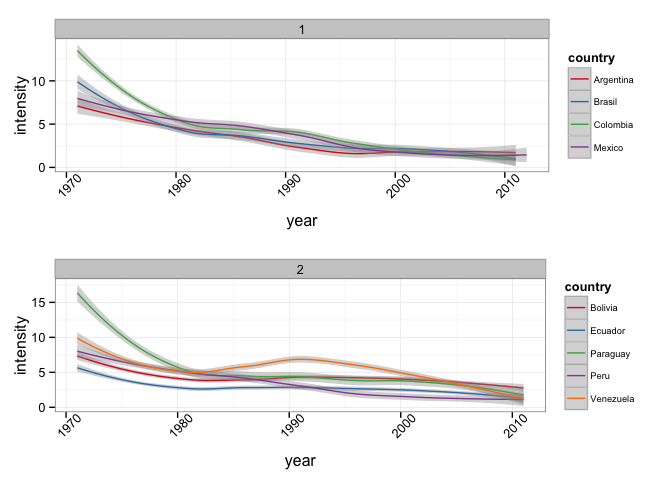
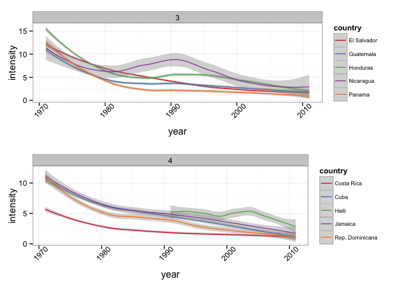
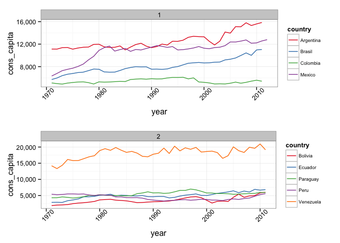
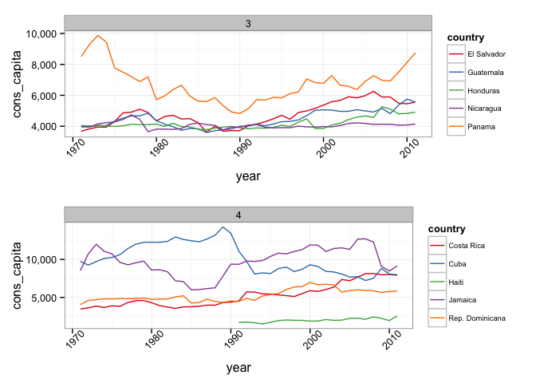
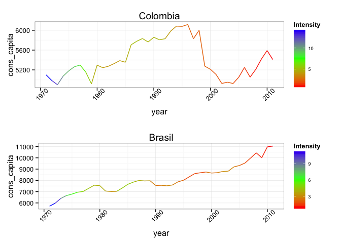
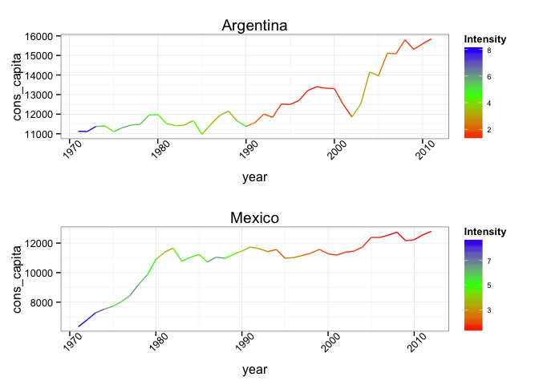

Unlike a previous _post_ about energy, in which we analyzed the different sources of electricity generation in Latin America, here we present some information on the consumption of energy during the last 40 years. Using variables such as GDP and population we want to mention some things about the access to electricity in some countries. Studying these indices can inform us about the economic conditions of each country, particularly on matters of electricity and access to it. Maintaining good social indexes involves meeting the basic needs of the population, such as electricity. 

We start by looking at the fraction between the total consumption in megajoules (MJ) and the GDP in dollars. This indicator says a lot about a country's economy, actually, it measures the energy efficiency of a nation's economy. It is calculated as units of energy per unit of GDP. If this fraction is very high it means the country's income is not high enough to satisfy energy consumption. On the other hand, low values ​​of this indicator mean high income, therefore it is generating enough energy to create wealth in the country. 

 

We see that countries have gradually decreased energy intensity, which tells us that most improved their income and managed to meet the demand of its inhabitants. In Colombia, for example, there was a time of rationing during the 90's. This was because the infrastructure needed to provide electricity was not the best and demand was very high, so the goal of bringing electric power to households was not successfully accomplished.

Many factors affect this indicator, such as the country’s geographic location, its climate, and the distinct methods of internal transportation.Those countries where climatic conditions are extreme, the intensity increases due to the high fuel quantities used to maintain an ideal temperature, however is not the case in many Latin American countries since climatic conditions are very stable throughout the year. Countries in which the distances are very large, also show a high intensity because big amounts of energy are needed to move all the means of transportation.

We now continue to analyze the consumption per capita, we must clarify that this is different to what we used to calculate the energy intensity. In the following figures we see the consumption per capita, while the intensity is calculated using the total consumption of the country. 

 

Clearly, the consumption per capita remains constant, some increase and others decrease, but the generality is that it does not vary much. The case of Venezuela is interesting, it is above the average consumption in LA. We know that there is a strong relationship between consumption and energy demand, so there might be a high demand as well as a high consumption in Venezuela. Whatever the reason, the important thing is for people to have electricity 24 hours a day.  Yet another explanation in the case of this country could be the high level of subsidies applied to different energy. 

Finally, we see the relationship between intensity and consumption per capita. While access to electricity is not an indicator of interest in this post, the latter can be used to make inferences about the distribution of wealth. Keep in mind that the consumption per capita is not uniform, some consume more because they have better access and the ability to pay. The same applies to the GDP, wealth unfortunately is not evenly distributed and that is reflected in the access or lack of it, to resources and basic subsistence goods. 

For this case we will only compare countries in group 1 (Argentina, Brazil, Colombia and Mexico), which are the most populated. 

As mentioned at the beginning of this post, we wanted to analyze certain variables of each country, especially in the energy sector. Our purpose was to report some indexes related to this important subject, and open questions about the correlations between them. Also, we wanted to present information related to our country and to better understand under what conditions we are, in terms of this important goog as electricity.