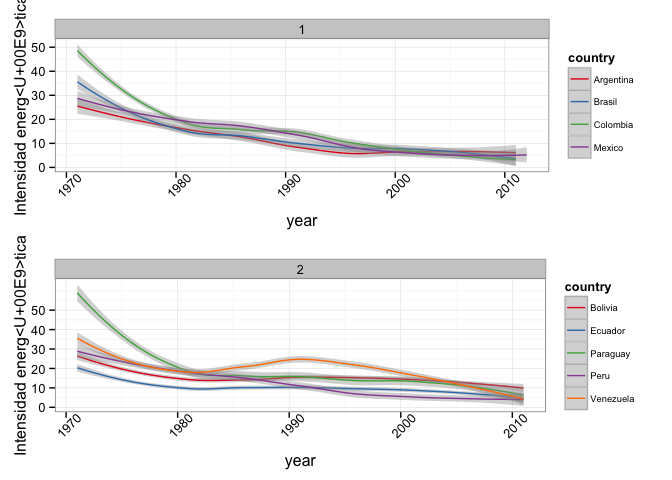
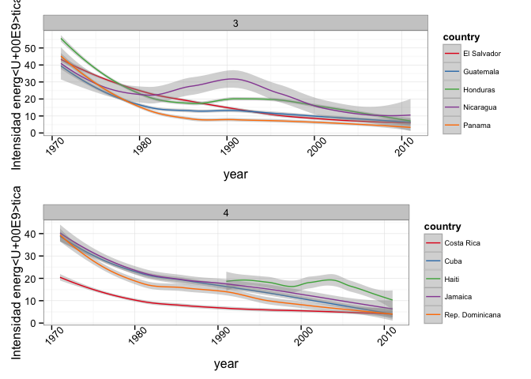
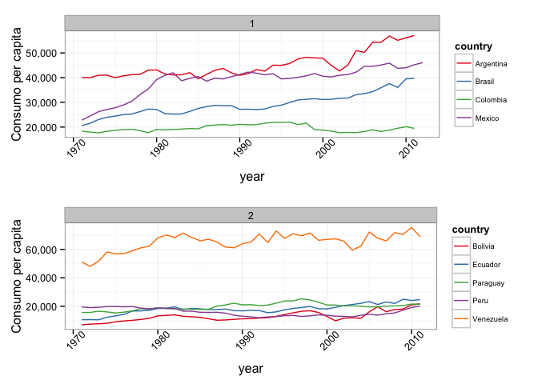
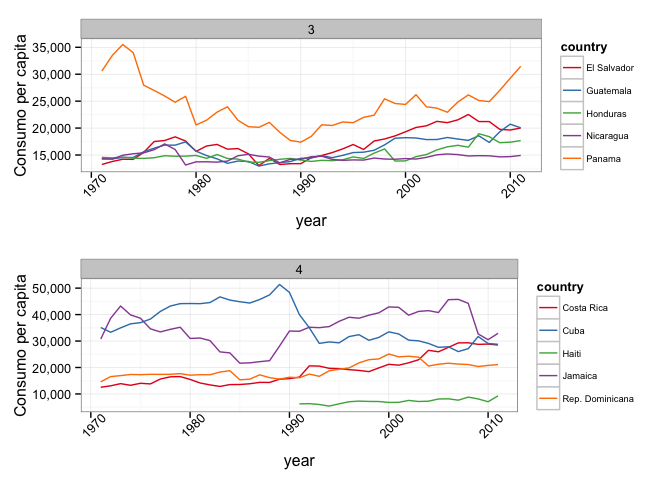
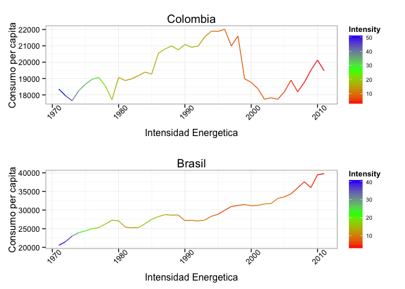
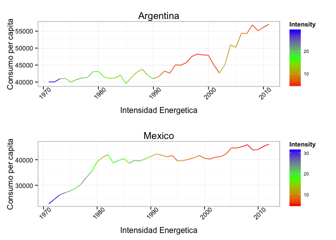

A diferencia de otro _post_ sobre energía, en el que analizamos las distintas fuentes de generación de electricidad en Latinoamérica, en el presente queremos investigar un poco sobre el consumo de energía en latinoamérica durante los últimos 40 años. Utilizando variables como el PIB y la población queremos mencionar algunas cosas sobre el acceso a la electricidad en algunos paises. Estudiar estos índices nos puede informar sobre las condiciones económicas de cada país, particularmente sobre los esquemas de energía eléctrica y el acceso a ésta. Mantener un buen índice social implica satisfacer las necesidades básicas de la población, tales como la luz y el agua. 

Comenzamos mirando la fracción entre el consumo total del país en kWh y el PIB en dólares. Este indicador dice mucho sobre la economía de un país, de hecho lo que mide es cuantas unidades de energía se necesitan para producir 1 "unidad de riqueza". Si esta fracción es muy alta quiere decir que los ingresos del país no son lo suficientemente altos para contrarrestar el consumo de energía. Por otro lado, los valores bajos de este indicador significan un alto ingreso, es decir, se estan generando las suficientes unidades de energía para crear riqueza en el país.

 

Vemos que los países poco a poco han disminuido la intensidad energética, lo que nos dice que la mayoría mejoraron sus ingresos y lograron suplir la demanda de sus habitantes. En colombia, por ejemplo, se pasó por un momento de racionamiento durante los años 90's. Esto se debía a que la infraestructura para proveer electricidad no era la mejor y la demanda era muy alta, por lo tanto no se podía cumplir con el objetivo de llevar energía eléctrica a los hogares.

Muchos factores afectan a este indicador, la posición y geografía del país, el clima, y los medios de transporte internos. Aquellos países donde las condiciones climáticas son extremas, la intensidad aumenta debido al alto uso de combustibles para mantener una temperatura ideal, sin embargo no es el caso de muchos países latinoamericanos dado que las condiciones climáticas son muy estables a lo largo del año. Los países en los que es común el uso de automóviles y las distancias recorridas son muy largas, también muestran una alta intensidad debido a que se necesita mucha energía para este propósito. 

Seguimos analizando el consumo per cápita, y hay que aclarar que este es distinto al usado para calcular la intensidad energética. En las siguientes gráficas queremos ver cuál es el consumo por cada habitante, mientras que la intensidad se calcula a partir del consumo total del país.

 

 

Es evidente que el consumo per cápita se mantiene constante, algunos aumentan y otros disminuyen, pero la generalidad es que no varia mucho. Es interesante el caso de Venezuela, que está por encima del consumo promedio en LA. Hay una relación fuerte entre el consumo y la demanda de energía de manera que en Venezuela puede haber una altísima demanda como un gran consumo, lo importante es que la gente tenga electricidad 24 horas al día. Otra explicación adicional en el caso particular de este país podría ser el altísimo nivel de subsidios aplicado a los diferentes energéticos. 

Finalmente queremos ver que relación hay entre la intensidad y el consumo per cápita. Aunque el acceso a la electricidad no es uno de los indicadores de interés en este post, este último sirve para hacer inferencias sobre la distribución de riqueza. Hay que tener en cuenta que el consumo per cápita no es uniforme, algunos consumen más dado que tienen mejor acceso y mayor capacidad de pago. Lo mismo sucede con el PIB, la riqueza lamentablemente no esta uniformemente distribuida y eso se ve en el acceso a recursos y bienes básicos de subsistencia.

Para este caso solo vamos a comparar los países del grupo 1 (Argentina, Brazil, Colombia y México), que son los de mayor población.

 

Como comentamos al comenzar este post, queríamos analizar ciertas variables de cada país, especialmente del sector energético. Nuestro propósito era informar sobre algunos índices relacionados con éste importante tema, y abrir interrogantes sobre las correlaciones entre éstos.También, queríamos exponer la información relacionada con nuestro país y entender mejor en que condiciones estamos en cuanto a este bien tan importante como lo es la electricidad.

