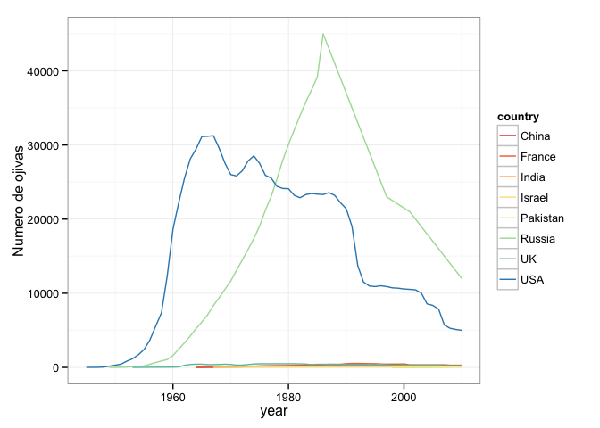
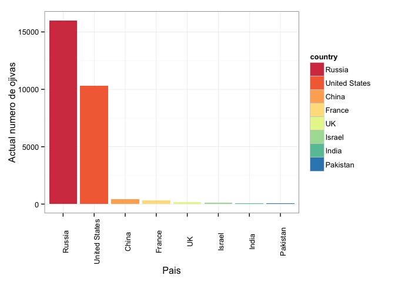
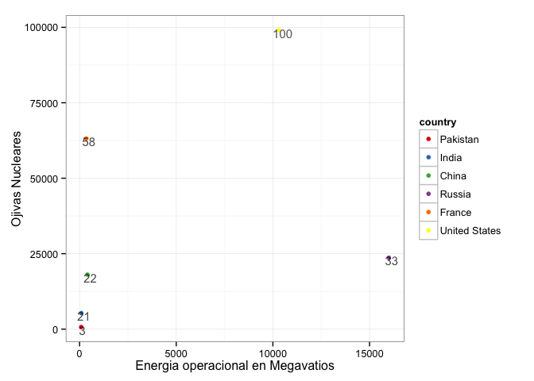
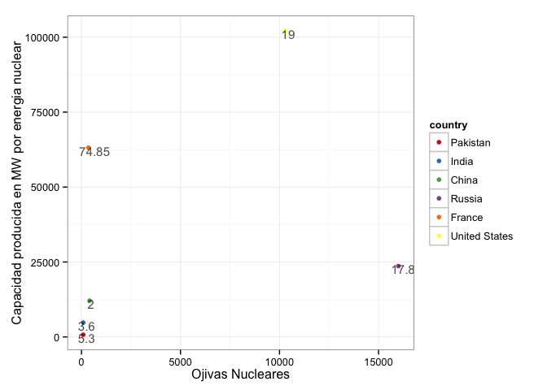

```r
library(ggplot2)
library(reshape2)
library(plyr)
library(knitr)
```


```r
datapath <- 'data/'
d <- read.csv(paste0(datapath, 'table1.csv'), header = T)
d1 <- read.csv(paste0(datapath, 'table2.csv'), header = T)
d2 <- read.csv(paste0(datapath, 'table3.csv'), header = T)
d3 <- read.csv(paste0(datapath, 'table4.csv'), header = T)
A <- merge(d,d2, by = 'country')
```

### ¿Cómo ha evolucinado el número de ojivas nucleares en el mundo? ###


```r
ggplot(d1, aes(year, value, colour = country)) + geom_line() + theme_bw() + scale_colour_brewer(palette = 'Spectral') + labs(y = 'Numero de ojivas')
```

 

### ¿Qué pai?ses tienen armas nucleares actualmente? ###


```r
d3 <- d3[order(d3$nuclear_weapons, decreasing = T),]
d3$country <- factor(d3$country, levels = d3$country, ordered = T)
ggplot(d3, aes(country, nuclear_weapons, fill = country)) + geom_bar(stat = 'identity') + scale_fill_brewer(palette = 'Spectral') + labs(x = 'Pais', y = 'Actual numero de ojivas') + theme_bw() + theme(axis.text.x = element_text(angle= 90))
```

 

### ¿Qué pai?ses tienen plantas nucleares operando? ###


```r
A <- A[order(A$operNum, decreasing = F),]
A$country <- factor(A$country, levels = A$country, ordered = T)

ggplot(A, aes(country, operNum)) + geom_bar(stat = 'identity', fill = '#CC0033') + theme_bw()  + labs(y = 'Plantas Nucleares Operacionales', x = 'Pais') + coord_flip()
```

 

### ¿Cuál es la relación entre la posesión de plantas nucleares activas y el número de ojivas? ###


```r
B <- merge(A, d3, by = 'country')
ggplot(B, aes(nuclear_weapons, operEnr_MW, colour = country, label = operNum)) + geom_point() + theme_bw() + scale_colour_brewer(palette = 'Set1') + labs(x = 'Energia operacional en Megavatios', y = 'Ojivas Nucleares') + geom_text(hjust = 0.3, vjust = 0.85, colour = 'black', size = 4, alpha = 0.7)
```

 

### ¿Qué relación existe entre la capacidad de producción y el número de ojivas nucleares? ###


```r
ggplot(B, aes(nuclear_weapons, capacity_MW_2012, colour = country, label = nuclearPercEnr_2011)) + geom_point() + theme_bw() + scale_colour_brewer(palette = 'Set1') + labs(y = 'Capacidad producida en MW por energia nuclear', x = 'Ojivas Nucleares') + geom_text(hjust = 0.3, vjust = 0.85, colour = 'black', size = 4, alpha = 0.7)
```

 

