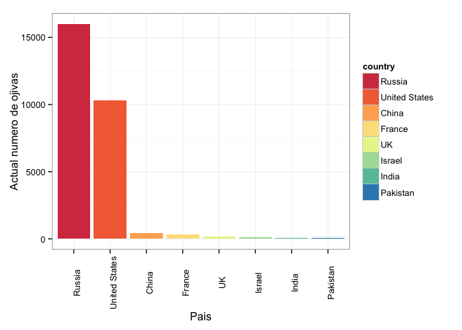
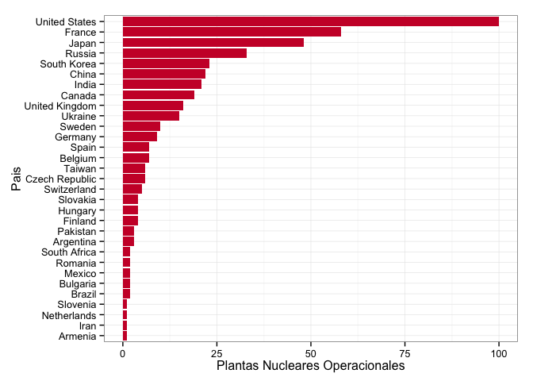

Con el fin de la Segunda Guerra Mundial, marcado por los bombardeos de Hiroshima y Nagasaki, comienza la Guerra Fría, con el miedo como motor de este conflicto, los países poseedores de poder nuclear vivieron un largo período de tensiones, impulsando así la construcción de ojivas nucleares para su repertorio armamentista. Con el pasar de los años, varios países se sumaron a la carrera nuclear, otros decidieron implementar los reactores nucleares para generar electricidad, ¿existirá alguna relación entre estas dos políticas? En este _post_ miramos qué países tienen armas nucleares, cuáles cuentan con plantas y finalmente de los que tienen ambas, cómo se relaciona el número de armas con ciertas variables de energía nuclear.

Comenzamos estudiando las potencias nucleares a través de la historia, nos interesa ver cómo cambiaron los armamentos nucleares en el tiempo y que ha desatado tales cambios. 

 

Es evidente que los países protagonistas de la Guerra Fría son los que más armas nucleares tienen. El declive en el número de ojivas se debe al [NPT](http://en.wikipedia.org/wiki/Treaty_on_the_Non-Proliferation_of_Nuclear_Weapons)(Non-Proliferation Treaty), Tratado de No-Proliferación Nuclear, firmado en 1968 con el fin del desarmar y restringir el uso de materiales nucleares como armas. Este tratado fué inicialmente constituido por EEUU, el Reino Unido, Francia, Rusia y China, y son los únicos que tienen derecho, por decreto de este tratado, a poseer ojivas nucleares; este "privilegio" lo tienen debido a que fueron los únicos en llevar a cabo pruebas nucleares antes de 1967, y aún así, éstos países han sido miembros permanentes en este tratado.

En los datos de EEUU es claro ver la reducción en el número de armas, sin embargo en Rusia, aumentó mucho la cantidad de armas nucleares hasta la caída del muro de Berlín, lo que marcó el fin de la USSR. Las otras naciones entraron más tarde al tratado y otros aún no han reportado la posesión de armas nucleares debido a que se rigen bajo una política de 'ambigüedad estratégica'. Esto significa que llevan a cabo un programa ultrasecreto de armas nucleares y no reportan su actividad, con el fin de no disuadir a sus enemigos regionales y tampoco desatar una carrera armamentista en la región. Cabe aclarar que para países como Pakistan, India e Israel, no firmaron el NPT de manera que la información puede no ser la más confiable.

Concretemos entonces el número de ojivas nucleares en este momento.

 

De nuevo, son los actores de la Guerra Fría, EEUU y USSR, los que más armas poseen en este momento. Como ya mencionamos, la información para algunos países puede estar comprometida dado que las fuentes no son muy confiables, aún así, existen estimaciones sobre la posesión de armas nucleares y esto es lo que exponemos.

Aunque ya vimos qué países tienen armas nucleares, ahora nos disponemos a ver cuáles producen energía a partir de fuentes nucleares. Comenzamos contando las plantas generadoras por país:

 

La gráfica habla por sí sola, EEUU tiene la red de plantas nucleares más grande del mundo, seguido de Francia, Rusia y Japón. Desde los años '50, se ha implementado el uso de fuentes nucleares para la producción de electricidad. En Francia, Bélgica y Eslovaquia la energía nuclear es la fuente principal de electricidad.
Poco a poco se esta introduciendo el uso de energía nuclear en las matrices energéticas de cada país. China por ejemplo, lo está haciendo fuertemente y pretende crecer de los 80 GW (gigavatio, mil millones) que produce hoy en día, a 400 GW en 2050. Coréa del Sur también quiere aumentar de 20.7 GW a 27.3 GW; India quiere subir a 14.6 GW en 2020 y 63 GW en 2032.

Ahora queremos analizar la relación entre las plantas en operación de cada país con el número de ojivas nucleares que tienen. Esta información se reduce a aquellos países que producen energía y que tienen armas nucleares.

 

El número que aparece al lado de cada punto corresponde al número de plantas en operación, mientras que el eje _x_ indica la cantidad de energía producida por estas plantas. No podemos decir que hay una clara relación entre tener plantas nucleares operacionales y poseer armas nucleares, los puntos están débilmente correlacionados de manera que no hay forma de inferir algo correcto sobre estas dos variables en observación.

Ahora queremos ver la capacidad de producción y el número de ojivas nucleares.

 

De nuevo, el número que aparece con cada punto equivale al porcentaje del total de energía que proviene de fuentes nucleares. Otra vez es poco clara la relación entre estas dos variables, y la única inferencia que podemos hacer es que tener energía nuclear como fuente de electricidad no implica tener armas nucleares.

Hemos visto en este _post_ algunas variables como la energía y el arsenal nuclear de cada país, los comparamos y realizamos inferencias. Algunos países están empezando a introducir la energía nuclear en su repertorio de producción de electricidad, y también están desarrollando armas, aunque de forma ultrasecreta.

La energía nuclear ha sido una de la grandes revoluciones de la ciencia, lamentablemente, las guerras y los conflictos mundiales han hecho de ésta un tema delicado y polémico. Producir electricidad a partir de fuentes nucleares no es algo nuevo, se viene haciendo desde hace más de 60 años. Como todas las formas de producción de energía, siempre existen riesgos en la implementación y también existe la posibilidad de contaminar si los residuos radiactivos que dejan los materiales no son correctamente tratados. Hoy en día, existen muchas políticas contra el uso de fuentes nucleares para la producción de energía, y así como muchos países restringen y prohíben las fuentes nucleares, otros continúan en crecimiento, como es el caso de India, Pakistan y China entre otros. La conclusión es muy similar a la de un post anterior sobre las distintas fuentes de energía, se debe implementar diversas formas de producción en los planes de los países, dados los costos y las dificultades que implica tener una sola fuente de generación.

