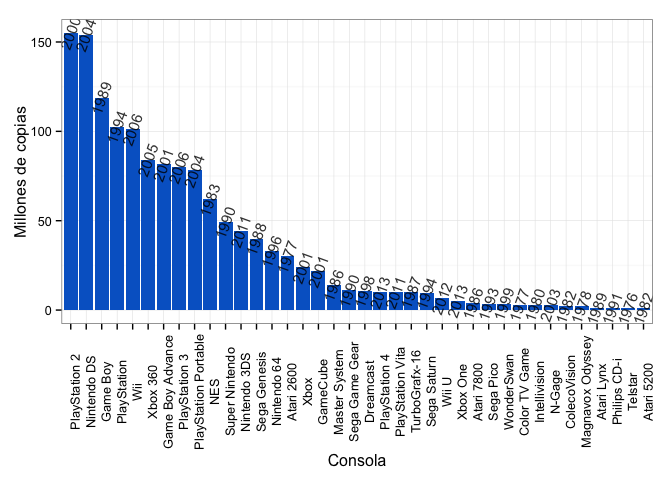
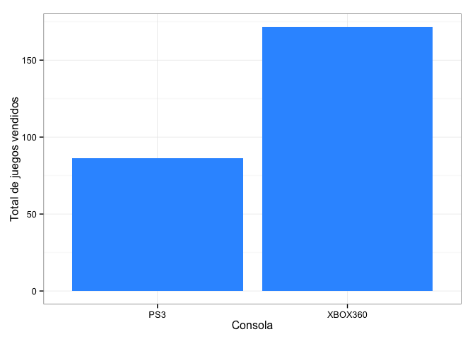

```r
library(ggplot2)
library(reshape)
library(plyr)
```

```
## 
## Attaching package: 'plyr'
## 
## The following objects are masked from 'package:reshape':
## 
##     rename, round_any
```

```r
library(knitr)
```


```r
datapath <- 'data/'
consoles <- read.csv(paste0(datapath,'consoles.csv'), header = T)
ps <- read.csv(paste0(datapath,'ps3.csv'), header = T)
xb <- read.csv(paste0(datapath,'xbox360.csv'), header = T)
games <- read.csv(paste0(datapath,'games.csv'), header = T)

names(consoles)[3] <- 'year'
```

### ¿Qué juego ha vendido más copias? ###


```r
kable(games)
```


| rank|game                           | year| millionCopies|
|----:|:------------------------------|----:|-------------:|
|    1|Tetris                         | 1984|        143.00|
|    2|Wii Sports                     | 2006|         82.54|
|    3|Minecraft                      | 2009|         54.00|
|    4|Super Mario Bros.              | 1985|         40.24|
|    5|Mario Kart Wii                 | 2008|         35.53|
|    6|Grand Theft Auto V             | 2013|         34.00|
|    7|Wii Sports Resort              | 2009|         32.58|
|    8|New Super Mario Bros.          | 2006|         30.75|
|    9|Call of Duty: Modern Warfare 2 | 2009|         28.50|
|   10|Wii Play                       | 2006|         28.02|
|   11|New Super Mario Bros. Wii      | 2009|         27.88|
|   12|Grand Theft Auto: San Andreas  | 2004|         27.50|
|   13|Call of Duty: Modern Warfare 3 | 2011|         26.50|
|   14|Grand Theft Auto IV            | 2008|         25.00|
|   15|Call of Duty: Black Ops        | 2010|         26.20|
|   16|Call of Duty: Black Ops II     | 2012|         24.20|
|   17|Kinect Adventures!             | 2010|         24.00|
|   18|Nintendogs                     | 2005|         23.94|
|   19|Pokemon Red, Blue, and Green   | 1996|         23.64|
|   20|Mario Kart DS                  | 2005|         23.56|
|   21|Pokemon Gold andSilver         | 1999|         23.00|
|   22|Wii Fit                        | 2007|         22.67|
|   23|Wii Fit Plus                   | 2009|         21.03|
|   24|Super Mario World              | 1990|         20.60|
|   25|Grand Theft Auto: Vice City    | 2002|         20.00|
|   26|The Sims 2                     | 2004|         20.00|
|   27|The Elder Scrolls V: Skyrim    | 2011|         20.00|
|   28|Battlefield 3                  | 2011|         20.00|
|   29|Brain Age                      | 2005|         19.01|
|   30|Call of Duty: Ghosts           | 2013|         19.00|
|   31|Super Mario Land               | 1989|         18.06|
|   32|Super Mario Bros. 3            | 1988|         18.00|
|   33|Pokemon Diamond andPearl       | 2006|         17.63|
|   34|The Sims                       | 2000|         16.00|
|   35|Pokemon Ruby andSapphire       | 2002|         16.00|
|   36|Call of Duty 4: Modern Warfare | 2007|         15.70|
|   37|Call of Duty: World at War     | 2008|         15.70|
|   38|Pokemon Black andWhite         | 2010|         15.42|
|   39|Sonic the Hedgehog             | 1991|         15.00|
|   40|Diablo III                     | 2012|         15.00|

### ¿Qué consola tiene el mayor número de unidades vendidas? ###


```r
consoles <- consoles[order(consoles$mlnUnits, decreasing = T),]
consoles$Platform <- factor(consoles$Platform, levels = consoles$Platform, ordered = T)

ggplot(consoles, aes(Platform, mlnUnits, label = year)) + geom_bar(stat = 'identity', fill = '#0066CC') + theme_bw() + theme(axis.text.x = element_text(angle = 90)) + geom_text(size = 4, alpha = 0.8, angle = 70, position = 'dodge') + labs(y = 'Millones de copias', x = 'Consola')
```

```
## ymax not defined: adjusting position using y instead
```

 

### ¿Qué consola es más popular entre el PS3 y XBOX 360? ###


```r
ps$console <- rep('PS3', nrow(ps))
xb$console <- rep('XBOX360', nrow(xb))
names(ps)[2] <- 'mlnCopies'

A <- rbind(ps,xb)

A <- ddply(A, .(console), summarize, TotalCopies = sum(mlnCopies))

ggplot(A, aes(console, TotalCopies)) + geom_bar(stat = 'identity', fill = '#3399FF') + theme_bw() + labs(x = 'Consola', y = 'Total de juegos vendidos')
```

 


