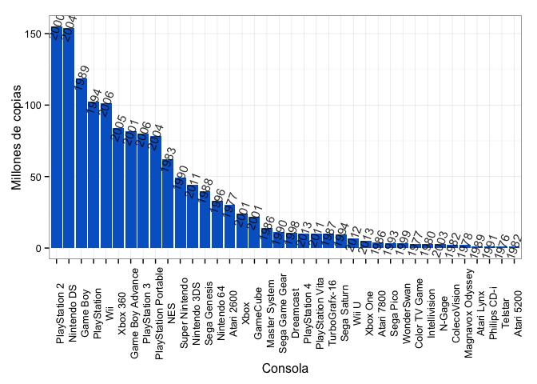

El momento es el indicado para hacer un recuento de la historia de los videojuegos. Las nuevas tecnologías han evolcionado de manera acelerada, y la competencia entre éstas es cada vez más intensa. Desde hace ya casi 30 años, la popularidad de los video juegos se ha expandido rápidamente, tal es la magnitud de ésta expansión, que las nuevas generaciones no conciben la idea de una vida sin las consolas y consideran el pasado de éstas obsoleto. En este post hacemos un breve análisis de los juegos y las consolas más populares en la historia, y finalemente comparamos dos de las consolas del presente.

Comenzamos con una tabla de los juegos más vendidos de todos los años. Esta tabla tiene en cuenta aquellos juegos que fueron pioneros en su momento y que fuéron los detonantes de una industria que hoy en día parece no tener fin.

 

| rank|Juego                           | Año| Millones de Copias|
|----:|:------------------------------|----:|-------------:|
|    1|Tetris                         | 1984|        143.00|
|    2|Wii Sports                     | 2006|         82.54|
|    3|Minecraft                      | 2009|         54.00|
|    4|Super Mario Bros.              | 1985|         40.24|
|    5|Mario Kart Wii                 | 2008|         35.53|
|    6|Grand Theft Auto V             | 2013|         34.00|
|    7|Wii Sports Resort              | 2009|         32.58|
|    8|New Super Mario Bros.          | 2006|         30.75|
|    9|Call of Duty: Modern Warfare 2 | 2009|         28.50|
|   10|Wii Play                       | 2006|         28.02|
|   11|New Super Mario Bros. Wii      | 2009|         27.88|
|   12|Grand Theft Auto: San Andreas  | 2004|         27.50|
|   13|Call of Duty: Modern Warfare 3 | 2011|         26.50|
|   14|Grand Theft Auto IV            | 2008|         25.00|
|   15|Call of Duty: Black Ops        | 2010|         26.20|
|   16|Call of Duty: Black Ops II     | 2012|         24.20|
|   17|Kinect Adventures!             | 2010|         24.00|
|   18|Nintendogs                     | 2005|         23.94|
|   19|Pokemon Red, Blue, and Green   | 1996|         23.64|
|   20|Mario Kart DS                  | 2005|         23.56|
|   21|Pokemon Gold andSilver         | 1999|         23.00|
|   22|Wii Fit                        | 2007|         22.67|
|   23|Wii Fit Plus                   | 2009|         21.03|
|   24|Super Mario World              | 1990|         20.60|
|   25|Grand Theft Auto: Vice City    | 2002|         20.00|
|   26|The Sims 2                     | 2004|         20.00|
|   27|The Elder Scrolls V: Skyrim    | 2011|         20.00|
|   28|Battlefield 3                  | 2011|         20.00|
|   29|Brain Age                      | 2005|         19.01|
|   30|Call of Duty: Ghosts           | 2013|         19.00|
|   31|Super Mario Land               | 1989|         18.06|
|   32|Super Mario Bros. 3            | 1988|         18.00|
|   33|Pokemon Diamond andPearl       | 2006|         17.63|
|   34|The Sims                       | 2000|         16.00|
|   35|Pokemon Ruby andSapphire       | 2002|         16.00|
|   36|Call of Duty 4: Modern Warfare | 2007|         15.70|
|   37|Call of Duty: World at War     | 2008|         15.70|
|   38|Pokemon Black andWhite         | 2010|         15.42|
|   39|Sonic the Hedgehog             | 1991|         15.00|
|   40|Diablo III                     | 2012|         15.00|

Es imposible que nuestra generación no haya jugado Tetris al menos una vez, ha sido un juego conocido por mucha gente en el mundo y todavía hay quienes lo juegan en los dispositivos modernos como las tabletas y los celulares. Es curioso ver que los primeros 5 juegos no pertenecen a esta década - incluso dos de ellos son de los años '80 - y se pueden considerar ya juegos antiguos, dado el rápido avance de la tecnología y la alta variedad de consolas y juegos.

Ahora pasamos a ver las consolas más vendidas de todos los tiempos.

 

De nuevo las top 5 del ranking tienen ocho o más años de antigüedad. Es obvio que las consolas de última generación tienden a estar más abajo en el ranking dado que llevan muy poco tiempo en el mercado. Sin embargo, las pertenecientes a la última ola de consolas (años 2005/6), no superan en ventas a los aparatos de los años '80. Podemos ver también que entre las consolas lanzadas el último año, el Play Station 4 supera al resto en ventas (XBOX One, WiiU). 
De las más populares hasta el año pasado, el PS3 y el XBOX 360, el segundo supera por muy poco al primero. Eso es en número de unidades, pero ¿cómo están en cuanto a la cantidad de juegos vendidos para cada una?

 

Este resultado es consistente con el anterior, entre más unidades se venden, mayor es la venta de juegos para esa consola, además, el XBOX 360 supera por bastante al PS3; claramente Microsoft supera a Sony en ésta ronda. La siguiente batalla entre el PS4 y el XBOX One acaba de comenzar, ya vimos que Sony va liderando en ventas hasta ahora, pero no debe subestimar la popularidad del XBOX One.

Es curioso ver en qué punto estamos en el uso de las consolas después de ver algunos datos sobre la historia de los videojuegos. A algunos les podrá dar nostalgía de aquellos días en los que apenas se utilizaba un botón y una pequeña palanca, incluso desprecian los juegos de hoy en día y no los encuentran divertidos dada su complejidad. Otros piensas que hasta ahora está comenzando el verdadero momento y consideran los juegos de video indispensables para la diversión. 

